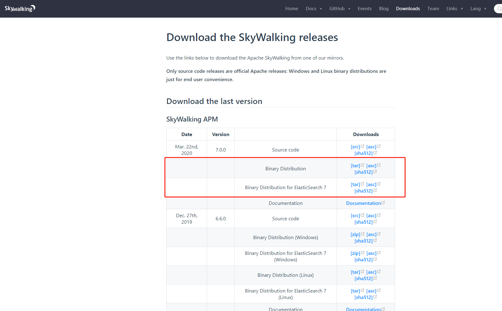

## skywalking 7 安装
>- 环境依赖
>- 如果选了elastic存储数据，则需要elastic 7.x
>- elastic 7.x依赖 jdk 11+

### 官方安装包，Windows 单例安装使用

**下载：** [源文件或执行文件下载](http://skywalking.apache.org/downloads/)

如图所示，目前官方最新是7.0，github最新发布的版本是8.0

1. 下载编译好的可执行程序
    1. Binary Distribution 只包含skywalking的服务端及客户端
    2. Binary Distribution for ElasticSearch 7 除了基础服务，还附带存储服务elastic所依赖的jar
    3. 根据自己的选择下载
    
2. 下载elasticsearch 7.x
    1. 参考数据库篇-elastic下载安装使用

3. 准备工作
    1. 修改 apache-skywalking-apm-bin-es7\webapp\webapp.yml
        1. server.port  #skywalking服务启动端口，在浏览器输入http://ip:port即可访问监控主页
        2. collector.ribbon.listOfServers  # skywalking-collector收集器服务端的rest访问地址，ip:port格式，即core.default.restHost,core.default.restPort
    2. 修改apache-skywalking-apm-bin-es7\config\application.yml
        1. core.default.restHost,core.default.restPort,指定收集器服务的restful ip和端口
        2. core.default.gRPCHost,core.default.gRPCPort,指定grpc启动服务端的ip和端口，这两个参数用于collector.ribbon.listOfServers，
        以及 agent客户端启动参数里的collector.backend_service
    3. java 应用程序启动时，例如，`java -jar xxx.jar`,在后面接上以下的参数
        1. `-javaagent:${这里填的是实际agent的目录地址}\skywalking-agent.jar -Dagent.service_name=server-local -Dcollector.backend_service=127.0.0.1:11800`
        2. service_name 服务名称，该名称会在UI界面上作为一个服务标识展示对应的数据
        3. collector.backend_service 收集器服务端的通讯地址，即上面第二点core.default.gRPCHost,core.default.gRPCPort的值

**apache-skywalking-apm-es7-7.0.0.tar.gz 说明**
>- 不区分环境，linux，window下均可直接通过脚本启动
>- 可用于制作docker镜像，运行于docker中

**文件目录介绍**

- agent
    - 数据采集客户端，该目录可以任意移动。
- bin
    - 官方整理的启动脚本，其中主要用到的是startup.bat或startup.sh
    - 主要是启动skywalking web服务，collector服务
- config
    - skywalking核心配置文件
    - application.yml 这个为主要配置文件，配置单节点，集群，collector配置，数据存储配置等等
- license
    - 协议文件
- logs
    - 日志输出位置
- oap-libs
    - 该目录为收集器collector服务程序以及依赖包
- tools
- webapp
    - skywalking web服务目录。
    - 包含一个配置文件，用于配置web服务启动端口和收集器服务rest地址配置

###