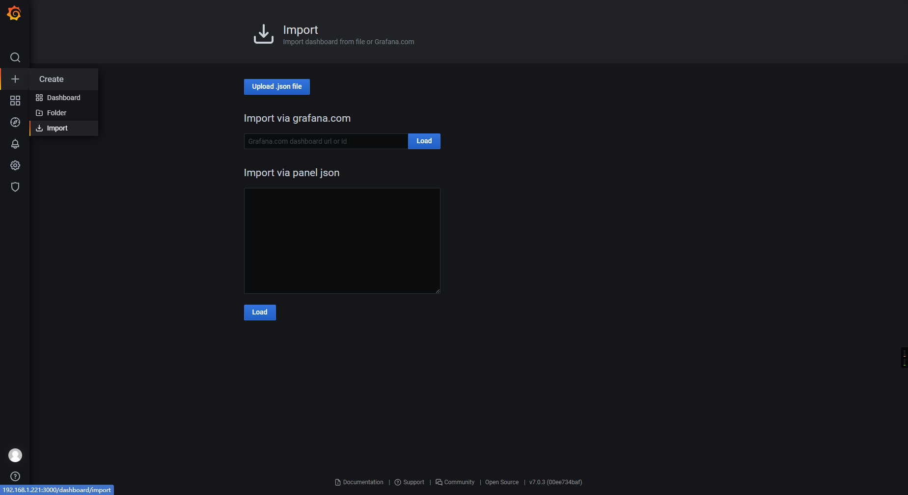
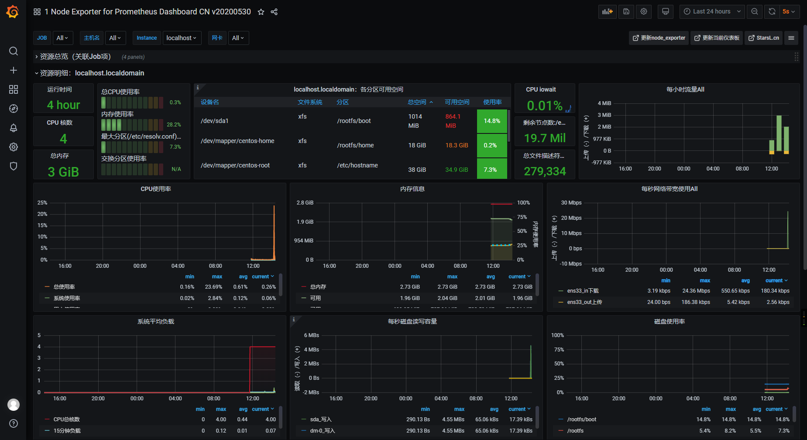

## grafana 安装使用

- 拉取镜像

```cmd
docker pull grafana/grafana:latest
```

- 创建挂载目录

```cmd
mkdir -p /usr/local/grafana-storage
chmod 777 /usr/local/grafana-storage
```

- 启动服务

```cmd
docker run -d \
  -p 3000:3000 \
  --name=grafana \
  -v /usr/local/grafana-storage:/var/lib/grafana \
  --restart=always \
  --privileged=true \
  --name grafana \
  grafana/grafana
```

- 下载汉化的prometheus，导入

`https://grafana.com/grafana/dashboards/8919/revisions`

下载最新的json文件



导入文件，保存。

效果如图所示：

