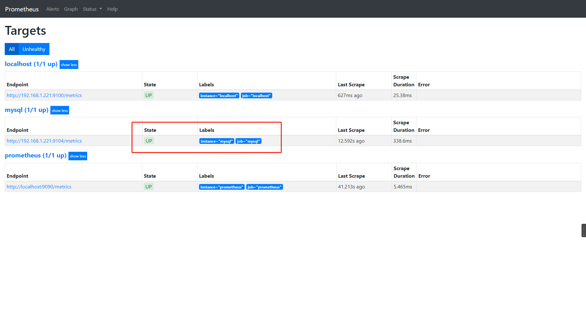
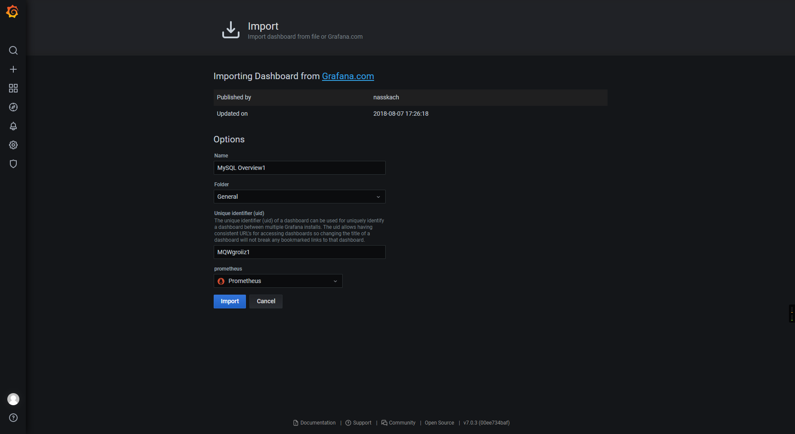
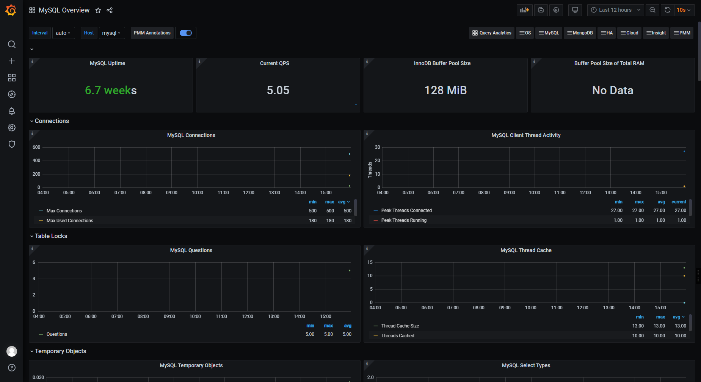

## prometheus 安装使用

```cmd
docker pull prom/prometheus:latest
```

- 创建配置文件

```cmd
vi /usr/local/etc/prometheus.yml
```

```yaml
global:
  scrape_interval:     60s
  evaluation_interval: 60s
 
scrape_configs:
  - job_name: prometheus
    static_configs:
      - targets: ['localhost:9090']
        labels:
          instance: prometheus
 
  - job_name: localhost
    static_configs:
      - targets: ['192.168.1.221:9100']
        labels:
          instance: localhost
```

- 启动服务

```cmd
docker run  -d \
  --user root \
  -p 9090:9090 \
  -v /usr/local/etc/prometheus.yml:/etc/prometheus/prometheus.yml  \
  --restart=always \
  --privileged=true \
  --name prometheus \
  prom/prometheus
```

### prometheus-mysql 监控

```cmd
docker pull prom/mysqld-exporter

docker run -d \
  -p 9104:9104 \
  --user root \
  -e DATA_SOURCE_NAME="user:password@(hostname:3306)/" \
  prom/mysqld-exporter
```

- 启动后，查看http://host:9090/targets

检查是否启动正常




- grafana首页，导入模板



- mysql首页监控鸟瞰图

