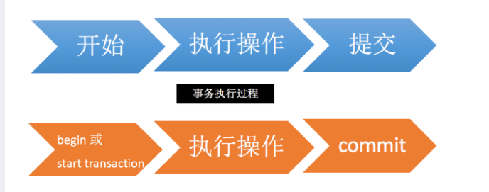
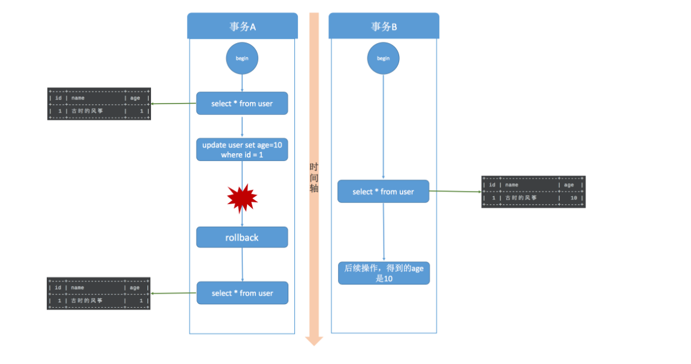
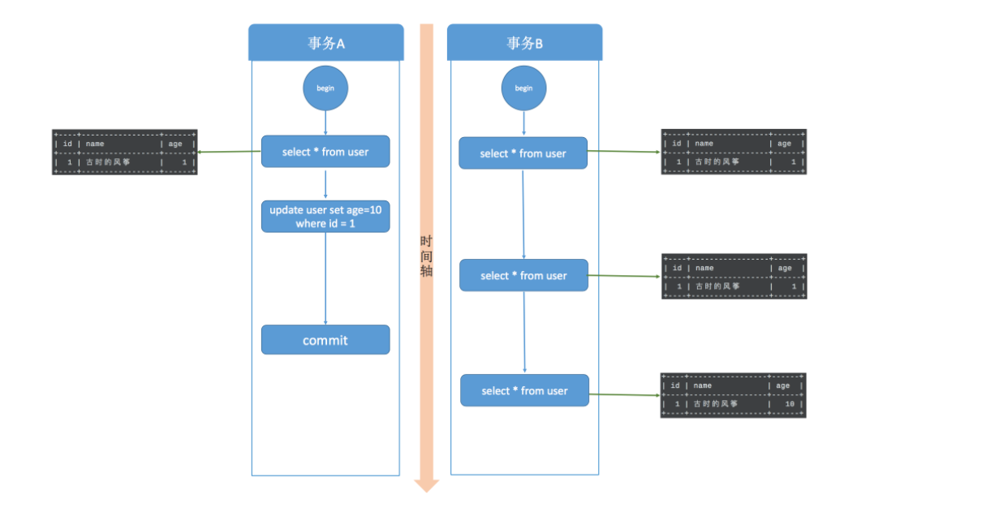
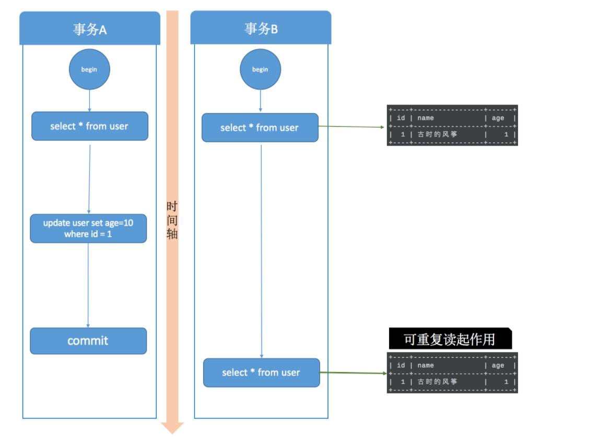
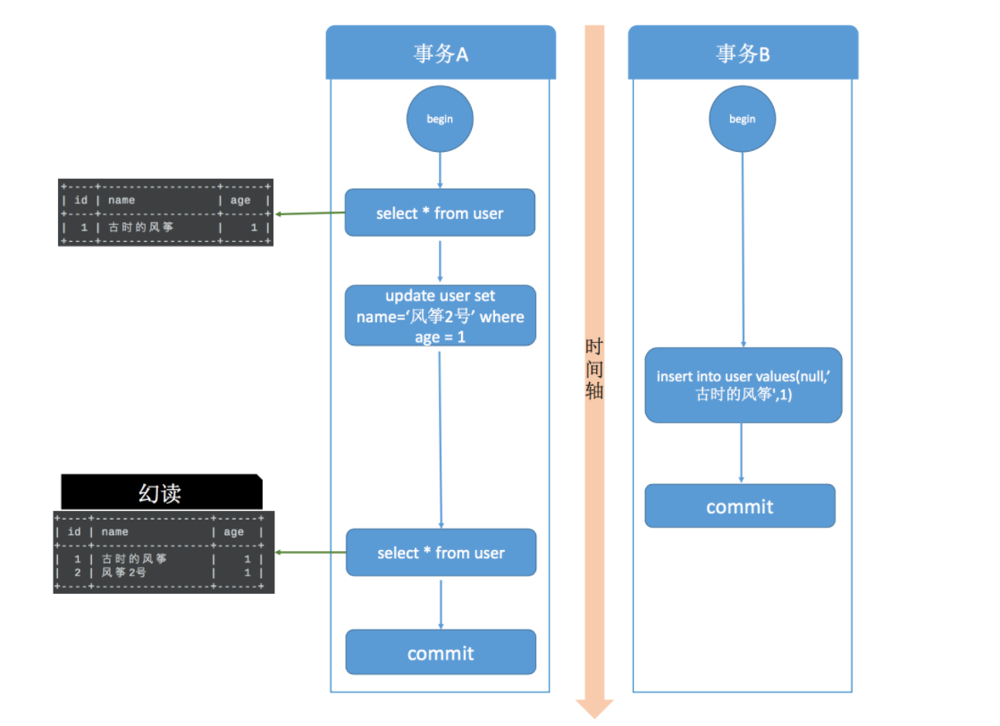
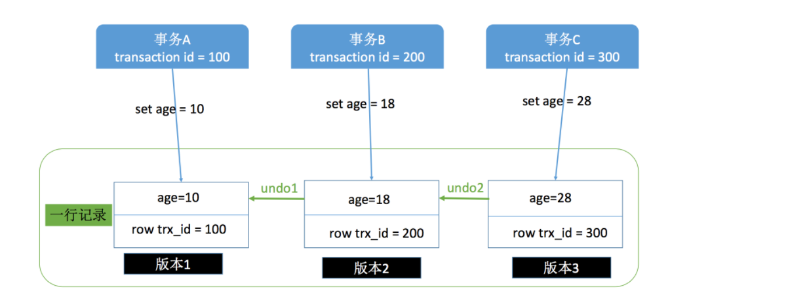
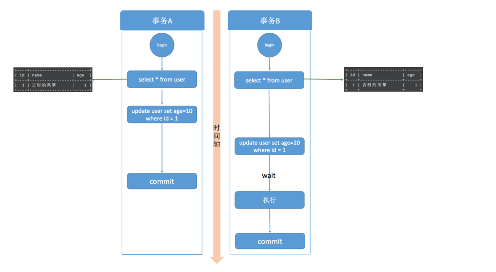
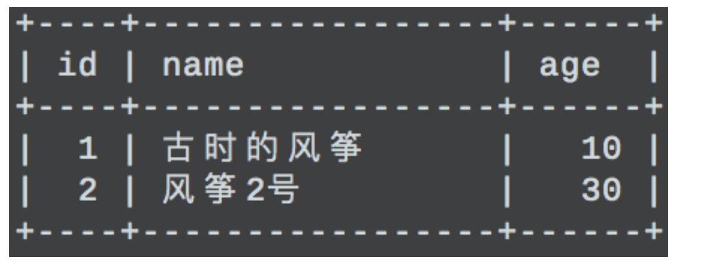
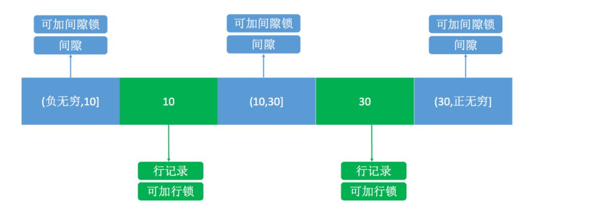
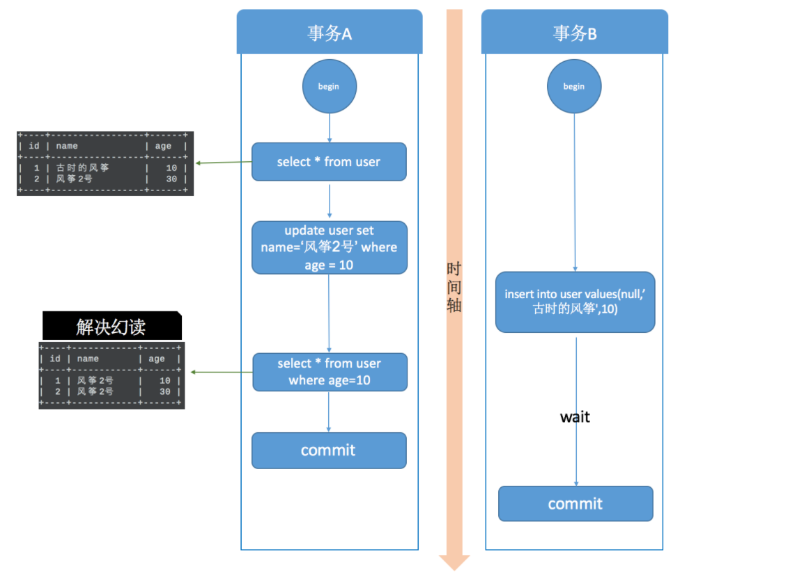

### MySQL 事务

本文所说的 MySQL 事务都是指在 InnoDB 引擎下，MyISAM 引擎是不支持事务的。

数据库事务指的是一组数据操作，事务内的操作要么就是全部成功，要么就是全部失败，什么都不做，其实不是没做，是可能做了一部分但是只要有一步失败，就要回滚所有操作，有点一不做二不休的意思。

假设一个网购付款的操作，用户付款后要涉及到订单状态更新、扣库存以及其他一系列动作，这就是一个事务，如果一切正常那就相安无事，一旦中间有某个环节异常，那整个事务就要回滚，总不能更新了订单状态但是不扣库存吧，这问题就大了。

事务具有原子性（Atomicity）、一致性（Consistency）、隔离性（Isolation）、持久性（Durability）四个特性，简称 ACID，缺一不可。今天要说的就是隔离性。


#### 概念说明

>脏读
>   - 脏读指的是读到了其他事务未提交的数据，未提交意味着这些数据可能会回滚，也就是可能最终不会存到数据库中，也就是不存在的数据。读到了并一定最终存在的数据，这就是脏读。

>可重复读
>   - 可重复读指的是在一个事务内，最开始读到的数据和事务结束前的任意时刻读到的同一批数据都是一致的。通常针对数据更新（UPDATE）操作。

>不可重复读
>   - 对比可重复读，不可重复读指的是在同一事务内，不同的时刻读到的同一批数据可能是不一样的，可能会受到其他事务的影响，比如其他事务改了这批数据并提交了。通常针对数据更新（UPDATE）操作。

>幻读
>   - 幻读是针对数据插入（INSERT）操作来说的。假设事务A对某些行的内容作了更改，但是还未提交，此时事务B插入了与事务A更改前的记录相同的记录行，并且在事务A提交之前先提交了，而这时，在事务A中查询，会发现好像刚刚的更改对于某些数据未起作用，但其实是事务B刚插入进来的，让用户感觉很魔幻，感觉出现了幻觉，这就叫幻读。


SQL 标准定义了四种隔离级别，MySQL 全都支持。这四种隔离级别分别是：

    读未提交（READ UNCOMMITTED）

    读提交 （READ COMMITTED）

    可重复读 （REPEATABLE READ）

    串行化 （SERIALIZABLE）


从上往下，隔离强度逐渐增强，性能逐渐变差。采用哪种隔离级别要根据系统需求权衡决定，其中，可重复读是 MySQL 的默认级别。

事务隔离其实就是为了解决上面提到的脏读、不可重复读、幻读这几个问题，下面展示了 4 种隔离级别对这三个问题的解决程度。


隔离级别|	脏读|	不可重复读|	幻读
----|----|----|----
读未提交|	可能|	可能|	可能
读提交	|不可能|	可能	|可能
可重复读|	不可能|	不可能|	可能
串行化|	不可能	|不可能|	不可能


#### 如何设置隔离级别

我们可以通过以下语句查看当前数据库的隔离级别，通过下面语句可以看出我使用的 MySQL 的隔离级别是 REPEATABLE-READ，也就是可重复读，这也是 MySQL 的默认级别。

```
# 查看事务隔离级别 5.7.20 之后
show variables like 'transaction_isolation';
SELECT @@transaction_isolation

# 5.7.20 之后
SELECT @@tx_isolation
show variables like 'tx_isolation'

+---------------+-----------------+
| Variable_name | Value           |
+---------------+-----------------+
| tx_isolation  | REPEATABLE-READ |
+---------------+-----------------+
```


稍后，我们要修改数据库的隔离级别，所以先了解一下具体的修改方式。

修改隔离级别的语句是：set [作用域] transaction isolation level [事务隔离级别]，
SET [SESSION | GLOBAL] TRANSACTION ISOLATION LEVEL {READ UNCOMMITTED | READ COMMITTED | REPEATABLE READ | SERIALIZABLE}。

其中作用于可以是 SESSION 或者 GLOBAL，GLOBAL 是全局的，而 SESSION 只针对当前回话窗口。隔离级别是 {READ UNCOMMITTED | READ COMMITTED | REPEATABLE READ | SERIALIZABLE} 这四种，不区分大小写。

比如下面这个语句的意思是设置全局隔离级别为读提交级别。

``
mysql> set global transaction isolation level read committed; 
``

#### MySQL 中执行事务

事务的执行过程如下，以 begin 或者 start transaction 开始，然后执行一系列操作，最后要执行 commit 操作，事务才算结束。当然，如果进行回滚操作(rollback)，事务也会结束。


需要注意的是，begin 命令并不代表事务的开始，事务开始于 begin 命令之后的第一条语句执行的时候。例如下面示例中，select * from xxx 才是事务的开始，

```
begin;
select * from xxx; 
commit; -- 或者 rollback;
```

另外，通过以下语句可以查询当前有多少事务正在运行。

    select * from information_schema.innodb_trx;


好了，重点来了，开始分析这几个隔离级别了。

接下来我会用一张表来做一下验证，表结构简单如下：

    CREATE TABLE `user` (
      `id` int(11) NOT NULL AUTO_INCREMENT,
      `name` varchar(30) DEFAULT NULL,
      `age` tinyint(4) DEFAULT NULL,
      PRIMARY KEY (`id`)
    ) ENGINE=InnoDB AUTO_INCREMENT=2 DEFAULT CHARSET=utf8

初始只有一条记录：

    mysql> SELECT * FROM user;
    +----+-----------------+------+
    | id | name            | age  |
    +----+-----------------+------+
    |  1 | 古时的风筝        |    1 |
    +----+-----------------+------+

##### 读未提交

MySQL 事务隔离其实是依靠锁来实现的，加锁自然会带来性能的损失。而读未提交隔离级别是不加锁的，所以它的性能是最好的，没有加锁、解锁带来的性能开销。但有利就有弊，这基本上就相当于裸奔啊，所以它连脏读的问题都没办法解决。

任何事务对数据的修改都会第一时间暴露给其他事务，即使事务还没有提交。

下面来做个简单实验验证一下，首先设置全局隔离级别为读未提交。

    set global transaction isolation level read uncommitted;


设置完成后，只对之后新起的 session 才起作用，对已经启动 session 无效。如果用 shell 客户端那就要重新连接 MySQL，如果用 Navicat 那就要创建新的查询窗口。

启动两个事务，分别为事务A和事务B，在事务A中使用 update 语句，修改 age 的值为10，初始是1 ，在执行完 update 语句之后，在事务B中查询 user 表，会看到 age 的值已经是 10 了，这时候事务A还没有提交，而此时事务B有可能拿着已经修改过的 age=10 去进行其他操作了。在事务B进行操作的过程中，很有可能事务A由于某些原因，进行了事务回滚操作，那其实事务B得到的就是脏数据了，拿着脏数据去进行其他的计算，那结果肯定也是有问题的。

顺着时间轴往表示两事务中操作的执行顺序，重点看图中 age 字段的值。



读未提交，其实就是可以读到其他事务未提交的数据，但没有办法保证你读到的数据最终一定是提交后的数据，如果中间发生回滚，那就会出现脏数据问题，读未提交没办法解决脏数据问题。更别提可重复读和幻读了，想都不要想。


##### 读提交

既然读未提交没办法解决脏数据问题，那么就有了读提交。读提交就是一个事务只能读到其他事务已经提交过的数据，也就是其他事务调用 commit 命令之后的数据。那脏数据问题迎刃而解了。

读提交事务隔离级别是大多数流行数据库的默认事务隔离界别，比如 Oracle，但是不是 MySQL 的默认隔离界别。

我们继续来做一下验证，首先把事务隔离级别改为读提交级别。

    set global transaction isolation level read committed;

之后需要重新打开新的 session 窗口，也就是新的 shell 窗口才可以。

同样开启事务A和事务B两个事务，在事务A中使用 update 语句将 id=1 的记录行 age 字段改为 10。此时，在事务B中使用 select 语句进行查询，我们发现在事务A提交之前，事务B中查询到的记录 age 一直是1，直到事务A提交，此时在事务B中 select 查询，发现 age 的值已经是 10 了。

这就出现了一个问题，在同一事务中(本例中的事务B)，事务的不同时刻同样的查询条件，查询出来的记录内容是不一样的，事务A的提交影响了事务B的查询结果，这就是不可重复读，也就是读提交隔离级别。



每个 select 语句都有自己的一份快照，而不是一个事务一份，所以在不同的时刻，查询出来的数据可能是不一致的。

读提交解决了脏读的问题，但是无法做到可重复读，也没办法解决幻读。

##### 可重复读

可重复是对比不可重复而言的，上面说不可重复读是指同一事物不同时刻读到的数据值可能不一致。而可重复读是指，事务不会读到其他事务对已有数据的修改，及时其他事务已提交，也就是说，事务开始时读到的已有数据是什么，在事务提交前的任意时刻，这些数据的值都是一样的。但是，对于其他事务新插入的数据是可以读到的，这也就引发了幻读问题。

同样的，需改全局隔离级别为可重复读级别。

    set global transaction isolation level repeatable read;

在这个隔离级别下，启动两个事务，两个事务同时开启。

首先看一下可重复读的效果，事务A启动后修改了数据，并且在事务B之前提交，事务B在事务开始和事务A提交之后两个时间节点都读取的数据相同，已经可以看出可重复读的效果。


可重复读做到了，这只是针对已有行的更改操作有效，但是对于新插入的行记录，就没这么幸运了，幻读就这么产生了。我们看一下这个过程：

事务A开始后，执行 update 操作，将 age = 1 的记录的 name 改为“风筝2号”；

事务B开始后，在事务执行完 update 后，执行 insert 操作，插入记录 age =1，name = 古时的风筝，这和事务A修改的那条记录值相同，然后提交。

事务B提交后，事务A中执行 select，查询 age=1 的数据，这时，会发现多了一行，并且发现还有一条 name = 古时的风筝，age = 1 的记录，这其实就是事务B刚刚插入的，这就是幻读。


要说明的是，当你在 MySQL 中测试幻读的时候，并不会出现上图的结果，幻读并没有发生，MySQL 的可重复读隔离级别其实解决了幻读问题，这会在后面的内容说明

##### 串行化

>串行化是4种事务隔离级别中隔离效果最好的，解决了脏读、可重复读、幻读的问题，但是效果最差，它将事务的执行变为顺序执行，与其他三个隔离级别相比，它就相当于单线程，后一个事务的执行必须等待前一个事务结束。

### MySQL 中是如何实现事务隔离的

首先说读未提交，它是性能最好，也可以说它是最野蛮的方式，因为它压根儿就不加锁，所以根本谈不上什么隔离效果，可以理解为没有隔离。

再来说串行化。读的时候加共享锁，也就是其他事务可以并发读，但是不能写。写的时候加排它锁，其他事务不能并发写也不能并发读。

最后说读提交和可重复读。这两种隔离级别是比较复杂的，既要允许一定的并发，又想要兼顾的解决问题。

**实现可重复读**

为了解决不可重复读，或者为了实现可重复读，MySQL 采用了 MVVC (多版本并发控制) 的方式。

我们在数据库表中看到的一行记录可能实际上有多个版本，每个版本的记录除了有数据本身外，还要有一个表示版本的字段，记为 row trx_id，而这个字段就是使其产生的事务的 id，事务 ID 记为 transaction id，它在事务开始的时候向事务系统申请，按时间先后顺序递增。


按照上面这张图理解，一行记录现在有 3 个版本，每一个版本都记录这使其产生的事务 ID，比如事务A的transaction id 是100，那么版本1的row trx_id 就是 100，同理版本2和版本3。

在上面介绍读提交和可重复读的时候都提到了一个词，叫做快照，学名叫做一致性视图，这也是可重复读和不可重复读的关键，可重复读是在事务开始的时候生成一个当前事务全局性的快照，而读提交则是每次执行语句的时候都重新生成一次快照。

对于一个快照来说，它能够读到那些版本数据，要遵循以下规则：

- 当前事务内的更新，可以读到；
- 版本未提交，不能读到；
- 版本已提交，但是却在快照创建后提交的，不能读到；
- 版本已提交，且是在快照创建前提交的，可以读到；

利用上面的规则，再返回去套用到读提交和可重复读的那两张图上就很清晰了。还是要强调，两者主要的区别就是在快照的创建上，可重复读仅在事务开始是创建一次，而读提交每次执行语句的时候都要重新创建一次。


**并发写问题**

存在这的情况，两个事务，对同一条数据做修改。最后结果应该是哪个事务的结果呢，肯定要是时间靠后的那个对不对。并且更新之前要先读数据，这里所说的读和上面说到的读不一样，更新之前的读叫做“当前读”，总是当前版本的数据，也就是多版本中最新一次提交的那版。

假设事务A执行 update 操作， update 的时候要对所修改的行加行锁，这个行锁会在提交之后才释放。而在事务A提交之前，事务B也想 update 这行数据，于是申请行锁，但是由于已经被事务A占有，事务B是申请不到的，此时，事务B就会一直处于等待状态，直到事务A提交，事务B才能继续执行，如果事务A的时间太长，那么事务B很有可能出现超时异常。如下图所示。


加锁的过程要分有索引和无索引两种情况，比如下面这条语句

    update user set age=11 where id = 1
id 是这张表的主键，是有索引的情况，那么 MySQL 直接就在索引数中找到了这行数据，然后干净利落的加上行锁就可以了。

而下面这条语句

    update user set age=11 where age=10
表中并没有为 age 字段设置索引，所以， MySQL 无法直接定位到这行数据。那怎么办呢，当然也不是加表锁了。MySQL 会为这张表中所有行加行锁，没错，是所有行。但是呢，在加上行锁后，MySQL 会进行一遍过滤，发现不满足的行就释放锁，最终只留下符合条件的行。虽然最终只为符合条件的行加了锁，但是这一锁一释放的过程对性能也是影响极大的。所以，如果是大表的话，建议合理设计索引，如果真的出现这种情况，那很难保证并发度。


**解决幻读**

上面介绍可重复读的时候，那张图里标示着出现幻读的地方实际上在 MySQL 中并不会出现，MySQL 已经在可重复读隔离级别下解决了幻读的问题。

前面刚说了并发写问题的解决方式就是行锁，而解决幻读用的也是锁，叫做间隙锁，MySQL 把行锁和间隙锁合并在一起，解决了并发写和幻读的问题，这个锁叫做 Next-Key锁。

假设现在表中有两条记录，并且 age 字段已经添加了索引，两条记录 age 的值分别为 10 和 30。


此时，在数据库中会为索引维护一套B+树，用来快速定位行记录。B+索引树是有序的，所以会把这张表的索引分割成几个区间。


如图所示，分成了3 个区间，(负无穷,10]、(10,30]、(30,正无穷]，在这3个区间是可以加间隙锁的。

之后，我用下面的两个事务演示一下加锁过程。


在事务A提交之前，事务B的插入操作只能等待，这就是间隙锁起得作用。当事务A执行
`update user set name='风筝2号’ where age = 10; `
的时候，由于条件 where age = 10 ，数据库不仅在 age =10 的行上添加了行锁，而且在这条记录的两边，也就是(负无穷,10]、(10,30]这两个区间加了间隙锁，从而导致事务B插入操作无法完成，只能等待事务A提交。不仅插入 age = 10 的记录需要等待事务A提交，age<10、10<age<30 的记录页无法完成，而大于等于30的记录则不受影响，这足以解决幻读问题了。

这是有索引的情况，如果 age 不是索引列，那么数据库会为整个表加上间隙锁。所以，如果是没有索引的话，不管 age 是否大于等于30，都要等待事务A提交才可以成功插入。


**总结**

MySQL 的 InnoDB 引擎才支持事务，其中可重复读是默认的隔离级别。

读未提交和串行化基本上是不需要考虑的隔离级别，前者不加锁限制，后者相当于单线程执行，效率太差。

读提交解决了脏读问题，行锁解决了并发更新的问题。并且 MySQL 在可重复读级别解决了幻读问题，是通过行锁和间隙锁的组合 Next-Key 锁实现的。

>PS:参考：https://www.cnblogs.com/fengzheng/p/12557762.html

