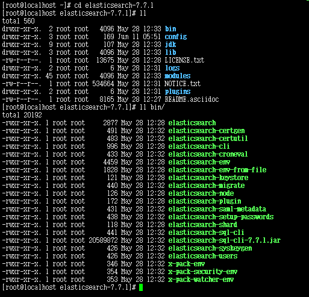

## elastic 7.x 安装教程

官方下载地址：https://www.elastic.co/cn/downloads/elasticsearch

### elastic之单机版，宿主机安装

> windows,centos,ubuntu 主机安装elastic单机版

- 下载编译后的执行程序压缩包

`根据系统类型下载对应的文件`

windows: https://artifacts.elastic.co/downloads/elasticsearch/elasticsearch-7.7.1-windows-x86_64.zip


- 以window解压目录为例


`bin` 目录为elastic启动脚本
`config` elastic配置文件
`jdk` 内置的jdk14, elastic7.x依赖jdk11+
...

- 启动elastic服务

>注意! **修改/bin/elasticsearch-env.bat**
如果使用者的系统安装jdk是1.8版本，环境变量JAVA_HOME也配置了。则可以修改该脚本，告诉服务使用自带的jdk14,

```cmd
# 将这里的if defined后面的JAVA_HOME改一下名称。就会使用默认自带的jdk14
if defined JAVA_HOME (
  set JAVA="%JAVA_HOME%\bin\java.exe"
  set JAVA_TYPE=JAVA_HOME
) else (
  set JAVA="%ES_HOME%\jdk\bin\java.exe"
  set JAVA_HOME="%ES_HOME%\jdk"
  set JAVA_TYPE=bundled jdk
)

```

`如果本身系统安装的jdk版本≥11，可以忽略上述步骤。`

- 启动成功后，验证服务是否正常

```cmd
curl http://localhost:9200 -XGET
# 返回版本信息，则服务启动正常
```

#### linux版本安装

##### 官方文件形式安装启动

下载可执行文件压缩包

linux: https://artifacts.elastic.co/downloads/elasticsearch/elasticsearch-7.7.1-linux-x86_64.tar.gz

```cmd
# 下载
curl -o elasticsearch-7.7.1-linux-x86_64.tar.gz  https://artifacts.elastic.co/downloads/elasticsearch/elasticsearch-7.7.1-linux-x86_64.tar.gz

# 解压文件
tar -zxvf elasticsearch-7.7.1-linux-x86_64.tar.gz
```

目录如图所示：




添加新用户：

```cmd
adduser elastic

passwd elastic
#密码为 elastic123

# 为elastic用户赋予该目录的执行权限
chown -R elastic ./elasticsearch-7.7.1
```

切换到elastic用户，执行命令启动

```cmd
su elastic
./bin/elasticsearch
```

启动后，验证是否正常

```cmd
curl http://localhost:9200

{
  "name" : "localhost.localdomain",
  "cluster_name" : "elasticsearch",
  "cluster_uuid" : "2HgmxgKWR0Kp6l6pcz_mog",
  "version" : {
    "number" : "7.7.1",
    "build_flavor" : "default",
    "build_type" : "tar",
    "build_hash" : "ad56dce891c901a492bb1ee393f12dfff473a423",
    "build_date" : "2020-05-28T16:30:01.040088Z",
    "build_snapshot" : false,
    "lucene_version" : "8.5.1",
    "minimum_wire_compatibility_version" : "6.8.0",
    "minimum_index_compatibility_version" : "6.0.0-beta1"
  },
  "tagline" : "You Know, for Search"
}

```

##### yum 安装elastic

- 添加源

```cmd
vi /etc/yum.repos.d/elastic.repo

# 输入一下内容
[elasticsearch]
name=Elasticsearch repository for 7.x packages
baseurl=https://artifacts.elastic.co/packages/7.x/yum
gpgcheck=1
gpgkey=https://artifacts.elastic.co/GPG-KEY-elasticsearch
enabled=0
autorefresh=1
type=rpm-md

#保存

yum install --enablerepo=elasticsearch elasticsearch

```


### elastic docker 安装

- 拉取镜像

```cmd
docker pull docker.elastic.co/elasticsearch/elasticsearch:7.7.1
```

- 更改系统配置

```cmd
vim /etc/sysctl.conf

# 更改以下属性
vm.max_map_count=655350

#保存并执行
sysctl -p
```
```cmd
mkdir -p /usr/elastic/data
chmod 777 -R /usr/elastic/data

```

#### 启动单个节点的elastic服务

```cmd

docker run -itd --name elasticsearch -p 9200:9200 -p 9300:9300 \
-v /usr/elastic/data:/usr/share/elasticsearch/data \
-e "discovery.type=single-node" docker.elastic.co/elasticsearch/elasticsearch:7.7.1
```

验证服务是否正常

```cmd
curl http://localhost:9200
{
  "name" : "3de4863adc48",
  "cluster_name" : "docker-cluster",
  "cluster_uuid" : "FB4aqyWuSnaSeb_gizUveA",
  "version" : {
    "number" : "7.7.1",
    "build_flavor" : "default",
    "build_type" : "docker",
    "build_hash" : "ad56dce891c901a492bb1ee393f12dfff473a423",
    "build_date" : "2020-05-28T16:30:01.040088Z",
    "build_snapshot" : false,
    "lucene_version" : "8.5.1",
    "minimum_wire_compatibility_version" : "6.8.0",
    "minimum_index_compatibility_version" : "6.0.0-beta1"
  },
  "tagline" : "You Know, for Search"
}

```

#### 通过docker-compose集群elastic

- 编写yml文件
```cmd
touch docker-compose.yml
vi docker-compose.yml
```

```yaml
version: '3'
services:
  es01:
    image: docker.elastic.co/elasticsearch/elasticsearch:7.7.1
    container_name: es01
    environment:
      - node.name=es01
      - cluster.name=es-docker-cluster
      - discovery.seed_hosts=es02,es03
      - cluster.initial_master_nodes=es01,es02,es03
      - bootstrap.memory_lock=true
      - "ES_JAVA_OPTS=-Xms512m -Xmx512m"
    ulimits:
      memlock:
        soft: -1
        hard: -1
    volumes:
      - data01:/usr/share/elasticsearch/data
    ports:
      - 9200:9200
    networks:
      - elastic
  es02:
    image: docker.elastic.co/elasticsearch/elasticsearch:7.7.1
    container_name: es02
    environment:
      - node.name=es02
      - cluster.name=es-docker-cluster
      - discovery.seed_hosts=es01,es03
      - cluster.initial_master_nodes=es01,es02,es03
      - bootstrap.memory_lock=true
      - "ES_JAVA_OPTS=-Xms512m -Xmx512m"
    ulimits:
      memlock:
        soft: -1
        hard: -1
    volumes:
      - data02:/usr/share/elasticsearch/data
    networks:
      - elastic
  es03:
    image: docker.elastic.co/elasticsearch/elasticsearch:7.7.1
    container_name: es03
    environment:
      - node.name=es03
      - cluster.name=es-docker-cluster
      - discovery.seed_hosts=es01,es02
      - cluster.initial_master_nodes=es01,es02,es03
      - bootstrap.memory_lock=true
      - "ES_JAVA_OPTS=-Xms512m -Xmx512m"
    ulimits:
      memlock:
        soft: -1
        hard: -1
    volumes:
      - data03:/usr/share/elasticsearch/data
    networks:
      - elastic

volumes:
  data01:
    driver: local
  data02:
    driver: local
  data03:
    driver: local

networks:
  elastic:
    driver: bridge
```

- 更改系统属性

```cmd
sysctl -w vm.max_map_count=262144
```


- 启动服务，查看详细

```cmd
# 启动服务
docker-compose up -d
Starting es03 ... done
Starting es01 ... done
Starting es02 ... done

# 查看容器启动情况
docker ps -a | grep Up

CONTAINER ID        IMAGE                                                 COMMAND                  CREATED             STATUS              PORTS                              NAMES
f73d63201fe0        docker.elastic.co/elasticsearch/elasticsearch:7.7.1   "/tini -- /usr/local…"   5 minutes ago       Up 4 seconds        0.0.0.0:9200->9200/tcp, 9300/tcp   es01
d64c7d8a78fa        docker.elastic.co/elasticsearch/elasticsearch:7.7.1   "/tini -- /usr/local…"   5 minutes ago       Up 4 seconds        9200/tcp, 9300/tcp                 es03
4567c17f59f1        docker.elastic.co/elasticsearch/elasticsearch:7.7.1   "/tini -- /usr/local…"   5 minutes ago       Up 4 seconds        9200/tcp, 9300/tcp                 es02

# 验证集群服务是否正常

curl -X GET "localhost:9200/_cat/nodes?v&pretty"
ip         heap.percent ram.percent cpu load_1m load_5m load_15m node.role master name
172.18.0.4           64          66   8    0.56    0.95     0.48 dilmrt    -      es03
172.18.0.2           49          66   9    0.56    0.95     0.48 dilmrt    *      es01
172.18.0.3           61          66   9    0.56    0.95     0.48 dilmrt    -      es02
```

