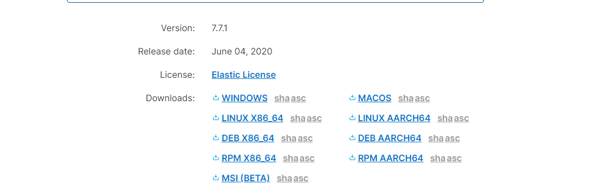

## elastic 7.x 安装教程

官方下载地址：https://www.elastic.co/cn/downloads/elasticsearch

### elastic之单机版，宿主机安装

> windows,centos,ubuntu 主机安装elastic单机版

- 下载编译后的执行程序压缩包

`根据系统类型下载对应的文件`

windows: https://artifacts.elastic.co/downloads/elasticsearch/elasticsearch-7.7.1-windows-x86_64.zip





- 以window解压目录为例


`bin` 目录为elastic启动脚本
`config` elastic配置文件
`jdk` 内置的jdk14, elastic7.x依赖jdk11+
...

- 启动elastic服务

>注意! **修改/bin/elasticsearch-env.bat**
如果使用者的系统安装jdk是1.8版本，环境变量JAVA_HOME也配置了。则可以修改该脚本，告诉服务使用自带的jdk14,

```cmd
# 将这里的if defined后面的JAVA_HOME改一下名称。就会使用默认自带的jdk14
if defined JAVA_HOME (
  set JAVA="%JAVA_HOME%\bin\java.exe"
  set JAVA_TYPE=JAVA_HOME
) else (
  set JAVA="%ES_HOME%\jdk\bin\java.exe"
  set JAVA_HOME="%ES_HOME%\jdk"
  set JAVA_TYPE=bundled jdk
)

```

`如果本身系统安装的jdk版本≥11，可以忽略上述步骤。`

- 启动成功后，验证服务是否正常

```cmd
curl http://localhost:9200 -XGET
# 返回版本信息，则服务启动正常
```

- linux版本安装

下载可执行文件压缩包

linux: https://artifacts.elastic.co/downloads/elasticsearch/elasticsearch-7.7.1-linux-x86_64.tar.gz

```cmd
# 下载


```