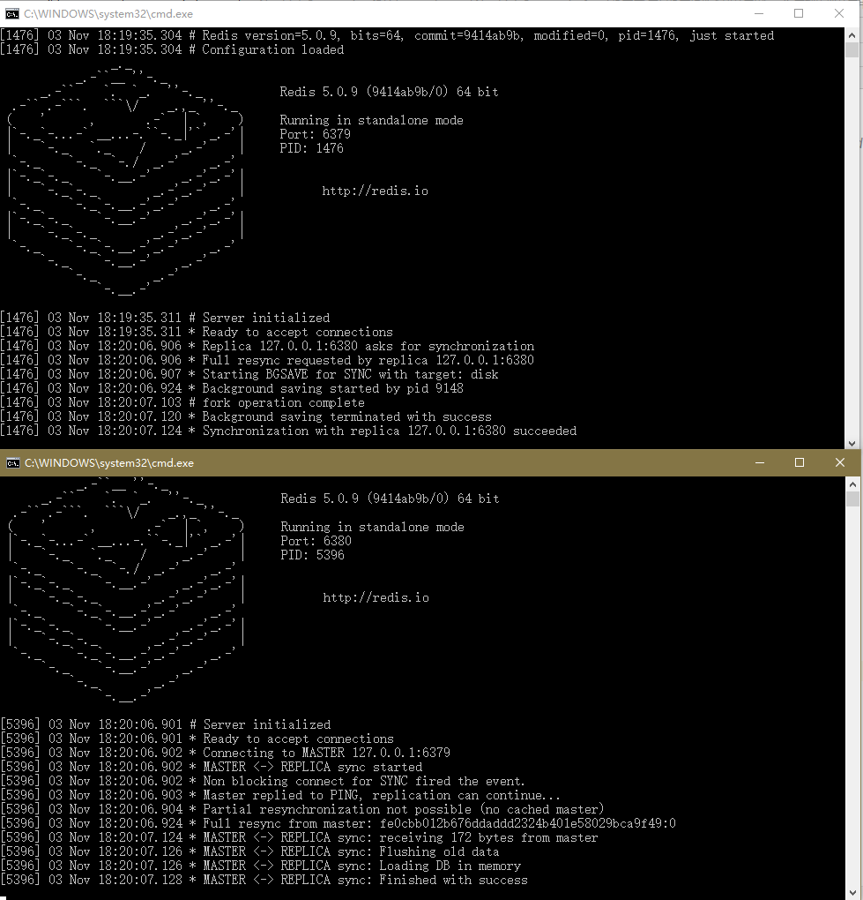

### redis配置详解


### redis 单机版安装

#### window安装

[redis 3.x版本下载](https://github.com/microsoftarchive/redis/releases/download/win-3.2.100/Redis-x64-3.2.100.zip)

[redis 5.x以后下载](https://github.com/tporadowski/redis/releases)

解压后，修改redis.conf

#### centos安装

命令：
```
wget http://download.redis.io/releases/redis-5.0.7.tar.gz
tar xzf redis-5.0.7.tar.gz
cd redis-5.0.7
make
```
复制

```cmd
cp src/redis-server /usr/local/redis/redis-server
cp src/redis-cli /usr/local/redis/redis-cli
cp redis.conf /usr/local/redis/redis.conf
```

启动
```
./redis-server redis.conf
```

#### docker 安装

[redis hub页面](https://hub.docker.com/_/redis/)

下载镜像

```
docker pull redis:lastest
docker pull redis:5.0.7
```

自定义redis.conf

```dockerfile
FROM redis:lastest
COPY redis.conf /usr/local/etc/redis/redis.conf
CMD ["redis-server","/usr/local/etc/redis/redis.conf"]
```

或者在启动一个redis服务时，指定conf文件：

``docker run -itd -v /myredis/conf/redis.conf:/usr/local/etc/redis/redis.conf --name myredis redis redis-server /usr/local/etc/redis/redis.conf``


### redis高可用方案

> PS:参考 https://www.jianshu.com/p/c2abf726acc7


#### 一主一从

主redis配置：
```conf
# bind，可以绑定多个ip地址
bind 127.0.0.1 
port 6379
requirepass 123456
```

从redis配置：
```
bind 127.0.0.1 
port 6380
slaveof 127.0.0.1 6379
masterauth 123456
```

启动成功：




##### spring-boot redis连接代码示例

核心测试代码：


#### 一主多从


#### redis集群


#### redis 哨兵模式