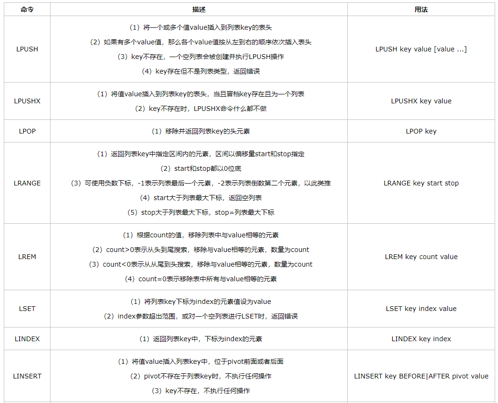

### redis的六大数据类型详细用法

#### string 数据类型
string 是Redis的最基本的数据类型，可以理解为与 Memcached 一模一样的类型，一个key 对应一个 value。string 类型是二进制安全的，意思是 Redis 的 string 可以包含任何数据，比如图片或者序列化的对象，一个 redis 中字符串 value 最多可以是 512M。

string 数据类型在 Redis 中的相关命令：

①、上面的 ttl 命令是返回 key 的剩余过期时间，单位为秒。

　　②、mset和mget这种批量处理命令，能够极大的提高操作效率。因为一次命令执行所需要的时间=1次网络传输时间+1次命令执行时间，n个命令耗时=n次网络传输时间+n次命令执行时间，而批量处理命令会将n次网络时间缩减为1次网络时间，也就是1次网络传输时间+n次命令处理时间。

　　但是需要注意的是，Redis是单线程的，如果一次批量处理命令过多，会造成Redis阻塞或网络拥塞（传输数据量大）。

　　③、setnx可以用于实现分布式锁，具体实现方式后面会介绍。

上面是 string 类型的基本命令，下面介绍几个自增自减操作，这在实际工作中还是特别有用的（分布式环境中统计系统的在线人数，利用Redis的高性能读写，在Redis中完成秒杀，而不是直接操作数据库。）。

②、典型使用场景

　　一、计数

　　由于Redis单线程的特点，我们不用考虑并发造成计数不准的问题，通过 incrby 命令，我们可以正确的得到我们想要的结果。

　　二、限制次数

　　比如登录次数校验，错误超过三次5分钟内就不让登录了，每次登录设置key自增一次，并设置该key的过期时间为5分钟后，每次登录检查一下该key的值来进行限制登录。

#### hash 数据类型

hash 是一个键值对集合，是一个 string 类型的 key和 value 的映射表，key 还是key，但是value是一个键值对（key-value）。类比于 Java里面的 Map<String,Map<String,Object>> 集合。

#### list 数据类型

list 列表，它是简单的字符串列表，按照插入顺序排序，你可以添加一个元素到列表的头部（左边）或者尾部（右边），它的底层实际上是个链表。

　　列表有两个特点：

　　一、有序

　　二、可以重复

　　这两个特点要注意和后面介绍的集合和有序集合相对比。

②、典型使用场景

 　　一、栈

　　通过命令 lpush+lpop

　　二、队列

　　命令 lpush+rpop

　　三、有限集合

　　命令 lpush+ltrim

　　四、消息队列

　　命令 lpush+brpop

#### set 数据类型

Redis 的 set 是 string 类型的无序集合。

　　相对于列表，集合也有两个特点：

　　一、无序

　　二、不可重复

②、典型使用场景

　　利用集合的交并集特性，比如在社交领域，我们可以很方便的求出多个用户的共同好友，共同感兴趣的领域等。

#### zset 数据类型

zset（sorted set 有序集合），和上面的set 数据类型一样，也是 string 类型元素的集合，但是它是有序的。

②、典型使用场景

　　和set数据结构一样，zset也可以用于社交领域的相关业务，并且还可以利用zset 的有序特性，还可以做类似排行榜的业务。

#### Redis5.0新数据结构-stream

Redis的作者在Redis5.0中，放出一个新的数据结构，Stream。Redis Stream 的内部，其实也是一个队列，每一个不同的key，对应的是不同的队列，每个队列的元素，也就是消息，都有一个msgid，并且需要保证msgid是严格递增的。在Stream当中，消息是默认持久化的，即便是Redis重启，也能够读取到消息。那么，stream是如何做到多播的呢？其实非常的简单，与其他队列系统相似，Redis对不同的消费者，也有消费者Group这样的概念，不同的消费组，可以消费同一个消息，对于不同的消费组，都维护一个Idx下标，表示这一个消费群组消费到了哪里，每次进行消费，都会更新一下这个下标，往后面一位进行偏移。

>PS: https://www.cnblogs.com/ysocean/p/9080940.html

