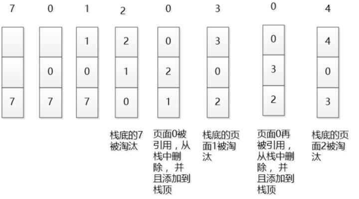
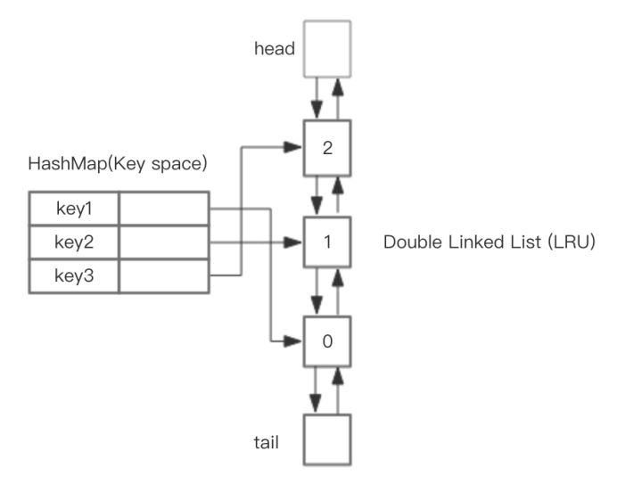
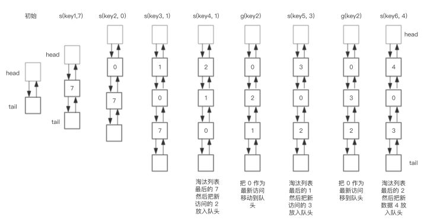

### LRU算法和Redis的LRU实现

#### LRU原理

在一般标准的操作系统教材里，会用下面的方式来演示 LRU 原理，假设内存只能容纳3个页大小，按照 7 0 1 2 0 3 0 4 的次序访问页。假设内存按照栈的方式来描述访问时间，在上面的，是最近访问的，在下面的是，最远时间访问的，LRU就是这样工作的。



但是如果让我们自己设计一个基于 LRU 的缓存，这样设计可能问题很多，这段内存按照访问时间进行了排序，会有大量的内存拷贝操作，所以性能肯定是不能接受的。

那么如何设计一个LRU缓存，使得放入和移除都是 O(1) 的，我们需要把访问次序维护起来，但是不能通过内存中的真实排序来反应，有一种方案就是使用双向链表。

#### 实现LRU

1.用一个数组来存储数据，给每一个数据项标记一个访问时间戳，每次插入新数据项的时候，先把数组中存在的数据项的时间戳自增，并将新数据项的时间戳置为0并插入到数组中。每次访问数组中的数据项的时候，将被访问的数据项的时间戳置为0。当数组空间已满时，将时间戳最大的数据项淘汰。

2.利用一个链表来实现，每次新插入数据的时候将新数据插到链表的头部；每次缓存命中（即数据被访问），则将数据移到链表头部；那么当链表满的时候，就将链表尾部的数据丢弃。

3.利用链表和hashmap。当需要插入新的数据项的时候，如果新数据项在链表中存在（一般称为命中），则把该节点移到链表头部，如果不存在，则新建一个节点，放到链表头部，若缓存满了，则把链表最后一个节点删除即可。在访问数据的时候，如果数据项在链表中存在，则把该节点移到链表头部，否则返回-1。这样一来在链表尾部的节点就是最近最久未访问的数据项。

对于第一种方法，需要不停地维护数据项的访问时间戳，另外，在插入数据、删除数据以及访问数据时，时间复杂度都是O(n)。对于第二种方法，链表在定位数据的时候时间复杂度为O(n)。所以在一般使用第三种方式来是实现LRU算法。

#### 基于 java HashMap 和 双向链表实现 LRU 的

整体的设计思路是，可以使用 HashMap 存储 key，这样可以做到 save 和 get key的时间都是 O(1)，而 HashMap 的 Value 指向双向链表实现的 LRU 的 Node 节点，如图所示。



LRU 存储是基于双向链表实现的，下面的图演示了它的原理。其中 head 代表双向链表的表头，tail 代表尾部。首先预先设置 LRU 的容量，如果存储满了，可以通过 O(1) 的时间淘汰掉双向链表的尾部，每次新增和访问数据，都可以通过 O(1)的效率把新的节点增加到对头，或者把已经存在的节点移动到队头。

下面展示了，预设大小是 3 的，LRU存储的在存储和访问过程中的变化。为了简化图复杂度，图中没有展示 HashMap部分的变化，仅仅演示了上图 LRU 双向链表的变化。我们对这个LRU缓存的操作序列如下：

save("key1", 7)

save("key2", 0)

save("key3", 1)

save("key4", 2)

get("key2")

save("key5", 3)

get("key2")

save("key6", 4)

相应的 LRU 双向链表部分变化如下：



总结一下核心操作的步骤:

1. save(key, value)，首先在 HashMap 找到 Key 对应的节点，如果节点存在，更新节点的值，并把这个节点移动队头。如果不存在，需要构造新的节点，并且尝试把节点塞到队头，如果LRU空间不足，则通过 tail 淘汰掉队尾的节点，同时在 HashMap 中移除 Key。
2. get(key)，通过 HashMap 找到 LRU 链表节点，因为根据LRU 原理，这个节点是最新访问的，所以要把节点插入到队头，然后返回缓存的值。


Java 的代码参考如下:

```java
class DLinkedNode {
    String key;
    int value;
    DLinkedNode pre;
    DLinkedNode post;
}
public class LRUCache {
   
    private Hashtable<Integer, DLinkedNode>
            cache = new Hashtable<Integer, DLinkedNode>();
    private int count;
    private int capacity;
    private DLinkedNode head, tail;

    public LRUCache(int capacity) {
        this.count = 0;
        this.capacity = capacity;

        head = new DLinkedNode();
        head.pre = null;

        tail = new DLinkedNode();
        tail.post = null;

        head.post = tail;
        tail.pre = head;
    }

    public int get(String key) {

        DLinkedNode node = cache.get(key);
        if(node == null){
            return -1; // should raise exception here.
        }

        // move the accessed node to the head;
        this.moveToHead(node);

        return node.value;
    }


    public void set(String key, int value) {
        DLinkedNode node = cache.get(key);

        if(node == null){

            DLinkedNode newNode = new DLinkedNode();
            newNode.key = key;
            newNode.value = value;

            this.cache.put(key, newNode);
            this.addNode(newNode);

            ++count;

            if(count > capacity){
                // pop the tail
                DLinkedNode tail = this.popTail();
                this.cache.remove(tail.key);
                --count;
            }
        }else{
            // update the value.
            node.value = value;
            this.moveToHead(node);
        }
    }
    /**
     * Always add the new node right after head;
     */
    private void addNode(DLinkedNode node){
        node.pre = head;
        node.post = head.post;

        head.post.pre = node;
        head.post = node;
    }

    /**
     * Remove an existing node from the linked list.
     */
    private void removeNode(DLinkedNode node){
        DLinkedNode pre = node.pre;
        DLinkedNode post = node.post;

        pre.post = post;
        post.pre = pre;
    }

    /**
     * Move certain node in between to the head.
     */
    private void moveToHead(DLinkedNode node){
        this.removeNode(node);
        this.addNode(node);
    }

    // pop the current tail.
    private DLinkedNode popTail(){
        DLinkedNode res = tail.pre;
        this.removeNode(res);
        return res;
    }
}
```


继承LinkedHashMap的简单实现：

>LinkedHashMap底层就是用的HashMap加双链表实现的，而且本身已经实现了按照访问顺序的存储。此外，LinkedHashMap中本身就实现了一个方法removeEldestEntry用于判断是否需要移除最不常读取的数，方法默认是直接返回false，不会移除元素，所以需要重写该方法。即当缓存满后就移除最不常用的数。

```java
public class LRUCache<K, V> extends LinkedHashMap<K, V> {

    private final int CACHE_SIZE;

    // 这里就是传递进来最多能缓存多少数据
    public LRUCache(int cacheSize) {
        // 设置一个hashmap的初始大小，最后一个true指的是让linkedhashmap按照访问顺序来进行排序，最近访问的放在头，最老访问的就在尾
        super((int) Math.ceil(cacheSize / 0.75) + 1, 0.75f, true);
        CACHE_SIZE = cacheSize;
    }

    @Override
    protected boolean removeEldestEntry(Map.Entry eldest) {
        // 当map中的数据量大于指定的缓存个数的时候，就自动删除最老的数据
        return size() > CACHE_SIZE;
    }
}
```

### Redis的LRU实现原理

Redis作为高效率的cache系统, 在内存中实现数据缓存.在一些使用场景中,需要控制缓存的数据的内存消耗, 因此会自动淘汰(evict)一些缓存的数据.其实现机制一般可以基于数据的访问时间(LRU),也可以基于访问频率(LFU),或者二者的某种形式的结合.Redis的缓存淘汰机制既支持LRU也支持LFU, 本文档主要讨论Redis的LRU实现机制.

相比较其他具有LRU功能的系统, Redis的LRU实现机制的一个显著特点是:

    Redis系统的LRU算法在淘汰数据时, 使用的是一种近似算法,并不是严格的按照访问时间进行缓存数据的淘汰

##### LRU行为配置参数

Redis系统中与LRU功能相关的配置参数有三个:

    maxmemory. 该参数即为缓存数据占用的内存限制. 当缓存的数据消耗的内存超过这个数值限制时, 将触发数据淘汰. 该数据配置为0时,表示缓存的数据量没有限制, 即LRU功能不生效.
    maxmemory_policy. 淘汰策略. 定义参与淘汰的数据的类型和属性.
    maxmemory_samples. 随机采样的精度. 该数值配置越大, 越接近于真实的LRU算法,但是数值越大, 消耗的CPU计算时间越多,执行效率越低.

要在Redis系统中使用LRU功能, 只需配置maxmemory参数即可.maxmemory_policy参数和maxmemory_samples参数有默认的配置. 这两个参数将在下面的内容中具体讨论.

这三个配置参数既可以在conf文件中设置,Redis启动时,从该配置文件中读取设置, 也可以在运行过程中动态的设置.在动态设置时,使用CONFIG SET命令进行设置.

##### 淘汰策略

Redis缓存的数据可以有超时属性,也可以没有超时属性,所以,Redis在每个数据库结构中使用了两个不同的哈希表来管理缓存数据. Redis数据库结构的定义为(redis.h):

```
typedef struct redisDb {
    dict *dict;                 /* The keyspace for this DB */
    dict *expires;              /* Timeout of keys with a timeout set */
    dict *blocking_keys;        /* Keys with clients waiting for data (BLPOP) */
    dict *ready_keys;           /* Blocked keys that received a PUSH */
    dict *watched_keys;         /* WATCHED keys for MULTI/EXEC CAS */
    int id;
    long long avg_ttl;          /* Average TTL, just for stats */
} redisDb;
```

哈希表字段expires存储具有超时属性的数据,哈希表字段dict既存储没有超时属性的数据, 也存储具有超时属性的数据,即哈希表dict中存储的是全量的缓存数据.

Redis系统提供五种淘汰策略,即参数maxmemory_policy有五种取值:

- noeviction: 如果缓存数据超过了maxmemory限定值,并且客户端正在执行的命令会导致内存分配,则向客户端返回错误响应.
- allkeys-lru: 所有的缓存数据(包括没有超时属性的和具有超时属性的)都参与LRU算法淘汰.
- volatile-lru: 只有超时属性的缓存数据才参与LRU算法淘汰.
- allkeys-random: 所有的缓存数据(包括没有超时属性的和具有超时属性的)都参与淘汰, 但是采用随机淘汰,而不是用LRU算法进行淘汰.
- volatile-random: 只有超时属性的缓存数据才参与淘汰,但是采用随机淘汰,而不是用LRU算法进行淘汰.
- volatile-ttl: 只有超时属性的缓存数据才参与淘汰. 根据缓存数据的超时TTL进行淘汰,而不是用LRU算法进行淘汰.

因为volatile-lru, volatile-random和volatile-ttl这三个淘汰策略使用的不是全量的缓存数据,有可能无法淘汰出足够的内存空间.

因为将缓存数据设置超时属性占用更多的内存, 因此,当内存压力比较大的时候,需要慎重考虑设置超时属性.

##### 处理流程概述


如果Redis系统支持LRU功能,其处理流程如下:

客户端向Redis系统发送命令,Redis系统解析命令,为命令参数分配内存空间.
Redis检查内存使用是否超过限定值maxmemory,如果超过限制值,根据淘汰算法进行释放.
如果客户端命令是读取命令, 则忽略淘汰算法的结果,继续执行客户端命令.如果是写命令(导致内存使用增加),根据淘汰算法的结果进行处理, 如果淘汰算法无法释放足够的内存,则向客户端写命令返回错误响应,如果淘汰算法释放了足够的内存,则继续执行该写命令.
Redis LRU源码实现细节
Redis处理命令的入口函数processCommand, 其实现为(redis.c):

```
int processCommand(redisClient *c) {
   /* The QUIT command is handled separately. Normal command procs will
    * go through checking for replication and QUIT will cause trouble
    * when FORCE_REPLICATION is enabled and would be implemented in
    * a regular command proc. */
   if (!strcasecmp(c->argv[0]->ptr,"quit")) {
       addReply(c,shared.ok);
       c->flags |= REDIS_CLOSE_AFTER_REPLY;
       return REDIS_ERR;
   }
   /* Now lookup the command and check ASAP about trivial error conditions
    * such as wrong arity, bad command name and so forth. */
   c->cmd = c->lastcmd = lookupCommand(c->argv[0]->ptr);
   if (!c->cmd) {
       flagTransaction(c);
       addReplyErrorFormat(c,"unknown command '%s'",
           (char*)c->argv[0]->ptr);
       return REDIS_OK;
   } else if ((c->cmd->arity > 0 && c->cmd->arity != c->argc) ||
              (c->argc < -c->cmd->arity)) {
       flagTransaction(c);
       addReplyErrorFormat(c,"wrong number of arguments for '%s' command",
           c->cmd->name);
       return REDIS_OK;
   }

   /* Check if the user is authenticated */
   if (server.requirepass && !c->authenticated && c->cmd->proc != authCommand)
   {
       flagTransaction(c);
       addReply(c,shared.noautherr);
       return REDIS_OK;
   }

   /* Handle the maxmemory directive.
    *
    * First we try to free some memory if possible (if there are volatile
    * keys in the dataset). If there are not the only thing we can do
    * is returning an error. */
   if (server.maxmemory) {
       int retval = freeMemoryIfNeeded();
       /* freeMemoryIfNeeded may flush slave output buffers. This may result
        * into a slave, that may be the active client, to be freed. */
       if (server.current_client == NULL) return REDIS_ERR;

       /* It was impossible to free enough memory, and the command the client
        * is trying to execute is denied during OOM conditions? Error. */
       if ((c->cmd->flags & REDIS_CMD_DENYOOM) && retval == REDIS_ERR) {
           flagTransaction(c);
           addReply(c, shared.oomerr);
           return REDIS_OK;
       }
   }

   /* Don't accept write commands if there are problems persisting on disk
    * and if this is a master instance. */
   if (((server.stop_writes_on_bgsave_err &&
         server.saveparamslen > 0 &&
         server.lastbgsave_status == REDIS_ERR) ||
         server.aof_last_write_status == REDIS_ERR) &&
       server.masterhost == NULL &&
       (c->cmd->flags & REDIS_CMD_WRITE ||
        c->cmd->proc == pingCommand))
   {
       flagTransaction(c);
       if (server.aof_last_write_status == REDIS_OK)
           addReply(c, shared.bgsaveerr);
       else
           addReplySds(c,
               sdscatprintf(sdsempty(),
               "-MISCONF Errors writing to the AOF file: %s\r\n",
               strerror(server.aof_last_write_errno)));
       return REDIS_OK;
   }

   /* Don't accept write commands if there are not enough good slaves and
    * user configured the min-slaves-to-write option. */
   if (server.masterhost == NULL &&
       server.repl_min_slaves_to_write &&
       server.repl_min_slaves_max_lag &&
       c->cmd->flags & REDIS_CMD_WRITE &&
       server.repl_good_slaves_count < server.repl_min_slaves_to_write)
   {
       flagTransaction(c);
       addReply(c, shared.noreplicaserr);
       return REDIS_OK;
   }

   /* Don't accept write commands if this is a read only slave. But
    * accept write commands if this is our master. */
   if (server.masterhost && server.repl_slave_ro &&
       !(c->flags & REDIS_MASTER) &&
       c->cmd->flags & REDIS_CMD_WRITE)
   {
       addReply(c, shared.roslaveerr);
       return REDIS_OK;
   }

   /* Only allow SUBSCRIBE and UNSUBSCRIBE in the context of Pub/Sub */
   if (c->flags & REDIS_PUBSUB &&
       c->cmd->proc != pingCommand &&
       c->cmd->proc != subscribeCommand &&
       c->cmd->proc != unsubscribeCommand &&
       c->cmd->proc != psubscribeCommand &&
       c->cmd->proc != punsubscribeCommand) {
       addReplyError(c,"only (P)SUBSCRIBE / (P)UNSUBSCRIBE / QUIT allowed in this context");
       return REDIS_OK;
   }

   /* Only allow INFO and SLAVEOF when slave-serve-stale-data is no and
    * we are a slave with a broken link with master. */
   if (server.masterhost && server.repl_state != REDIS_REPL_CONNECTED &&
       server.repl_serve_stale_data == 0 &&
       !(c->cmd->flags & REDIS_CMD_STALE))
   {
       flagTransaction(c);
       addReply(c, shared.masterdownerr);
       return REDIS_OK;
   }

   /* Loading DB? Return an error if the command has not the
    * REDIS_CMD_LOADING flag. */
   if (server.loading && !(c->cmd->flags & REDIS_CMD_LOADING)) {
       addReply(c, shared.loadingerr);
       return REDIS_OK;
   }

   /* Lua script too slow? Only allow a limited number of commands. */
   if (server.lua_timedout &&
         c->cmd->proc != authCommand &&
         c->cmd->proc != replconfCommand &&
       !(c->cmd->proc == shutdownCommand &&
         c->argc == 2 &&
         tolower(((char*)c->argv[1]->ptr)[0]) == 'n') &&
       !(c->cmd->proc == scriptCommand &&
         c->argc == 2 &&
         tolower(((char*)c->argv[1]->ptr)[0]) == 'k'))
   {
       flagTransaction(c);
       addReply(c, shared.slowscripterr);
       return REDIS_OK;
   }

   /* Exec the command */
   if (c->flags & REDIS_MULTI &&
       c->cmd->proc != execCommand && c->cmd->proc != discardCommand &&
       c->cmd->proc != multiCommand && c->cmd->proc != watchCommand)
   {
       queueMultiCommand(c);
       addReply(c,shared.queued);
   } else {
       call(c,REDIS_CALL_FULL);
       if (listLength(server.ready_keys))
           handleClientsBlockedOnLists();
   }
   return REDIS_OK;
}
```

需要注意的是调用到该函数的时候,Redis已经解析完命令以及参数,并分配了内存空间,客户端对象的argv字段指向这些分配的内存空间.

LINE40:53调用函数freeMemoryIfNeeded释放缓存的内存空间,如果freeMemoryIfNeeded返回失败,即无法释放足够的内存,并且客户端命令是导致内存增加的命令,则向客户端返回OOM错误消息响应.

在分析缓存数据淘汰函数freeMemoryIfNeeded之前,我们先看一下Redis记录内存分配的细节.其实比较简单,Redis使用自己定义的内存分配和释放接口中, 使用了一个全局变量used_memory记录当前缓存数据占用的内存大小.Redis的动态内存分配函数为(zmalloc.c):

```
void *zmalloc(size_t size) {
    void *ptr = malloc(size+PREFIX_SIZE);

    if (!ptr) zmalloc_oom_handler(size);
#ifdef HAVE_MALLOC_SIZE
    update_zmalloc_stat_alloc(zmalloc_size(ptr));
    return ptr;
#else
    *((size_t*)ptr) = size;
    update_zmalloc_stat_alloc(size+PREFIX_SIZE);
    return (char*)ptr+PREFIX_SIZE;
#endif
}
```
调用libc的库函数malloc分配内存成功后, 使用宏update_zmalloc_stat_alloc更新使用的内存大小.其宏定义为(zmalloc.c):
```
#define update_zmalloc_stat_alloc(__n) do { \
    size_t _n = (__n); \
    if (_n&(sizeof(long)-1)) _n += sizeof(long)-(_n&(sizeof(long)-1)); \
    if (zmalloc_thread_safe) { \
        update_zmalloc_stat_add(_n); \
    } else { \
        used_memory += _n; \
    } \
} while(0)
```
该宏定义实现的逻辑即是把malloc分配的内存大小更新到全局变量used_memory中.其中执行 if (_n&(sizeof(long)-1)) _n += sizeof(long)-(_n&(sizeof(long)-1)); 将分配的内存大小按照sizeof(long)向上对齐.库函数malloc在分配内存时,一般是按照某种对齐进行处理的,所以Redis做这个假设处理也是合理的.其实,Redis不做这个假设处理也是可以的,这里的关键就是,在zmalloc和zfree中保持假设处理行为的一致即可.

当调用zfree释放内存时,再次更新全局变量used_memory.

函数freeMemoryIfNeeded淘汰缓存的数据,其实现为(redis.c):

```
int freeMemoryIfNeeded(void) {
    size_t mem_used, mem_tofree, mem_freed;
    int slaves = listLength(server.slaves);
    mstime_t latency;

    /* Remove the size of slaves output buffers and AOF buffer from the
     * count of used memory. */
    mem_used = zmalloc_used_memory();
    if (slaves) {
        listIter li;
        listNode *ln;

        listRewind(server.slaves,&li);
        while((ln = listNext(&li))) {
            redisClient *slave = listNodeValue(ln);
            unsigned long obuf_bytes = getClientOutputBufferMemoryUsage(slave);
            if (obuf_bytes > mem_used)
                mem_used = 0;
            else
                mem_used -= obuf_bytes;
        }
    }
    if (server.aof_state != REDIS_AOF_OFF) {
        mem_used -= sdslen(server.aof_buf);
        mem_used -= aofRewriteBufferSize();
    }

    /* Check if we are over the memory limit. */
    if (mem_used <= server.maxmemory) return REDIS_OK;

    if (server.maxmemory_policy == REDIS_MAXMEMORY_NO_EVICTION)
        return REDIS_ERR; /* We need to free memory, but policy forbids. */

    /* Compute how much memory we need to free. */
    mem_tofree = mem_used - server.maxmemory;
    mem_freed = 0;
    latencyStartMonitor(latency);
    while (mem_freed < mem_tofree) {
        int j, k, keys_freed = 0;

        for (j = 0; j < server.dbnum; j++) {
            long bestval = 0; /* just to prevent warning */
            sds bestkey = NULL;
            struct dictEntry *de;
            redisDb *db = server.db+j;
            dict *dict;

            if (server.maxmemory_policy == REDIS_MAXMEMORY_ALLKEYS_LRU ||
                server.maxmemory_policy == REDIS_MAXMEMORY_ALLKEYS_RANDOM)
            {
                dict = server.db[j].dict;
            } else {
                dict = server.db[j].expires;
            }
            if (dictSize(dict) == 0) continue;

            /* volatile-random and allkeys-random policy */
            if (server.maxmemory_policy == REDIS_MAXMEMORY_ALLKEYS_RANDOM ||
                server.maxmemory_policy == REDIS_MAXMEMORY_VOLATILE_RANDOM)
            {
                de = dictGetRandomKey(dict);
                bestkey = dictGetKey(de);
            }

            /* volatile-lru and allkeys-lru policy */
            else if (server.maxmemory_policy == REDIS_MAXMEMORY_ALLKEYS_LRU ||
                server.maxmemory_policy == REDIS_MAXMEMORY_VOLATILE_LRU)
            {
                for (k = 0; k < server.maxmemory_samples; k++) {
                    sds thiskey;
                    long thisval;
                    robj *o;

                    de = dictGetRandomKey(dict);
                    thiskey = dictGetKey(de);
                    /* When policy is volatile-lru we need an additional lookup
                     * to locate the real key, as dict is set to db->expires. */
                    if (server.maxmemory_policy == REDIS_MAXMEMORY_VOLATILE_LRU)
                        de = dictFind(db->dict, thiskey);
                    o = dictGetVal(de);
                    thisval = estimateObjectIdleTime(o);

                    /* Higher idle time is better candidate for deletion */
                    if (bestkey == NULL || thisval > bestval) {
                        bestkey = thiskey;
                        bestval = thisval;
                    }
                }
            }

            /* volatile-ttl */
            else if (server.maxmemory_policy == REDIS_MAXMEMORY_VOLATILE_TTL) {
                for (k = 0; k < server.maxmemory_samples; k++) {
                    sds thiskey;
                    long thisval;

                    de = dictGetRandomKey(dict);
                    thiskey = dictGetKey(de);
                    thisval = (long) dictGetVal(de);

                    /* Expire sooner (minor expire unix timestamp) is better
                     * candidate for deletion */
                    if (bestkey == NULL || thisval < bestval) {
                        bestkey = thiskey;
                        bestval = thisval;
                    }
                }
            }

            /* Finally remove the selected key. */
            if (bestkey) {
                long long delta;

                robj *keyobj = createStringObject(bestkey,sdslen(bestkey));
                propagateExpire(db,keyobj);
                /* We compute the amount of memory freed by dbDelete() alone.
                 * It is possible that actually the memory needed to propagate
                 * the DEL in AOF and replication link is greater than the one
                 * we are freeing removing the key, but we can't account for
                 * that otherwise we would never exit the loop.
                 *
                 * AOF and Output buffer memory will be freed eventually so
                 * we only care about memory used by the key space. */
                delta = (long long) zmalloc_used_memory();
                dbDelete(db,keyobj);
                delta -= (long long) zmalloc_used_memory();
                mem_freed += delta;
                server.stat_evictedkeys++;
                notifyKeyspaceEvent(REDIS_NOTIFY_EVICTED, "evicted",
                    keyobj, db->id);
                decrRefCount(keyobj);
                keys_freed++;

                /* When the memory to free starts to be big enough, we may
                 * start spending so much time here that is impossible to
                 * deliver data to the slaves fast enough, so we force the
                 * transmission here inside the loop. */
                if (slaves) flushSlavesOutputBuffers();
            }
        }
        if (!keys_freed) {
            latencyEndMonitor(latency);
            latencyAddSampleIfNeeded("eviction-cycle",latency);
            return REDIS_ERR; /* nothing to free... */
        }
    }
    latencyEndMonitor(latency);
    latencyAddSampleIfNeeded("eviction-cycle",latency);
    return REDIS_OK;
}
```

该函数中不会释放replica节点的发送缓存和AOF的缓存,这两部的缓存由相应的逻辑负责释放,. 所以LINE9:22从全局变量mem_used中减去replica节点的发送缓存.LINE23:26从全局变量mem_used中减去AOF缓存.

执行if (mem_used <= server.maxmemory) return REDIS_OK;如果当前缓存数据占用的总的内存小于配置的maxmemory,则不用淘汰,直接返回.

如果当前缓存的数据使用的内存大于配置的maxmemory,并且淘汰策略不允许释放内存(noeviction),则该函数返回失败.

接下来,局部变量mem_tofree表示需要淘汰的内存,局部变量mem_freed表示已经淘汰的内存.循环执行while (mem_freed < mem_tofree)淘汰缓存数据,该循环中的逻辑可以概括为:

1. 从全局的0号数据库开始(Redis默认有16个全局的数据库),根据淘汰策略,选择该数据库中的哈希表.如果该哈希表为空, 选择下一个全局数据库.
2. 根据淘汰策略,在相应哈希表中找到一个待淘汰的key, 从该数据库对象中删除该key所对应的缓存数据.
3. 如果没有找到待淘汰的key,即无法淘汰所需的缓存数据大小 函数直接返回错误.
4. 如果当前访问的是最后一个全局数据库, 并且已经淘汰了所需的缓存数据,则该函数成功返回.如果没有淘汰所需的缓存数据,则返回步骤1,并且从0号数据库重新淘汰.
5. 如果当前访问的不是最后一个全局数据库, 则返回步骤1, 从当前数据库的下一个数据库继续淘汰缓存数据.

如果淘汰策略是allkeys-random或者volatile-random,则从相应数据库中随机选择一个key进行淘汰.

如果淘汰策略是allkeys-lru或者volatile-lru, 则根据配置的采样值maxmemory_samples,随机从数据库中选择maxmemory_samples个key, 淘汰其中热度最低的key对应的缓存数据.

如果淘汰策略是volatile-ttl,则根据配置的采样值maxmemory_samples,随机从数据库中选择maxmemory_samples个key,淘汰其中最先要超时的key对应的缓存数据.

所以采样参数maxmemory_samples配置的数值越大, 就越能精确的查找到待淘汰的缓存数据,但是也消耗更多的CPU计算,执行效率降低.

从数据库的哈希表结构中随机返回一个key的执行函数为dictGetRandomKey, 其实现为(dict.c):
```
/* Return a random entry from the hash table. Useful to
 * implement randomized algorithms */
dictEntry *dictGetRandomKey(dict *d)
{
    dictEntry *he, *orighe;
    unsigned int h;
    int listlen, listele;

    if (dictSize(d) == 0) return NULL;
    if (dictIsRehashing(d)) _dictRehashStep(d);
    if (dictIsRehashing(d)) {
        do {
            h = random() % (d->ht[0].size+d->ht[1].size);
            he = (h >= d->ht[0].size) ? d->ht[1].table[h - d->ht[0].size] :
                                      d->ht[0].table[h];
        } while(he == NULL);
    } else {
        do {
            h = random() & d->ht[0].sizemask;
            he = d->ht[0].table[h];
        } while(he == NULL);
    }

    /* Now we found a non empty bucket, but it is a linked
     * list and we need to get a random element from the list.
     * The only sane way to do so is counting the elements and
     * select a random index. */
    listlen = 0;
    orighe = he;
    while(he) {
        he = he->next;
        listlen++;
    }
    listele = random() % listlen;
    he = orighe;
    while(listele--) he = he->next;
    return he;
}
```

该函数意义直白,执行过程分为两步:

- 首先在哈希表中随机选择一个非空的桶(bucket).
- 然后在该桶的冲突链表中随机选择一个节点.

根据LRU淘汰算法的属性,如果缓存的数据被频繁访问, 其热度就高,反之,热度低. 下面说明缓存数据的热度相关的细节.

Redis中的对象结构定义为(redis.h):
```
typedef struct redisObject {
    unsigned type:4;
    unsigned encoding:4;
    unsigned lru:REDIS_LRU_BITS; /* lru time (relative to server.lruclock) */
    int refcount;
    void *ptr;
} robj;
```

即对象结构中存在一个lru字段, 且使用了unsigned的低24位(REDIS_LRU_BITS定义的值).

Redis命令访问缓存的数据时,均会调用函数lookupKey, 其实现为(db.c):
```
robj *lookupKey(redisDb *db, robj *key) {
    dictEntry *de = dictFind(db->dict,key->ptr);
    if (de) {
        robj *val = dictGetVal(de);

        /* Update the access time for the ageing algorithm.
         * Don't do it if we have a saving child, as this will trigger
         * a copy on write madness. */
        if (server.rdb_child_pid == -1 && server.aof_child_pid == -1)
            val->lru = server.lruclock;
        return val;
    } else {
        return NULL;
    }
}
```

该函数会更新对象的lru值, 设置为全局的server.lruclock值.当然,在对象创建的时候也会将该lru字段设置为全局的server.lruclock.

全局的server.lruclock是在函数serverCron中调用函数updateLRUClock更新的(redis.c):
```
void updateLRUClock(void) {
    server.lruclock = (server.unixtime/REDIS_LRU_CLOCK_RESOLUTION) &
                                                REDIS_LRU_CLOCK_MAX;
}
```

而全局的server.unixtime是在函数serverCron中调用函数updateCachedTime更新的(redis.c):
```
/* We take a cached value of the unix time in the global state because with
 * virtual memory and aging there is to store the current time in objects at
 * every object access, and accuracy is not needed. To access a global var is
 * a lot faster than calling time(NULL) */
void updateCachedTime(void) {
    server.unixtime = time(NULL);
    server.mstime = mstime();
}
```
函数serverCron是定时器执行函数, 会周期性执行.Redis系统中全局变量server.hz设置为10, 则serverCron的调度周期为100毫秒.也就是说,全局变量server.lruclock会每隔100毫秒得到更新,该字段也和对象结构的lru字段一样,也是使用了unsigned的低24位.

所以函数lookupKey中更新缓存数据的lru热度值时,不是调用的系统函数获得的当前时间戳,而是该值的一个近似值server.lruclock, 这样不用每次调用系统函数,可以提高执行效率.

函数estimateObjectIdleTime评估指定对象的lru热度,其实现为(object.c):
```
/* Given an object returns the min number of seconds the object was never
 * requested, using an approximated LRU algorithm. */
unsigned long estimateObjectIdleTime(robj *o) {
    if (server.lruclock >= o->lru) {
        return (server.lruclock - o->lru) * REDIS_LRU_CLOCK_RESOLUTION;
    } else {
        return ((REDIS_LRU_CLOCK_MAX - o->lru) + server.lruclock) *
                    REDIS_LRU_CLOCK_RESOLUTION;
    }
}
```

其思想就是对象的lru热度值和全局的server.lruclock的差值越大, 该对象热度越低.但是,因为全局的server.lruclock数值有可能发生溢出(超过REDIS_LRU_CLOCK_MAX则溢出), 所以对象的lru数值可能大于server.lruclock数值. 所以计算二者的差值时,需考虑二者间的大小关系.

### 总结

Redis系统没有使用一个全局的链表将所有的缓存数据管理起来,而是使用一种近似的算法来模拟LRU淘汰的效果, 个人认为其原因有:

首先可以节省内存占用.如果用全局的双向链表管理所有的缓存数据,则每个节点的两个指针字段将增加16字节(64位系统上).
Redis系统中不同对象实现的可能是不同的结构,有的是比较复杂的复合结构. 如果再引入一个全局的链表,将增加代码复杂性,可读性也变差.


>PS:参考：https://www.cnblogs.com/weknow619/p/10730653.html
>https://blog.csdn.net/azurelaker/article/details/85045245


