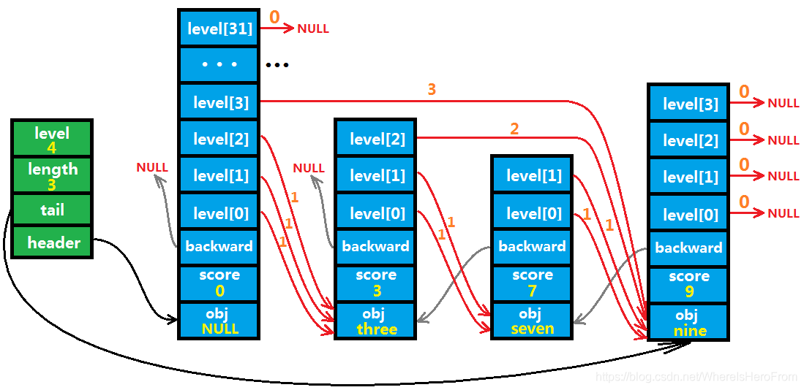
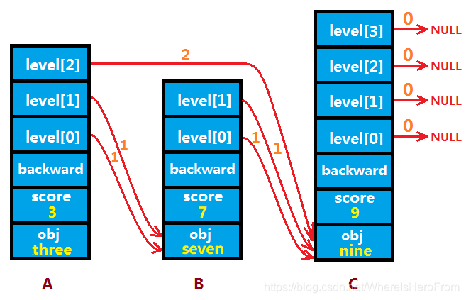
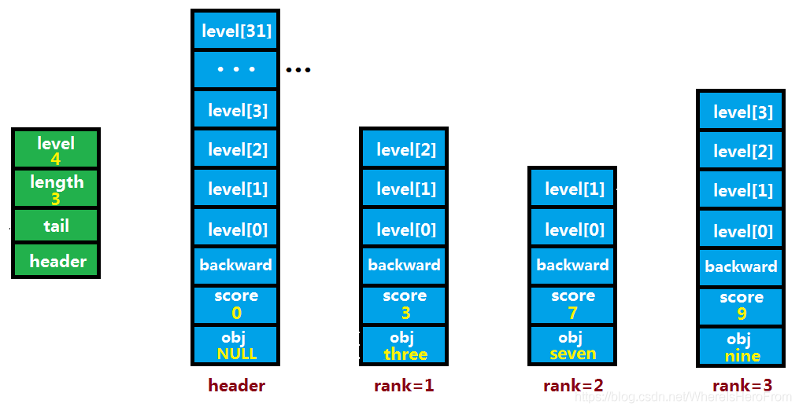
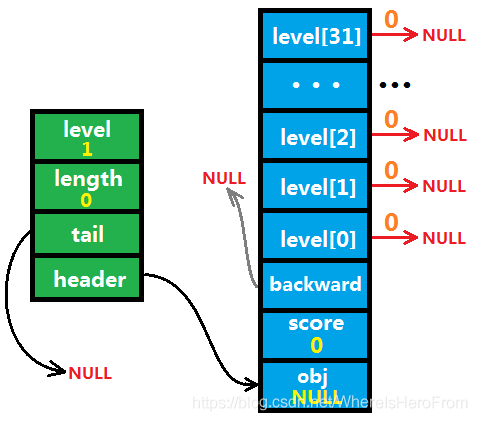
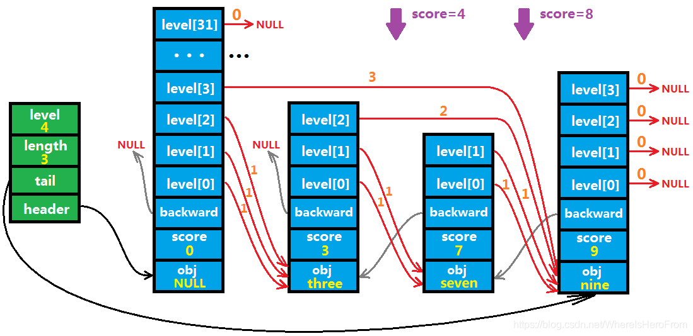
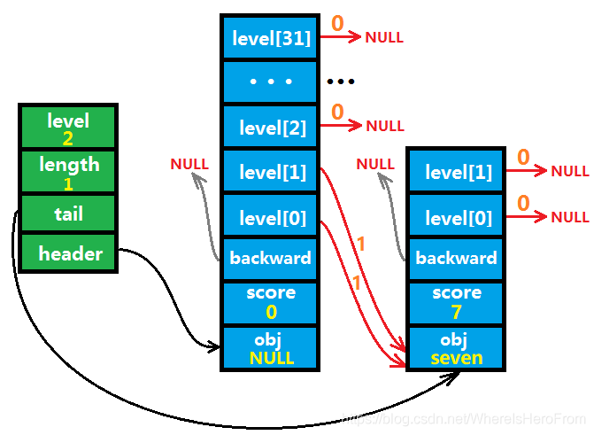
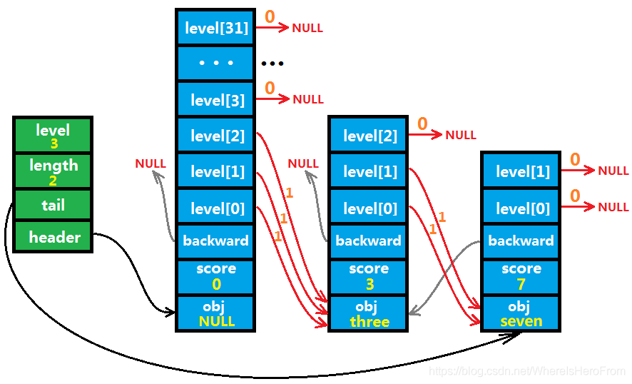

### Redis 跳跃表

>跳跃表是有序集合的底层实现之一。

#### 跳跃表结点

 跳跃表的结点 zskiplistNode 定义在 server.h 中，定义如下：

```
typedef struct zskiplistNode {
    robj *obj;                              /* a */
    double score;                           /* b */
    struct zskiplistNode *backward;         /* c */
    struct zskiplistLevel {                 /* d */
        struct zskiplistNode *forward;     
        unsigned int span;                  
    } level[];
} zskiplistNode;
```

        a、robj 是 redisObject 的别名，在跳跃表中它的类型是一个 sds 字符串 （见 Redis底层详解（二） 字符串）；
        b、score 是一个浮点类型的数值，obj 和 score 共同构成了跳跃表元素的排序依据。score 为排序的第一关键字，obj 为排序的第二关键字（score 不同，按照 score 从小到大排；score相同，按照 obj 字符串进行字节排序 memcmp）；
        c、backward 是指向跳跃表当前结点的前一个结点的指针；
        d、每个跳跃表结点有一个 level 数组，数组最大长度为 32，数组元素类型为 zskiplistLevel 。它记录了每个 level 下当前结点链接到的下一个结点的前进指针 forward ，以及跨度 span （下文会详细介绍这个链接关系）； 


#### 跳跃表

跳跃表结点被跳跃表结构 zskiplist 管理，定义在 server.h中：
```

typedef struct zskiplist {
    struct zskiplistNode *header, *tail;   /* a */
    unsigned long length;                  /* b */
    int level;                             /* c */
} zskiplist;
```

    a、header 指针指向跳跃表头结点，一旦创建后固定不变，tail 指向尾结点（当表为空时值为 NULL）；
        b、length 记录整个跳跃表的长度，便于在 O(1) 的时间内获取表长度；
        c、level 代表跳跃表的最高层数，初始化为1；

#### 跳跃表详解

看到这里，如果之前没有接触过跳跃表，应该已经一头雾水了。那么好，接下来图文并茂的时候到了。下图代表的是一个拥有三个元素的跳跃表，分别为 (3, "three"), (7, "seven"), (9, "nine")：



上图代表了一个三个元素的跳跃表。其中绿色格子是 zskiplist 部分，蓝色格子是 zskiplistNode 部分。图片从下往上看是内存递增的方向，即 绿色 header 代表跳跃表的首地址， 蓝色 obj 代表跳跃表结点的首地址。
       
当跳跃表中元素为 n 个时，其实有 n+1 个结点，多出来的那个结点就是跳跃表的头结点，头结点的 score 值为 0，obj 置 NULL，backward 后退指针指向 NULL，并且默认有 32 个层 level[0...31]。
        
绿色部分：整型值 level 代表除了头结点以外，其它结点的层高的最大值（这里为 4 ）；length 表示实际元素个数（这里为 3）；tail 指向跳跃表的尾结点；header 指向跳跃表的头结点（固定不变）。
        
蓝色部分：每个跳跃表结点都有一个后退指针 backward，用来指向链表结构中的前一个结点；而 level [] 数组的每个元素是一个由 前进指针 forward 和 跨度span 组成的 zskiplistLevel 结构。除了头结点外，其它结点的层高是在这个结点创建的时候随机出来的，（score，obj）则是用来对跳跃表进行排序的排序依据。

红色曲线：代表每个结点在当前层的 forward 指针，这个指针一定是指向一个结点的首地址，而非 zskiplistLevel 结构的地址。

橙色数字：代表每个结点在当前层指向的结点到当前结点的跨度 span。这个跨度的计算很容易从图中看出，如果把这个跳跃表横向理解成一个数组，那么跨度就代表红色曲线两头的两个结点的 Rank（接下来会介绍 Rank 的含义）之差。

    注意：为了区分各种指针，我们把 header 和 tail 的指针用黑色曲线表示；backward 的指针用灰色表示；forward 的指针用红色表示。所有的这些指针要么是 NULL，要么指向 跳跃表结点 的首地址。

#### 跳跃表概念

1、层后继结点
 
每个结点在创建的时候，会随机一个 [1,32] 的数 lv，作为结点的层高，并且创建 lv 个 zskiplistLevel 结构。每个结构会有一个 forward 指针 和 span 跨度，如下图中的红色曲线代表 forward 指针，橙色数字代表 span 跨度：



 图中结点 A 的第 0、1 层的 forward 指针指向 B，跨度为 1； 第 2 层的 forward 指针指向 C，跨度为 2。
        这里 B 就是 A 在第 0 和 第 1 层的 后继结点，而 C 则是 A 在第 2 层的后继结点。 同理，C 也是 B 在第 0 和 第 1 层的后继结点（并且，C 也是头结点在第 3 层的后继结点）。

2、层前驱结点

  和后继相对应的就是前驱结点，结点 A 在第0、1层是结点 B 的前驱结点，在第 2 层则是结点 C 的前驱结点。

3、Rank

 跳跃表中一个很重要的概念就是 Rank，它代表每个结点在跳跃表中的相对位置 （类似数组下标）。Rank 从 1开始计数，如图所示，三个结点的 Rank 分别为 1 、 2 、 3：



我们可以通过 zslGetRank 接口来获取 (score, obj) 这个结点在给定跳跃表 zsl 中的 Rank，如果结点不存在则返回 0； 

```

unsigned long zslGetRank(zskiplist *zsl, double score, robj *o) {
    zskiplistNode *x;
    unsigned long rank = 0;
    int i;
    x = zsl->header;
    for (i = zsl->level-1; i >= 0; i--) {
        while (x->level[i].forward &&                                       /* a */
            (x->level[i].forward->score < score ||                          /* b */
                (x->level[i].forward->score == score &&                     
                compareStringObjects(x->level[i].forward->obj,o) <= 0))) {
            rank += x->level[i].span;                                       /* c */
            x = x->level[i].forward;                                        
        } 
        if (x->obj && equalStringObjects(x->obj,o)) {                       /* d */
            return rank;
        }
    }
    return 0;
}
```
    a、从最高层开始枚举，对每一层找到  (score, obj)  的前驱结点；
        b、前驱结点的 score 要么小于 当前结点的 score，要么 score 和当前结点相等且 obj 的字典序比 当前结点的obj 小；
        c、对跨度进行累加，所有层的前驱结点的跨度之和就是最后要求的 Rank；
        d、为了避免找到的 x 是头结点，需要判断 x->obj 不为 NULL；

#### 跳跃表操作

1、创建跳跃表
        
 跳跃表的创建调用 zslCreate 接口，默认层数 level 为 1， 跳跃表长度 length 为 0，tail 置NULL， zslCreateNode 为创建一个跳跃表结点的接口，这里用来创建头结点，函数实现在 t_zset.c 中：

```
zskiplistNode *zslCreateNode(int level, double score, robj *obj) {
    zskiplistNode *zn = zmalloc(sizeof(*zn)+level*sizeof(struct zskiplistLevel));
    zn->score = score;
    zn->obj = obj;
    return zn;
}
 
zskiplist *zslCreate(void) {
    int j;
    zskiplist *zsl;
    zsl = zmalloc(sizeof(*zsl));                               
    zsl->level = 1;                                         
    zsl->length = 0;
    zsl->header = zslCreateNode(ZSKIPLIST_MAXLEVEL,0,NULL);
    for (j = 0; j < ZSKIPLIST_MAXLEVEL; j++) {
        zsl->header->level[j].forward = NULL;
        zsl->header->level[j].span = 0;
    }
    zsl->header->backward = NULL;
    zsl->tail = NULL;
    return zsl;
}
```



上图代表了一个刚创建完的跳跃表，即空表。

初始创建一个头结点，score 为 0，obj 置 NULL，backward 后退指针指向 NULL，并且生成 32 个层 level[0...31]，图中每个层的向右红色箭头表示 forward 指针，橙色数字代表跨度 span。初始化每个层的 forward 指向 NULL，跨度为0。
        
 2、插入跳跃表结点

跳跃表的插入有点类似链表，首先要找到一个插入位置，生成一个结点，然后修改插入位置的指针进行插入操作。结点插入的 API 为 zslInsert，整个插入过程分为以下四部分：

        a、寻找插入位置；
        b、随机插入结点层数；
        c、生成插入结点并插入；
        d、额外信息更新；

具体实现在 t_zset.c 中：

```
zskiplistNode *zslInsert(zskiplist *zsl, double score, robj *obj) {
    zskiplistNode *update[ZSKIPLIST_MAXLEVEL], *x;
    unsigned int rank[ZSKIPLIST_MAXLEVEL];
    int i, level;
    serverAssert(!isnan(score));
 
    /************************* a、寻找插入位置 *************************/
    x = zsl->header;
    for (i = zsl->level-1; i >= 0; i--) {
        rank[i] = i == (zsl->level-1) ? 0 : rank[i+1];
        while (x->level[i].forward &&
          (x->level[i].forward->score < score ||
            (x->level[i].forward->score == score &&
              compareStringObjects(x->level[i].forward->obj,obj) < 0))) {
            rank[i] += x->level[i].span;
            x = x->level[i].forward;
        }
        update[i] = x;
    }
    /************************* a、寻找插入位置 *************************/
 
    /*********************** b、随机插入结点层数 ***********************/
    level = zslRandomLevel();
    if (level > zsl->level) {
        for (i = zsl->level; i < level; i++) {
            rank[i] = 0;
            update[i] = zsl->header;
            update[i]->level[i].span = zsl->length;
        }
        zsl->level = level;
    }
    /*********************** b、随机插入结点层数 ***********************/
 
    /***********************  c、生成结点并插入  ***********************/
    x = zslCreateNode(level,score,obj);
    for (i = 0; i < level; i++) {
        x->level[i].forward = update[i]->level[i].forward;
        update[i]->level[i].forward = x;
        x->level[i].span = update[i]->level[i].span - (rank[0] - rank[i]);
        update[i]->level[i].span = (rank[0] - rank[i]) + 1;
    }
    for (i = level; i < zsl->level; i++) {
        update[i]->level[i].span++;
    }
    /***********************  c、生成结点并插入  ***********************/
 
    /***********************   d、额外信息更新   ***********************/
    x->backward = (update[0] == zsl->header) ? NULL : update[0];
    if (x->level[0].forward)
        x->level[0].forward->backward = x;
    else
        zsl->tail = x;
    zsl->length++;
    /***********************   d、额外信息更新   ***********************/
    return x;
}
```

a、寻找插入位置。这步操作类似上文提到的计算 Rank 的过程。由于跳跃表是个有序表，所以 (score, obj) 一定是严格递增的，比如 score = 4 时一定是插入到 score 为 3 和 score 为 7 的结点之间；score = 8 时一定是插入到 score 为 7 和 score 为 9 的结点之间（当然，如果 score 相同，则需要比较另一个关键字 obj 的大小关系，这里为了简化问题，不再详述）；如下图所示的紫色箭头指示了插入位置：



源码的实现是从跳跃表的最大那层开始，对每一层进行统计。将插入的位置信息存储在了两个辅助数组 update[] 和 rank[] 中。其中， update[ i ] 表示将要插入位置在第 i 层的前驱结点。换言之，假设要插入的结点为 x，那么在执行完插入操作之后，update[i]->level[i] 的 forward 成员指向的就应该是 x 了 （显然，在插入之前还不是，因为我们还没有生成 x 这个结点）。而 rank[ i ] 表示 update[ i ] 这个结点的 Rank 值 （如果 update[i] 是头结点，那么 Rank 值为0）。

b、随机插入结点层数。如果新插入结点随机得到的层数比之前的最大层数还要大，则 需要更新最大层数 level 以及超出部分的 update [] 和 rank [] 的值。

c、生成结点并插入。调用 zslCreateNode 生成结点 x，遍历结点的每一层，将这个结点每一层的后继结点 （x->level[i].forward）指向对应的 update[i] 在该层的后继结点 （update[i]->level[i].forward）。然后将 update[i] 在该层的后继结点修改为 x。这一步操作和普通链表的插入操作一致。然后利用 rank[] 数组修改每一层的跨度。

d、额外信息更新。主要是更新 backward 指针。 令插入结点为 x，如果 x 在跳跃表的第一个元素，那么它的 backward 指针置为NULL，否则指向前一个结点（即 update[0]）；如果 x 在跳跃表的最后一个元素，那么跳跃表的 tail 指针指向 x，否则 x 的相邻的下一个结点的 backward 指针置为 x。最后，跳跃表 length 属性自增1。

依次插入三个元素的展示如下：




#### 删除跳跃表结点

删除结点的过程是插入的逆过程，如果已经理解了插入，那么删除将完全不成问题。删除的 API 为 zslDelete，在 t_zset.c 中，实现如下：


```
int zslDelete(zskiplist *zsl, double score, robj *obj) {
    zskiplistNode *update[ZSKIPLIST_MAXLEVEL], *x;
    int i;
    /************************* a、寻找待删除结点 *************************/
    x = zsl->header;
    for (i = zsl->level-1; i >= 0; i--) {
        while (x->level[i].forward &&
            (x->level[i].forward->score < score ||
                (x->level[i].forward->score == score &&
                compareStringObjects(x->level[i].forward->obj,obj) < 0)))
            x = x->level[i].forward;
        update[i] = x;
    }
    x = x->level[0].forward;
    /************************* a、寻找待删除结点 *************************/
 
    /************************* b、执行结点的删除 *************************/
    if (x && score == x->score && equalStringObjects(x->obj,obj)) {
        zslDeleteNode(zsl, x, update);
        zslFreeNode(x);
        return 1;
    }
    /************************* b、执行结点的删除 *************************/
 
    return 0;
}
```

a、寻找待删除结点。这步操作类似上文提到的插入结点的过程。update[] 代表待删除结点在每一层上的前驱结点，从最高层往下遍历，最后得到的 x 就是待删除节点。

b、执行结点的删除。如果待删除结点的 score 和 obj 与 传参不完全相等，说明这个结点不存在，返回 0； 否则， 调用 zslDeleteNode 执行结点的删除。最后调用 zslFreeNode 进行内存释放。

zslDeleteNode 的实现如下：

```

void zslDeleteNode(zskiplist *zsl, zskiplistNode *x, zskiplistNode **update) {
    int i;
    for (i = 0; i < zsl->level; i++) {
        if (update[i]->level[i].forward == x) {                        /* a */
            update[i]->level[i].span += x->level[i].span - 1;
            update[i]->level[i].forward = x->level[i].forward;
        } else {                                                  
            update[i]->level[i].span -= 1;                            
        }
    }
    if (x->level[0].forward) {                                         /* b */
        x->level[0].forward->backward = x->backward;
    } else {
        zsl->tail = x->backward;
    }
    while(zsl->level > 1 &&                                           /* c */
          zsl->header->level[zsl->level-1].forward == NULL)
        zsl->level--;
    zsl->length--;
}
```

a、遍历所有层 i，如果待删除结点 x 的层高小于 i，显然这一层的前驱结点 update[i] 在第 i 层的的后继结点不会是x，所以只需要将前驱结点的第 i 层的跨度 span 减1 即可；否则，前驱结点的第 i 层的后继结点就是 x，这时候需要根据 x 的 forward 和 span 对前驱结点的第 i 层 forward 和 span 进行更新；

b、如果被删除的结点是原跳跃表的最后一个结点（没有后继结点），则更新跳跃表的 tail 指针；否则，更新它后继结点的 backward 指针；

c、结点删除后，如果删除的结点的层高是其它所有结点中最高的 （没有并列），那么，势必会导致整个跳跃表的最大层高的减少，这时就要将跳跃表的 level 字段进行更新。最后 length 自减 1。

结点删除后，需要将删除的结点的内存释放掉，否则就会引起内存泄漏。释放内存的 API 是 zslFreeNode，实现如下：
```
void zslFreeNode(zskiplistNode *node) {
    decrRefCount(node->obj);
    zfree(node);
}
```
decrRefCount 用来减少 obj 的引用计数，当计数为 0 时，会自动将 obj 的内存释放掉。如果没有这一步， 调用 zfree 的时候只释放 node 的内存，对于其中成员 obj 指向的那块内存是不会进行管理的。

#### 其他API

跳跃表还有几个和区间操作相关的 API，实现概述和复杂度如下，具体可以参看源码：

        1、zslIsInRange
        给定一个 score 的 范围 range，判断跳跃表内是否有元素在这个 range 内。实现方式采用的是两个区间进行判交，如果有交集返回1，否则返回0。算法的时间复杂度为 O(1)。

        2、zslFirstInRange
        获取第一个 score 在 range 范围内的跳跃表结点。实现方式和计算 Rank 的方式类似，核心就是找小于 range最小值 的且最接近它的结点，将的到的结点的直接后继结点，如果它的 score 在 range 范围内，返回这个结点；否则返回 NULL；期望复杂度是 O(log N) 的，但是最坏复杂度是 O(N) 的。

        3、zslLastInRange
        获取最后一个 score 在 range 范围内的跳跃表结点。实现方式参照 zslFirstRange 。

        4、zslDeleteRangeByScore
        删除给定 score 范围内的所有跳跃表结点。算法最坏复杂度 O(N)。

        5、zslDeleteRangeByRank
        删除给定 Rank 范围内的所有跳跃表结点。算法最坏复杂度 O(N)。


>PS:参考 https://blog.csdn.net/WhereIsHeroFrom/article/details/84997418
