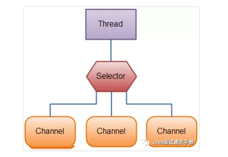

### Nio简介

    Java NIO 是 java 1.4 之后新出的一套IO接口，这里的的新是相对于原有标准的Java IO和Java Networking接口。NIO提供了一种完全不同的操作方式。
    
    NIO中的N可以理解为Non-blocking，不单纯是New。
    
    它支持面向缓冲的，基于通道的I/O操作方法。 随着JDK 7的推出，NIO系统得到了扩展，为文件系统功能和文件处理提供了增强的支持。 由于NIO文件类支持的这些新的功能，NIO被广泛应用于文件处理。

### NIO的特性/NIO与IO区别

     Channels and Buffers（通道和缓冲区）

- IO是面向流的，NIO是面向缓冲区的

    - 标准的IO编程接口是面向字节流和字符流的。而NIO是面向通道和缓冲区的，数据总是从通道中读到buffer缓冲区内，或者从buffer缓冲区写入到通道中；（ NIO中的所有I/O操作都是通过一个通道开始的。）

    - Java IO面向流意味着每次从流中读一个或多个字节，直至读取所有字节，它们没有被缓存在任何地方；

    - Java NIO是面向缓存的I/O方法。 将数据读入缓冲器，使用通道进一步处理数据。 在NIO中，使用通道和缓冲区来处理I/O操作。

    Non-blocking IO（非阻塞IO）

- IO流是阻塞的，NIO流是不阻塞的。

    - Java NIO使我们可以进行非阻塞IO操作。比如说，单线程中从通道读取数据到buffer，同时可以继续做别的事情，当数据读取到buffer中后，线程再继续处理数据。写数据也是一样的。另外，非阻塞写也是如此。一个线程请求写入一些数据到某通道，但不需要等待它完全写入，这个线程同时可以去做别的事情。

    - Java IO的各种流是阻塞的。这意味着，当一个线程调用read() 或 write()时，该线程被阻塞，直到有一些数据被读取，或数据完全写入。该线程在此期间不能再干任何事情了

     Selectors（选择器）

- NIO有选择器，而IO没有。

    - 选择器用于使用单个线程处理多个通道。因此，它需要较少的线程来处理这些通道。

    - 线程之间的切换对于操作系统来说是昂贵的。 因此，为了提高系统效率选择器是有用的。

### 读数据和写数据方式

通常来说NIO中的所有IO都是从 Channel（通道） 开始的。

从通道进行数据读取 ：创建一个缓冲区，然后请求通道读取数据。

从通道进行数据写入 ：创建一个缓冲区，填充数据，并要求通道写入数据。

    读： channel --> buffer
    写： channel <-- buffer

### NIO核心组件

    Channels
    
    Buffers
    
    Selectors
    
- channel

在Java NIO中，主要使用的通道如下（涵盖了UDP 和 TCP 网络IO，以及文件IO）：

DatagramChannel

SocketChannel

FileChannel

ServerSocketChannel

- 缓冲区

在Java NIO中使用的核心缓冲区如下（覆盖了通过I/O发送的基本数据类型：byte, char、short, int, long, float, double ，long）：

ByteBuffer

CharBuffer

ShortBuffer

IntBuffer

FloatBuffer

DoubleBuffer

LongBuffer

- 选择器

Java NIO提供了“选择器”的概念。这是一个可以用于监视多个通道的对象，如数据到达，连接打开等。因此，单线程可以监视多个通道中的数据。

如果应用程序有多个通道(连接)打开，但每个连接的流量都很低，则可考虑使用它。 例如：在聊天服务器中。

下面是一个单线程中Slector维护3个Channel的示意图：

要使用Selector的话，我们必须把Channel注册到Selector上，然后就可以调用Selector的select()方法。这个方法会进入阻塞，直到有一个channel的状态符合条件。当方法返回后，线程可以处理这些事件。

PS: https://mp.weixin.qq.com/s?__biz=Mzg2OTA0Njk0OA==&mid=2247484951&amp;idx=1&amp;sn=0cef67df4b883b198da467c927533316&source=41#wechat_redirect

