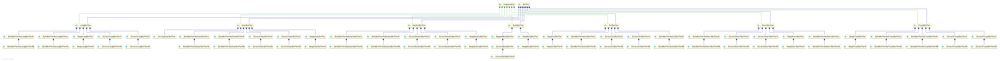
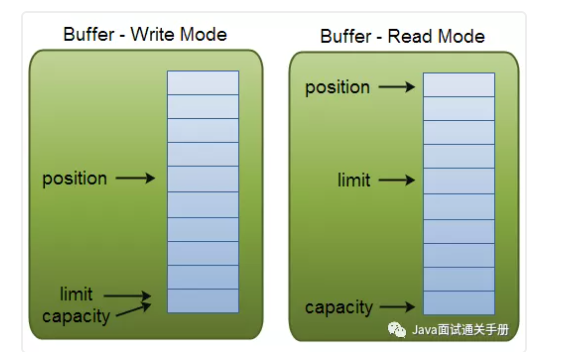

### Buffer 缓冲区

>Java NIO Buffers用于和NIO Channel交互。 我们从Channel中读取数据到buffers里，从Buffer把数据写入到Channels.

>Buffer本质上就是一块内存区，可以用来写入数据，并在稍后读取出来。这块内存被NIO Buffer包裹起来，对外提供一系列的读写方便开发的接口。

在Java NIO中使用的核心缓冲区如下（覆盖了通过I/O发送的基本数据类型：byte, char、short, int, long, float, double ，long）：

    ByteBuffer

    CharBuffer

    ShortBuffer

    IntBuffer

    FloatBuffer

    DoubleBuffer

    LongBuffer
    

继承关系图：




利用Buffer读写数据，通常遵循四个步骤：

1. 把数据写入buffer；
2. 调用flip；
3. 从Buffer中读取数据；
4. 调用buffer.clear()或者buffer.compact()。

当写入数据到buffer中时，buffer会记录已经写入的数据大小。当需要读数据时，通过 flip() 方法把buffer从写模式调整为读模式；在读模式下，可以读取所有已经写入的数据。

当读取完数据后，需要清空buffer，以满足后续写入操作。清空buffer有两种方式：调用 clear() 或 compact() 方法。clear会清空整个buffer，compact则只清空已读取的数据，未被读取的数据会被移动到buffer的开始位置，写入位置则近跟着未读数据之后。


**Buffer的容量，位置，上限（Buffer Capacity, Position and Limit）**

Buffer缓冲区实质上就是一块内存，用于写入数据，也供后续再次读取数据。这块内存被NIO Buffer管理，并提供一系列的方法用于更简单的操作这块内存。

一个Buffer有三个属性是必须掌握的，分别是：

    capacity容量
    position位置
    limit限制


position和limit的具体含义取决于当前buffer的模式。capacity在两种模式下都表示容量。

读写模式下position和limit的含义：




    容量（Capacity）

作为一块内存，buffer有一个固定的大小，叫做capacit（容量）。也就是最多只能写入容量值得字节，整形等数据。一旦buffer写满了就需要清空已读数据以便下次继续写入新的数据。

    位置（Position）

当写入数据到Buffer的时候需要从一个确定的位置开始，默认初始化时这个位置position为0，一旦写入了数据比如一个字节，整形数据，那么position的值就会指向数据之后的一个单元，position最大可以到capacity-1.

当从Buffer读取数据时，也需要从一个确定的位置开始。buffer从写入模式变为读取模式时，position会归零，每次读取后，position向后移动。


    上限（Limit）
    
在写模式，limit的含义是我们所能写入的最大数据量，它等同于buffer的容量。

一旦切换到读模式，limit则代表我们所能读取的最大数据量，他的值等同于写模式下position的位置。换句话说，您可以读取与写入数量相同的字节数（限制设置为写入的字节数，由位置标记）。


### Buffer的常见方法

方法|	介绍
----|:----
abstract Object array()	|返回支持此缓冲区的数组 （可选操作）
abstract int arrayOffset()	|返回该缓冲区的缓冲区的第一个元素的在数组中的偏移量 （可选操作）
int capacity()	|返回此缓冲区的容量
Buffer clear()	|清除此缓存区。将position = 0;limit = capacity;mark = -1;
Buffer flip()	|flip()方法可以吧Buffer从写模式切换到读模式。调用flip方法会把position归零，并设置limit为之前的position的值。 也就是说，现在position代表的是读取位置，limit标示的是已写入的数据位置。
abstract boolean hasArray()	|告诉这个缓冲区是否由可访问的数组支持
boolean hasRemaining()	|return position < limit，返回是否还有未读内容
abstract boolean isDirect()	|判断个缓冲区是否为 direct
abstract boolean isReadOnly()	|判断告知这个缓冲区是否是只读的
int limit()	|返回此缓冲区的限制
Buffer position(int newPosition)|	设置这个缓冲区的位置
int remaining()	|return limit - position; 返回limit和position之间相对位置差
Buffer rewind()	|把position设为0，mark设为-1，不改变limit的值
Buffer mark()	|将此缓冲区的标记设置在其位置


### Buffer的使用方式/方法介绍


#### 分配缓冲区（Allocating a Buffer）

>为了获得缓冲区对象，我们必须首先分配一个缓冲区。在每个Buffer类中，allocate()方法用于分配缓冲区。

下面来看看ByteBuffer分配容量为28字节的例子：

```
ByteBuffer bf = ByteBuffer.allocate(28);
```

下面来看看另一个示例：CharBuffer分配空间大小为2048个字符。
```
CharBuffer cf = CharBuffer.allocate(2048)
```

#### 写入数据到缓冲区（Writing Data to a Buffer）

写数据到Buffer有两种方法：

    1. 从Channel中写数据到Buffer

    2. 手动写数据到Buffer，调用put方法

下面是一个实例，演示从Channel写数据到Buffer：


通过put写数据：

put方法有很多不同版本，对应不同的写数据方法。例如把数据写到特定的位置，或者把一个字节数据写入buffer。看考JavaDoc文档可以查阅的更多数据。


#### 翻转（flip()）

>flip()方法可以吧Buffer从写模式切换到读模式。调用flip方法会把position归零，并设置limit为之前的position的值。 也就是说，现在position代表的是读取位置，limit标示的是已写入的数据位置。


#### 从Buffer读取数据（Reading Data from a Buffer）

从Buffer读数据也有两种方式。

    1. 从buffer读数据到channel

    2. 从buffer直接读取数据，调用get方法

读取数据到channel的例子：

调用get读取数据的例子：


#### rewind()

>Buffer.rewind()方法将position置为0，这样我们可以重复读取buffer中的数据。limit保持不变。


#### clear() and compact()

一旦我们从buffer中读取完数据，需要复用buffer为下次写数据做准备。只需要调用clear（）或compact（）方法。

如果调用的是clear()方法，position将被设回0，limit被设置成 capacity的值。换句话说，Buffer 被清空了。Buffer中的数据并未清除，只是这些标记告诉我们可以从哪里开始往Buffer里写数据。

如果Buffer还有一些数据没有读取完，调用clear就会导致这部分数据被“遗忘”，因为我们没有标记这部分数据未读。

针对这种情况，如果需要保留未读数据，那么可以使用compact。 因此 compact() 和 clear() 的区别就在于: 对未读数据的处理，是保留这部分数据还是一起清空 。


#### mark()与reset()方法

>通过调用Buffer.mark()方法，可以标记Buffer中的一个特定position。之后可以通过调用Buffer.reset()方法恢复到这个position


#### equals() and compareTo()

可以用eqauls和compareTo比较两个buffer

equals():

判断两个buffer相对，需满足：

- 类型相同
- buffer中剩余字节数相同
- 所有剩余字节相等

从上面的三个条件可以看出，equals只比较buffer中的部分内容，并不会去比较每一个元素。

compareTo():

compareTo也是比较buffer中的剩余元素，只不过这个方法适用于比较排序的：


>PS：参考：https://mp.weixin.qq.com/s?__biz=Mzg2OTA0Njk0OA==&mid=2247484950&amp;idx=1&amp;sn=796cd8c9141268e3683bf6b22736858e&source=41#wechat_redirect


