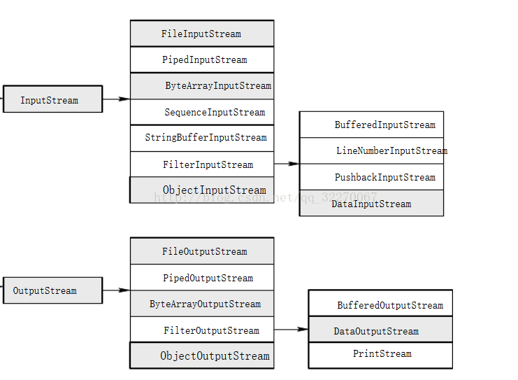
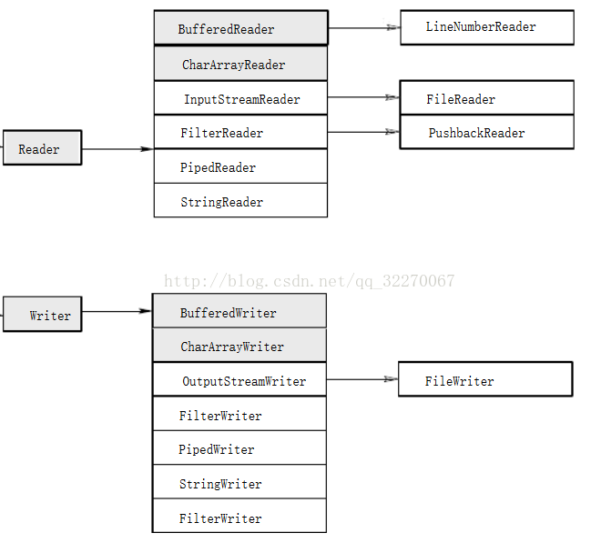

### 流家族介绍

流是一个相对抽象的概念，所谓流就是一个传输数据的通道，这个通道可以传输相应类型的数据。
进而完成数据的传输。这个通道被实现为一个具体的对象。

输入流：从外部空间（文件、网络连接、内存块）读入字节序列的管道（对象）。

输出流：可以向外部空间（文件、网络连接、内存块）写入字节序列的管道（对象）。

######两种最基本的抽象类：

处理字节：InputStream   OutputStream

处理字符：Reader   Writer

***注：为什么会有两种类型呢？Java中字符是以Unicode形式存储的，一个字符占用两个字节，
然而InputStream和OutputStream都是以字节形式读取或写出数据的，会将一个字符拆分成
两个字节来读写这样会造成乱码（比如读取或者写出中文）。***

######最基本的两个方法：

- 在InputStream 和 Reader抽象类中都有一个抽象方法 abstract int read()，这个方法将会读入一个字节或字符，当到达输入数据块的末尾的时候返回-1，所有的输入流只要覆盖这个方法，完成具体的功能。

- 在OutputStream 和 Writer抽象类中都有一个抽象方法 abstract void write(int b)，这个方法将会象某一个输出位置写一个字节或者字符。所有的输出流只覆盖这个方法，完成具体的输出功能。

***注：read()和write()方法都是阻塞方法，当一个流不能被立即访问或者字节不能被
成功的读出或写入的时候，当前线程将进入阻塞态直到字节确实被读入或者被写出。
这样的设置保证了数据的安全性。及时的关闭不使用的流，避免造成资源流失。***

######重要的方法：
- available()检查可读入字节的数量，避免造成线程阻塞
- close()关闭当前的流，flush()冲刷输出流，让数据成功的保存到目标地址（如文件）。

流家族：整个流家族，读写字节的家长是InputStream 和 OutputStream，读写字符的家长是Reader和Writer。

流家族中分为原生的节点流（FileInputStream）和负责包装的处理流（BufferedInputStream）如（FilterInputStream的子类BufferedInputStream）。

######附加：Closeable、Flushable、Readable、Appendable接口。

简单介绍四个接口：

1. Closeable：InputStream、OutputStream、Reader、Writer都实现了Closeable
Closeable接口扩展了java.lang.AutoCloseable接口使其可以抛出任何异常。

2. Flushable：OutputStream和Writer实现了。

3. Readable：Reader实现了。内部方法int read(CharBuffer cb)

4. Appendable：Writer实现了。 内部方法Appendable append(char c) Appendable append(CharSequence s)

####常用流的介绍

- 对文件进行操作：FileInputStream（字节输入流），FileOutputStream（字节输出流），FileReader（字符输入流），FileWriter（字符输出流）

- 对管道进行操作：PipedInputStream（字节输入流）,PipedOutStream（字节输出流），PipedReader（字符输入流），PipedWriter（字符输出流）

PipedInputStream的一个实例要和PipedOutputStream的一个实例共同使用，共同完成管道的读取写入操作。主要用于线程操作。

- 字节/字符数组：ByteArrayInputStream，ByteArrayOutputStream，CharArrayReader，CharArrayWriter是在内存中开辟了一个字节或字符数组。

- Buffered缓冲流：BufferedInputStream，BufferedOutputStream，BufferedReader,BufferedWriter,是带缓冲区的处理流，缓冲区的作用的主要目的是：避免每次和硬盘打交道，提高数据访问的效率。

- 转化流

    - InputStreamReader：在读入数据的时候将字节转换成字符。
    - OutputStreamWriter：在写出数据的时候将字符转换成字节。

- 数据流：DataInputStream，DataOutputStream。

因为平时若是我们输出一个8个字节的long类型或4个字节的float类型，
那怎么办呢？可以一个字节一个字节输出，也可以把转换成字符串输出，
但是这样转换费时间，若是直接输出该多好啊，
因此这个数据流就解决了我们输出数据类型的困难。数据流可以直接输出float类型或long类型，
提高了数据读写的效率。

- 打印流：printStream，printWriter，一般是打印到控制台，可以进行控制打印的地方和格式，其中的  print方法不会抛出异常，可以通过checkError方法来查看异常。

- 对象流：ObjectInputStream，ObjectOutputStream，把封装的对象直接输出，而不是一个个在转换成字符串再输出。

- RandomAccessFile随机访问文件

- ZipInputStream、ZipOutputStream读取zip文档 getNextEntry、putNextEntry 得到或创建ZipEntry对象。

