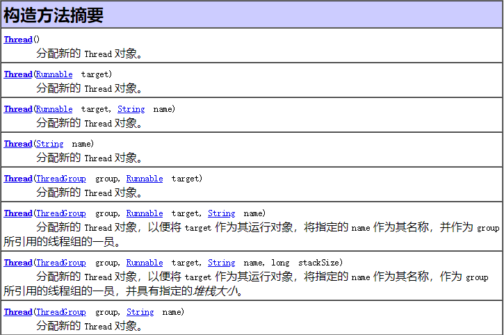
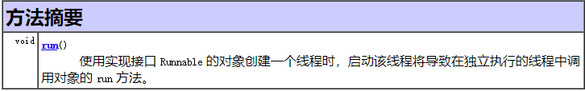
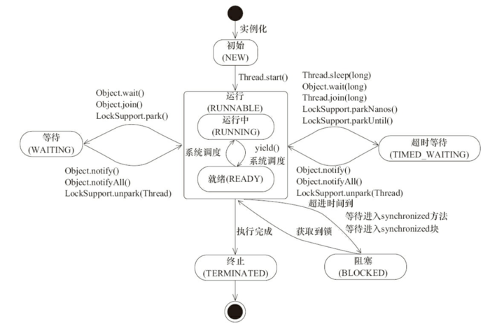
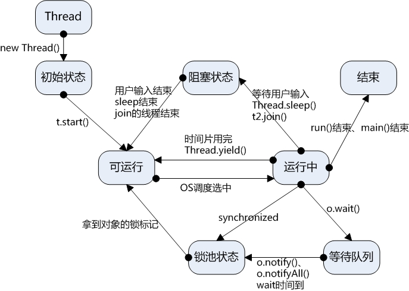

### 线程创建的方式

在Java中实现多线程有两种方法，1.继承Thread类，2.实现Runnable接口。

```java
public class threadSub extends Thread{
    public void run(){  
    }
}
public class runnableSub implements Runnable{
    public void run(){   
    }

}
```

#### Thread类和Runnable接口的结构

    public class Thread extends Object implements Runnable

Thread类实现Runnable接口，它们具有多态关系



可以传递Runnable接口的对象，而Runnable的设计是为了解决Java中单继承的限制。

还可以看出可以传递Thread类的对象，说明可以将一个Thread对象中的run()方法交给别的线程调用。

Runnable中只有一个run()方法



#### 继承Thread类

1）创建一个新类继承Thread类。

2）重写Thread类中的public void run()方法，将线程的代码封装到run()里。

3)  创建该新类对象，创建线程。

4）对象调用start()，启动线程（即调用run方法）。

```java

class MyThread extends Thread {  
    // 重载run函数  
    public void run() {  
        System.out.println("MyThread");
    }  
  
    public static void main(String argv[]) {  
        MyThread td = new MyThread(); // 创建，并初始化MyThread类型对象td  
        td.start(); // 调用start()方法执行一个新的线程  
        System.out.println("运行结束") 
    }  
} 
```

#### 实现Runnable

1）定义一个新类，实现Runnable接口。

2）重写接口中run()方法，将线程的代码封装到run()里。

3）创建Runnable接口的子类对象。

4）将Runnabl接口的子类对象作为参数传递给Thread类的构造函数，创建Thread类对象（原因：线程的任务都封装在Runnable接口子类对象的run方法中。所以要在线程对象创建时就必须明确要运行的任务）。

　　反正就是Runnable没有start()方法，需要通过传对象参数形式用线程类去启用它的run方法。

5）Thread类对象调用start()，启动线程（即调用run方法）。

```java
class MyRunnable implements Runnable {  
    // 重载run函数  
    public void run() {  
        System.out.println("运行中！");
    }  
  
    public static void main(String argv[]) {  
        MyRunnable rb = new MyRunnable(); // 创建，并初始化MyRunnable对象rb  
        Thread td = new Thread(rb); // 通过Thread创建线程  
        td.start(); // 启动线程td  
        System.out.pritnln("运行结束");
    }  
}  
```

注意：调用线程的 run()方法是通过启动线程的start()方法来实现的。 因为线程在调用start()方法之后，系统会自动调用 run()方法。与一般方法调用不同的地方在于一般方法调用另外一个方法后，必须等被调用的方法执行完毕才能返回，而线程的 start()方法被调用之后，系统会得知线程准备完毕并且可以执行run()方法，start()方法就返回了，start()方法不会等待run()方法执行完毕。  

为什么要重写run()方法呢?

因为不是类中的所有代码都需要被线程执行的。而这个时候，为了区分哪些代码能够被线程执行，java提供了Thread类中的run()用来包含那些被线程执行的代码。

#### 区别

两种创建线程性质都是一样的，但是通常建议创建线程是实现Runnable接口

优势是：

    1.可以支持多继承

    2.适合多个相同的程序代码的线程去处理同一个资源

    3.线程池只能放入实现Runable或callable类线程，不能直接放入继承Thread的类

### 线程的各个状态




1、新建状态（New）：新创建了一个线程对象。

2、就绪状态（Runnable）：线程对象创建后，其他线程调用了该对象的start()方法。该状态的线程位于可运行线程池中，变得可运行，等待获取CPU的使用权。

3、运行状态（Running）：就绪状态的线程获取了CPU，执行程序代码

4、阻塞状态（Blocked）：阻塞状态是线程因为某种原因放弃CPU使用权，暂时停止运行。直到线程进入就绪状态，才有机会转到运行状态。阻塞的情况分三种：

（一）、等待阻塞：运行的线程执行wait()方法，JVM会把该线程放入等待池中。(wait会释放持有的锁)

（二）、同步阻塞：运行的线程在获取对象的同步锁时，若该同步锁被别的线程占用，则JVM会把该线程放入锁池中。

（三）、其他阻塞：运行的线程执行sleep()或join()方法，或者发出了I/O请求时，JVM会把该线程置为阻塞状态。当sleep()状态超时、join()等待线程终止或者超时、或者I/O处理完毕时，线程重新转入就绪状态。（注意,sleep是不会释放持有的锁）

5、死亡状态（Dead）：线程执行完了或者因异常退出了run()方法，该线程结束生命周期。

### Thread类的常用API方法

#### currentThread()（静态）

    public static Thread currentThread()

 返回对当前正在执行的线程对象的引用。注意是静态的。

通常用作，Thread.currentThread.getName()返回线程名。


#### isAlive()

    public final boolean isAlive()

测试线程是否处于活动状态。如果线程已经启动且尚未终止，则为活动状态。

 返回：如果该线程处于活动状态，则返回 true；否则返回 false。    

#### sleep()（静态）

    public static void sleep(long millis) throws InterruptedException
    
    public static void sleep(long millis, int nanos) throws InterruptedException

在指定的毫秒数（或者加指定的纳秒数）内让当前正在执行的线程休眠（暂停执行）。注意是个静态方法

参数含义：millis - 以毫秒为单位的休眠时间。nanos - 要休眠的另外 0-999999 纳秒。

为什么要用sleep，主要是为了暂停当前线程，把cpu片段让出给其他线程，减缓当前线程的执行。 

#### getId()

    public long getId()

返回该线程的唯一标识。线程 ID 是一个正的 long 数，在创建该线程时生成。线程 ID 是唯一的，并终生不变。线程终止时，该线程 ID 可以被重新使用。

#### interrupt()，interrupted()（静态）,isInterrupted()

    public void interrupt()
    public static boolean interrupted(){
            return currentThread().isInterrupted(true);
    }
    public boolean isInterrupted(){
            return isInterrupted( false);//至于为什么是false请看下面链接
    }

interrupt()：对线程进行中断操作。

isInterrupted（）：测试线程Thread对象是否已经是中断状态，但不清除状态标志，如果该线程已经中断，则返回 true；否则返回 false。

interrupted（）：对当前线程进行中断操作（由上面源代码可知，就算当前是main线程用别的对象线程调用该方法，也还是判断返回main是否被中断），该方法会清除中断标志位为false。需要注意的是，当抛出InterruptedException时候，会清除中断标志位，也就是说此时再调用isInterrupted会返回false。

详细讲解这三个方法：https://www.cnblogs.com/w-wfy/p/6414801.html

#### yield()(静态）

    public static void yield()

 放弃当前的CPU资源，让它让给当前线程相同优先级的线程去占用CPU，即CPU暂停当前正在执行的线程对象，并执行其他线程。

但放弃的时间不确定，有可能刚刚放弃，马上又获得CPU时间片。


#### setDaemon() 守护线程Daemon

    public final void setDaemon(boolean on)

 将该线程标记为守护线程或用户线程。当正在运行的线程都是守护线程时，Java 虚拟机退出。该方法必须在启动线程前调用。
 
```java
class ThreadDemo extends Thread {
    @Override
    public void run() {
        for (int x = 0; x < 100; x++) {
            System.out.println(getName() + ":" + x);
        }
    }
}
public class test {
    public static void main(String[] args) {
        ThreadDemo td1 = new ThreadDemo();
        ThreadDemo td2 = new ThreadDemo();

        td1.setName("A");
        td2.setName("B");

        // 设置守护线程
        td1.setDaemon(true);
        td2.setDaemon(true);

        td1.start();
        td2.start();

        Thread.currentThread().setName("C");
        for (int x = 0; x < 5; x++) {
            System.out.println(Thread.currentThread().getName() + ":" + x);
        }
    }
}
//当C执行完第五次之后（即C：4时候），A和B也会执行完，并不会执行100次
``` 

#### join()

    public final void join() throws InterruptedException
    
    public final synchronized void join(long millis, int nanos) throws InterruptedException
    
    public final synchronized void join(long millis)throws InterruptedException

 等待该线程终止
 
```java
class ThreadDemo extends Thread {
     @Override
     public void run() {
            for (int x = 0; x < 100; x++) {
                System.out.println(getName() + ":" + x);
            }
        }
    }
public class test {
    public static void main(String[] args) {
        ThreadDemo ty1 = new ThreadDemo();
        ThreadDemo ty2 = new ThreadDemo();
        ThreadDemo ty3 = new ThreadDemo();
        ty1.setName("A");
        ty2.setName("B");
        ty3.setName("C");
        ty1.start();
        try {
            ty1.join();
        } catch (Exception e) {
            e.printStackTrace();
        }

        ty2.start();
        ty3.start();
    }
}
//运行程序可以发现，名字A的线程运行完之后才开始运行B和C
``` 


### Thread类和Object类一些相似的方法区别

#### sleep()和wait()

Java程序中wait 和 sleep都会造成某种形式的暂停，它们可以满足不同的需要。

两者的区别在于：

1.sleep()方法是Thread的静态方法，而wait是Object实例方法。

2.wait()方法必须要在同步方法或者同步块中调用，也就是必须已经获得对象锁；而sleep()方法没有这个限制可以在任何地方种使用。

3.wait()方法会释放占有的对象锁，使得该线程进入等待池中，等待下一次获取资源；而sleep()方法只是会让出CPU并不会释放掉对象锁；

例子：https://www.cnblogs.com/DreamSea/archive/2012/01/16/2263844.html

4.sleep()方法在休眠时间达到后如果再次获得CPU时间片就会继续执行；而wait()方法必须等待Object.notift/Object.notifyAll通知后，才会离开等待池，并且再次获得CPU时间片才会继续执行。

#### sleep()和yield()

sleep()方法和yield()方法都是Thread类的静态方法（注意两个方法都是作用于当前线程），都会使当前处于运行状态的线程放弃CPU，把运行机会让给别的线程。

两者的区别在于：

1.sleep()方法会给其他线程运行的机会，不考虑其他线程的优先级，因此会给较低优先级线程一个运行的机会；yield()方法只会给相同优先级或者更高优先级的线程一个运行的机会。

2.当线程执行了sleep(long millis)方法，将转到阻塞状态，参数millis指定睡眠时间；当线程执行了yield()方法，将转到就绪状态。

3.sleep()方法声明抛出InterruptedException异常，而yield()方法没有声明抛出任何异常。

4.sleep()方法比yield()方法具有更好的可移植性，不能依靠yield()方法来提高程序的并发性能。对于大多数程序员来说，yield()方法的唯一用途是在测试期间人为地提高程序的并发性能，以帮助发现一些隐藏的错误。


>PS:参考：https://www.cnblogs.com/furaywww/p/8859140.html