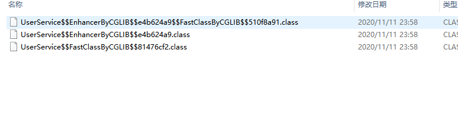

### Cglib proxy

    CGLIB(Code Generation Library)是一个开源项目！是一个强大的，高性能，高质量的Code生成类库，
    
    它可以在运行期扩展Java类与实现Java接口。Hibernate用它来实现PO(Persistent Object 持久化对象)字节码的动态生成。
    
    CGLIB是一个强大的高性能的代码生成包。它广泛的被许多AOP的框架使用，例如Spring AOP为他们提供
    
    方法的interception（拦截）。CGLIB包的底层是通过使用一个小而快的字节码处理框架ASM，来转换字节码并生成新的类。
    
    除了CGLIB包，脚本语言例如Groovy和BeanShell，也是使用ASM来生成java的字节码。当然不鼓励直接使用ASM，
    
    因为它要求你必须对JVM内部结构包括class文件的格式和指令集都很熟悉。

### 示例

```xml
<dependency>
  <groupId>org.springframework</groupId>
  <artifactId>spring-aop</artifactId>
  <version>5.1.6.RELEASE</version>
</dependency>
```

[代码示例](../../../code/dynamic-proxy-sample)

### 源码解读

```java
public interface MethodInterceptor extends org.springframework.cglib.proxy.Callback {
    java.lang.Object intercept(java.lang.Object o, java.lang.reflect.Method method, java.lang.Object[] objects, org.springframework.cglib.proxy.MethodProxy methodProxy) throws java.lang.Throwable;
}
```    

这个接口只有一个intercept()方法，这个方法有4个参数：

1）obj表示增强的对象，即实现这个接口类的一个对象；

2）method表示要被拦截的方法；

3）args表示要被拦截方法的参数；

4）proxy表示要触发父类的方法对象；

在上面的Client代码中，通过Enhancer.create()方法创建代理对象，create()方法的源码：

```
/**
	 * Generate a new class if necessary and uses the specified
	 * callbacks (if any) to create a new object instance.
	 * Uses the no-arg constructor of the superclass.
	 * @return a new instance
	 */
	public Object create() {
		classOnly = false;
		argumentTypes = null;
		return createHelper();
	}
```

该方法含义就是如果有必要就创建一个新类，并且用指定的回调对象创建一个新的对象实例，

使用的父类的参数的构造方法来实例化父类的部分。核心内容在createHelper()中，源码如下:

```
private Object createHelper() {
		preValidate();
		Object key = KEY_FACTORY.newInstance((superclass != null) ? superclass.getName() : null,
				ReflectUtils.getNames(interfaces),
				filter == ALL_ZERO ? null : new WeakCacheKey<CallbackFilter>(filter),
				callbackTypes,
				useFactory,
				interceptDuringConstruction,
				serialVersionUID);
		this.currentKey = key;
		Object result = super.create(key);
		return result;
	}
```

preValidate()方法校验callbackTypes、filter是否为空，以及为空时的处理。

通过newInstance()方法创建EnhancerKey对象，作为Enhancer父类AbstractClassGenerator.create()方法

创建代理对象的参数。
```
protected Object create(Object key) {
		try {
			ClassLoader loader = getClassLoader();
			Map<ClassLoader, ClassLoaderData> cache = CACHE;
			ClassLoaderData data = cache.get(loader);
			if (data == null) {
				synchronized (AbstractClassGenerator.class) {
					cache = CACHE;
					data = cache.get(loader);
					if (data == null) {
						Map<ClassLoader, ClassLoaderData> newCache = new WeakHashMap<ClassLoader, ClassLoaderData>(cache);
						data = new ClassLoaderData(loader);
						newCache.put(loader, data);
						CACHE = newCache;
					}
				}
			}
			this.key = key;
			Object obj = data.get(this, getUseCache());
			if (obj instanceof Class) {
				return firstInstance((Class) obj);
			}
			return nextInstance(obj);
		}
		catch (RuntimeException | Error ex) {
			throw ex;
		}
		catch (Exception ex) {
			throw new CodeGenerationException(ex);
		}
	}
```

真正创建代理对象方法在nextInstance()方法中，该方法为抽象类AbstractClassGenerator的一个方法，签名如下：

abstract protected Object nextInstance(Object instance) throws Exception;

在子类Enhancer中实现，实现源码如下：

```
protected Object nextInstance(Object instance) {
		EnhancerFactoryData data = (EnhancerFactoryData) instance;

		if (classOnly) {
			return data.generatedClass;
		}

		Class[] argumentTypes = this.argumentTypes;
		Object[] arguments = this.arguments;
		if (argumentTypes == null) {
			argumentTypes = Constants.EMPTY_CLASS_ARRAY;
			arguments = null;
		}
		return data.newInstance(argumentTypes, arguments, callbacks);
	}

```

看看data.newInstance(argumentTypes, arguments, callbacks)方法，

第一个参数为代理对象的构成器类型，第二个为代理对象构造方法参数，第三个为对应回调对象。

最后根据这些参数，通过反射生成代理对象，源码如下：

```
/**
		 * Creates proxy instance for given argument types, and assigns the callbacks.
		 * Ideally, for each proxy class, just one set of argument types should be used,
		 * otherwise it would have to spend time on constructor lookup.
		 * Technically, it is a re-implementation of {@link Enhancer#createUsingReflection(Class)},
		 * with "cache {@link #setThreadCallbacks} and {@link #primaryConstructor}"
		 * @param argumentTypes constructor argument types
		 * @param arguments constructor arguments
		 * @param callbacks callbacks to set for the new instance
		 * @return newly created proxy
		 * @see #createUsingReflection(Class)
		 */
		public Object newInstance(Class[] argumentTypes, Object[] arguments, Callback[] callbacks) {
			setThreadCallbacks(callbacks);
			try {
				// Explicit reference equality is added here just in case Arrays.equals does not have one
				if (primaryConstructorArgTypes == argumentTypes ||
						Arrays.equals(primaryConstructorArgTypes, argumentTypes)) {
					// If we have relevant Constructor instance at hand, just call it
					// This skips "get constructors" machinery
					return ReflectUtils.newInstance(primaryConstructor, arguments);
				}
				// Take a slow path if observing unexpected argument types
				return ReflectUtils.newInstance(generatedClass, argumentTypes, arguments);
			}
			finally {
				// clear thread callbacks to allow them to be gc'd
				setThreadCallbacks(null);
			}

		}
```

最后生成的代理对象：



反编译后的代码：

UserService$$EnhancerByCGLIB$$e4b624a9.class

```java
// 
// Decompiled by Procyon v0.5.36
// 

package com.lcg.proxy.cglib;

import org.springframework.cglib.core.Signature;
import org.springframework.cglib.core.ReflectUtils;
import org.springframework.cglib.proxy.MethodProxy;
import java.lang.reflect.Method;
import org.springframework.cglib.proxy.MethodInterceptor;
import org.springframework.cglib.proxy.Callback;
import org.springframework.cglib.proxy.Factory;

public class UserService$$EnhancerByCGLIB$$e4b624a9 extends UserService implements Factory
{
    private boolean CGLIB$BOUND;
    public static Object CGLIB$FACTORY_DATA;
    private static final ThreadLocal CGLIB$THREAD_CALLBACKS;
    private static final Callback[] CGLIB$STATIC_CALLBACKS;
    private MethodInterceptor CGLIB$CALLBACK_0;
    private static Object CGLIB$CALLBACK_FILTER;
    private static final Method CGLIB$getUser$0$Method;
    private static final MethodProxy CGLIB$getUser$0$Proxy;
    private static final Object[] CGLIB$emptyArgs;
    private static final Method CGLIB$equals$1$Method;
    private static final MethodProxy CGLIB$equals$1$Proxy;
    private static final Method CGLIB$toString$2$Method;
    private static final MethodProxy CGLIB$toString$2$Proxy;
    private static final Method CGLIB$hashCode$3$Method;
    private static final MethodProxy CGLIB$hashCode$3$Proxy;
    private static final Method CGLIB$clone$4$Method;
    private static final MethodProxy CGLIB$clone$4$Proxy;
    
    static void CGLIB$STATICHOOK1() {
        CGLIB$THREAD_CALLBACKS = new ThreadLocal();
        CGLIB$emptyArgs = new Object[0];
        final Class<?> forName = Class.forName("com.lcg.proxy.cglib.UserService$$EnhancerByCGLIB$$e4b624a9");
        final Class<?> forName2;
        CGLIB$getUser$0$Method = ReflectUtils.findMethods(new String[] { "getUser", "(Ljava/lang/String;)V" }, (forName2 = Class.forName("com.lcg.proxy.cglib.UserService")).getDeclaredMethods())[0];
        CGLIB$getUser$0$Proxy = MethodProxy.create((Class)forName2, (Class)forName, "(Ljava/lang/String;)V", "getUser", "CGLIB$getUser$0");
        final Class<?> forName3;
        final Method[] methods = ReflectUtils.findMethods(new String[] { "equals", "(Ljava/lang/Object;)Z", "toString", "()Ljava/lang/String;", "hashCode", "()I", "clone", "()Ljava/lang/Object;" }, (forName3 = Class.forName("java.lang.Object")).getDeclaredMethods());
        CGLIB$equals$1$Method = methods[0];
        CGLIB$equals$1$Proxy = MethodProxy.create((Class)forName3, (Class)forName, "(Ljava/lang/Object;)Z", "equals", "CGLIB$equals$1");
        CGLIB$toString$2$Method = methods[1];
        CGLIB$toString$2$Proxy = MethodProxy.create((Class)forName3, (Class)forName, "()Ljava/lang/String;", "toString", "CGLIB$toString$2");
        CGLIB$hashCode$3$Method = methods[2];
        CGLIB$hashCode$3$Proxy = MethodProxy.create((Class)forName3, (Class)forName, "()I", "hashCode", "CGLIB$hashCode$3");
        CGLIB$clone$4$Method = methods[3];
        CGLIB$clone$4$Proxy = MethodProxy.create((Class)forName3, (Class)forName, "()Ljava/lang/Object;", "clone", "CGLIB$clone$4");
    }
    
    final void CGLIB$getUser$0(final String s) {
        super.getUser(s);
    }
    
    public final void getUser(final String s) {
        MethodInterceptor cglib$CALLBACK_2;
        MethodInterceptor cglib$CALLBACK_0;
        if ((cglib$CALLBACK_0 = (cglib$CALLBACK_2 = this.CGLIB$CALLBACK_0)) == null) {
            CGLIB$BIND_CALLBACKS(this);
            cglib$CALLBACK_2 = (cglib$CALLBACK_0 = this.CGLIB$CALLBACK_0);
        }
        if (cglib$CALLBACK_0 != null) {
            cglib$CALLBACK_2.intercept((Object)this, UserService$$EnhancerByCGLIB$$e4b624a9.CGLIB$getUser$0$Method, new Object[] { s }, UserService$$EnhancerByCGLIB$$e4b624a9.CGLIB$getUser$0$Proxy);
            return;
        }
        super.getUser(s);
    }
    
    final boolean CGLIB$equals$1(final Object o) {
        return super.equals(o);
    }
    
    public final boolean equals(final Object o) {
        MethodInterceptor cglib$CALLBACK_2;
        MethodInterceptor cglib$CALLBACK_0;
        if ((cglib$CALLBACK_0 = (cglib$CALLBACK_2 = this.CGLIB$CALLBACK_0)) == null) {
            CGLIB$BIND_CALLBACKS(this);
            cglib$CALLBACK_2 = (cglib$CALLBACK_0 = this.CGLIB$CALLBACK_0);
        }
        if (cglib$CALLBACK_0 != null) {
            final Object intercept = cglib$CALLBACK_2.intercept((Object)this, UserService$$EnhancerByCGLIB$$e4b624a9.CGLIB$equals$1$Method, new Object[] { o }, UserService$$EnhancerByCGLIB$$e4b624a9.CGLIB$equals$1$Proxy);
            return intercept != null && (boolean)intercept;
        }
        return super.equals(o);
    }
    
    final String CGLIB$toString$2() {
        return super.toString();
    }
    
    public final String toString() {
        MethodInterceptor cglib$CALLBACK_2;
        MethodInterceptor cglib$CALLBACK_0;
        if ((cglib$CALLBACK_0 = (cglib$CALLBACK_2 = this.CGLIB$CALLBACK_0)) == null) {
            CGLIB$BIND_CALLBACKS(this);
            cglib$CALLBACK_2 = (cglib$CALLBACK_0 = this.CGLIB$CALLBACK_0);
        }
        if (cglib$CALLBACK_0 != null) {
            return (String)cglib$CALLBACK_2.intercept((Object)this, UserService$$EnhancerByCGLIB$$e4b624a9.CGLIB$toString$2$Method, UserService$$EnhancerByCGLIB$$e4b624a9.CGLIB$emptyArgs, UserService$$EnhancerByCGLIB$$e4b624a9.CGLIB$toString$2$Proxy);
        }
        return super.toString();
    }
    
    final int CGLIB$hashCode$3() {
        return super.hashCode();
    }
    
    public final int hashCode() {
        MethodInterceptor cglib$CALLBACK_2;
        MethodInterceptor cglib$CALLBACK_0;
        if ((cglib$CALLBACK_0 = (cglib$CALLBACK_2 = this.CGLIB$CALLBACK_0)) == null) {
            CGLIB$BIND_CALLBACKS(this);
            cglib$CALLBACK_2 = (cglib$CALLBACK_0 = this.CGLIB$CALLBACK_0);
        }
        if (cglib$CALLBACK_0 != null) {
            final Object intercept = cglib$CALLBACK_2.intercept((Object)this, UserService$$EnhancerByCGLIB$$e4b624a9.CGLIB$hashCode$3$Method, UserService$$EnhancerByCGLIB$$e4b624a9.CGLIB$emptyArgs, UserService$$EnhancerByCGLIB$$e4b624a9.CGLIB$hashCode$3$Proxy);
            return (intercept == null) ? 0 : ((Number)intercept).intValue();
        }
        return super.hashCode();
    }
    
    final Object CGLIB$clone$4() throws CloneNotSupportedException {
        return super.clone();
    }
    
    protected final Object clone() throws CloneNotSupportedException {
        MethodInterceptor cglib$CALLBACK_2;
        MethodInterceptor cglib$CALLBACK_0;
        if ((cglib$CALLBACK_0 = (cglib$CALLBACK_2 = this.CGLIB$CALLBACK_0)) == null) {
            CGLIB$BIND_CALLBACKS(this);
            cglib$CALLBACK_2 = (cglib$CALLBACK_0 = this.CGLIB$CALLBACK_0);
        }
        if (cglib$CALLBACK_0 != null) {
            return cglib$CALLBACK_2.intercept((Object)this, UserService$$EnhancerByCGLIB$$e4b624a9.CGLIB$clone$4$Method, UserService$$EnhancerByCGLIB$$e4b624a9.CGLIB$emptyArgs, UserService$$EnhancerByCGLIB$$e4b624a9.CGLIB$clone$4$Proxy);
        }
        return super.clone();
    }
    
    public static MethodProxy CGLIB$findMethodProxy(final Signature signature) {
        final String string = signature.toString();
        switch (string.hashCode()) {
            case -508378822: {
                if (string.equals("clone()Ljava/lang/Object;")) {
                    return UserService$$EnhancerByCGLIB$$e4b624a9.CGLIB$clone$4$Proxy;
                }
                break;
            }
            case 1212039262: {
                if (string.equals("getUser(Ljava/lang/String;)V")) {
                    return UserService$$EnhancerByCGLIB$$e4b624a9.CGLIB$getUser$0$Proxy;
                }
                break;
            }
            case 1826985398: {
                if (string.equals("equals(Ljava/lang/Object;)Z")) {
                    return UserService$$EnhancerByCGLIB$$e4b624a9.CGLIB$equals$1$Proxy;
                }
                break;
            }
            case 1913648695: {
                if (string.equals("toString()Ljava/lang/String;")) {
                    return UserService$$EnhancerByCGLIB$$e4b624a9.CGLIB$toString$2$Proxy;
                }
                break;
            }
            case 1984935277: {
                if (string.equals("hashCode()I")) {
                    return UserService$$EnhancerByCGLIB$$e4b624a9.CGLIB$hashCode$3$Proxy;
                }
                break;
            }
        }
        return null;
    }
    
    public UserService$$EnhancerByCGLIB$$e4b624a9() {
        CGLIB$BIND_CALLBACKS(this);
    }
    
    public static void CGLIB$SET_THREAD_CALLBACKS(final Callback[] value) {
        UserService$$EnhancerByCGLIB$$e4b624a9.CGLIB$THREAD_CALLBACKS.set(value);
    }
    
    public static void CGLIB$SET_STATIC_CALLBACKS(final Callback[] cglib$STATIC_CALLBACKS) {
        CGLIB$STATIC_CALLBACKS = cglib$STATIC_CALLBACKS;
    }
    
    private static final void CGLIB$BIND_CALLBACKS(final Object o) {
        final UserService$$EnhancerByCGLIB$$e4b624a9 userService$$EnhancerByCGLIB$$e4b624a9 = (UserService$$EnhancerByCGLIB$$e4b624a9)o;
        if (!userService$$EnhancerByCGLIB$$e4b624a9.CGLIB$BOUND) {
            userService$$EnhancerByCGLIB$$e4b624a9.CGLIB$BOUND = true;
            Object o2;
            if ((o2 = UserService$$EnhancerByCGLIB$$e4b624a9.CGLIB$THREAD_CALLBACKS.get()) != null || (o2 = UserService$$EnhancerByCGLIB$$e4b624a9.CGLIB$STATIC_CALLBACKS) != null) {
                userService$$EnhancerByCGLIB$$e4b624a9.CGLIB$CALLBACK_0 = (MethodInterceptor)((Callback[])o2)[0];
            }
        }
    }
    
    public Object newInstance(final Callback[] array) {
        CGLIB$SET_THREAD_CALLBACKS(array);
        final UserService$$EnhancerByCGLIB$$e4b624a9 userService$$EnhancerByCGLIB$$e4b624a9 = new UserService$$EnhancerByCGLIB$$e4b624a9();
        CGLIB$SET_THREAD_CALLBACKS(null);
        return userService$$EnhancerByCGLIB$$e4b624a9;
    }
    
    public Object newInstance(final Callback callback) {
        CGLIB$SET_THREAD_CALLBACKS(new Callback[] { callback });
        final UserService$$EnhancerByCGLIB$$e4b624a9 userService$$EnhancerByCGLIB$$e4b624a9 = new UserService$$EnhancerByCGLIB$$e4b624a9();
        CGLIB$SET_THREAD_CALLBACKS(null);
        return userService$$EnhancerByCGLIB$$e4b624a9;
    }
    
    public Object newInstance(final Class[] array, final Object[] array2, final Callback[] array3) {
        CGLIB$SET_THREAD_CALLBACKS(array3);
        switch (array.length) {
            case 0: {
                final UserService$$EnhancerByCGLIB$$e4b624a9 userService$$EnhancerByCGLIB$$e4b624a9 = new UserService$$EnhancerByCGLIB$$e4b624a9();
                CGLIB$SET_THREAD_CALLBACKS(null);
                return userService$$EnhancerByCGLIB$$e4b624a9;
            }
            default: {
                throw new IllegalArgumentException("Constructor not found");
            }
        }
    }
    
    public Callback getCallback(final int n) {
        CGLIB$BIND_CALLBACKS(this);
        Object cglib$CALLBACK_0 = null;
        switch (n) {
            case 0: {
                cglib$CALLBACK_0 = this.CGLIB$CALLBACK_0;
                break;
            }
            default: {
                cglib$CALLBACK_0 = null;
                break;
            }
        }
        return (Callback)cglib$CALLBACK_0;
    }
    
    public void setCallback(final int n, final Callback callback) {
        switch (n) {
            case 0: {
                this.CGLIB$CALLBACK_0 = (MethodInterceptor)callback;
                break;
            }
        }
    }
    
    public Callback[] getCallbacks() {
        CGLIB$BIND_CALLBACKS(this);
        return new Callback[] { (Callback)this.CGLIB$CALLBACK_0 };
    }
    
    public void setCallbacks(final Callback[] array) {
        this.CGLIB$CALLBACK_0 = (MethodInterceptor)array[0];
    }
    
    static {
        CGLIB$STATICHOOK1();
    }
}

```

看getUser方法

```
 public final void getUser(final String s) {
        MethodInterceptor cglib$CALLBACK_2;
        MethodInterceptor cglib$CALLBACK_0;
        if ((cglib$CALLBACK_0 = (cglib$CALLBACK_2 = this.CGLIB$CALLBACK_0)) == null) {
            CGLIB$BIND_CALLBACKS(this);
            cglib$CALLBACK_2 = (cglib$CALLBACK_0 = this.CGLIB$CALLBACK_0);
        }
        if (cglib$CALLBACK_0 != null) {
            cglib$CALLBACK_2.intercept((Object)this, UserService$$EnhancerByCGLIB$$e4b624a9.CGLIB$getUser$0$Method, new Object[] { s }, UserService$$EnhancerByCGLIB$$e4b624a9.CGLIB$getUser$0$Proxy);
            return;
        }
        super.getUser(s);
    }
```

从代理对象反编译源码可以知道，代理对象继承于UserService，拦截器调用intercept()方法，

intercept()方法由自定义MyMethodInterceptor实现，所以，最后调用MyMethodInterceptor中

的intercept()方法，从而完成了由代理对象访问到目标对象的动态代理实现。


>PS: 另附上在线反编译的网站：http://www.javadecompilers.com/

>>PS：参考： https://blog.csdn.net/yhl_jxy/article/details/80633194
