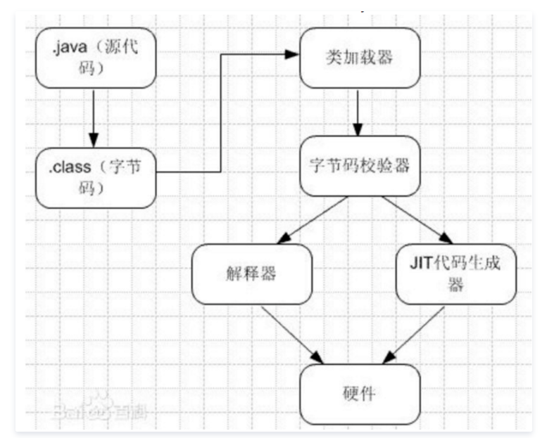
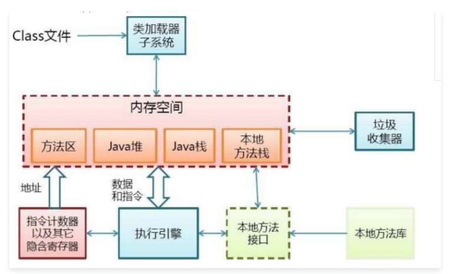
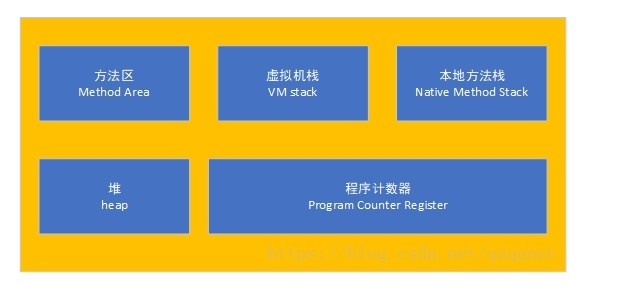
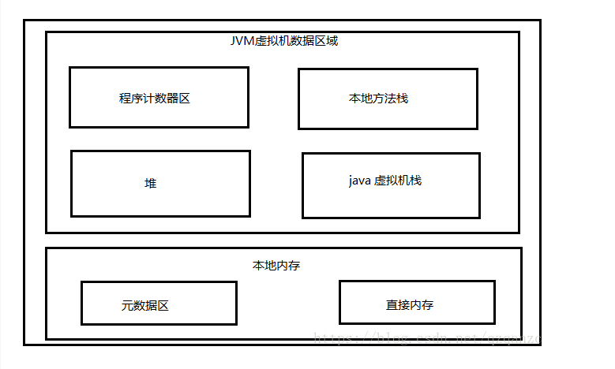
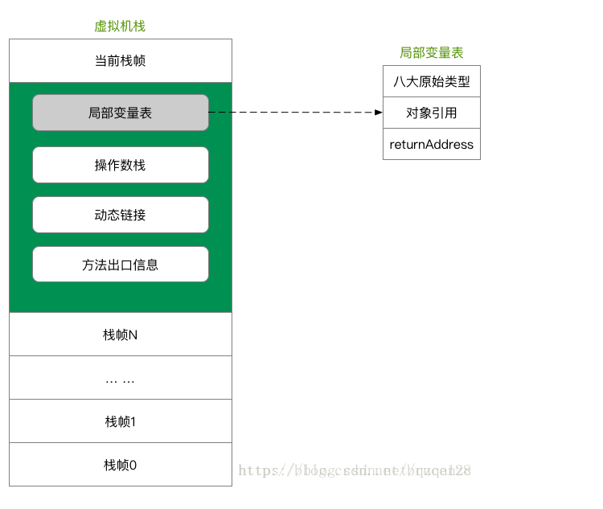
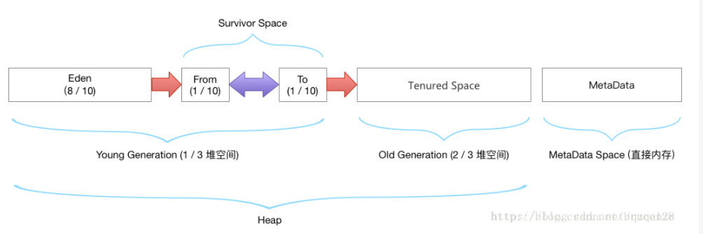

### 什么是JVM

>JVM是Java Virtual Machine（Java虚拟机）的缩写，JVM是一种用于计算设备的规范，它是一个虚构出来的计算机，是通过在实际的计算机上仿真模拟各种计算机功能来实现的。Java虚拟机包括一套字节码指令集、一组寄存器、一个栈、一个垃圾回收堆和一个存储方法域。 JVM屏蔽了与具体操作系统平台相关的信息，使Java程序只需生成在Java虚拟机上运行的目标代码（字节码）,就可以在多种平台上不加修改地运行。JVM在执行字节码时，实际上最终还是把字节码解释成具体平台上的机器指令执行。

### JRE/JDK/JVM是什么关系

>JRE(JavaRuntimeEnvironment，Java运行环境)，也就是Java平台。所有的Java 程序都要在JRE下才能运行。普通用户只需要运行已开发好的java程序，安装JRE即可。
 
>JDK(Java Development Kit)是程序开发者用来来编译、调试java程序用的开发工具包。JDK的工具也是Java程序，也需要JRE才能运行。为了保持JDK的独立性和完整性，在JDK的安装过程中，JRE也是 安装的一部分。所以，在JDK的安装目录下有一个名为jre的目录，用于存放JRE文件。
 
>JVM(JavaVirtualMachine，Java虚拟机)是JRE的一部分。它是一个虚构出来的计算机，是通过在实际的计算机上仿真模拟各种计算机功能来实现的。JVM有自己完善的硬件架构，如处理器、堆栈、寄存器等，还具有相应的指令系统。Java语言最重要的特点就是跨平台运行。使用JVM就是为了支持与操作系统无关，实现跨平台。

### JVM原理

>JVM是java的核心和基础，在java编译器和os平台之间的虚拟处理器。它是一种利用软件方法实现的抽象的计算机基于下层的操作系统和硬件平台，可以在上面执行java的字节码程序。

java编译器只要面向JVM，生成JVM能理解的代码或字节码文件。Java源文件经编译成字节码程序，通过JVM将每一条指令翻译成不同平台机器码，通过特定平台运行。

### JVM的体系结构

类装载器（ClassLoader）（用来装载.class文件）

执行引擎（执行字节码，或者执行本地方法）

运行时数据区（方法区、堆、java栈、PC寄存器、本地方法栈）,也称为内存模型划分

### 1.7以前标准内存模型

>Java内存模型（Java Memory Model ,JMM）就是一种符合内存模型规范的，屏蔽了各种硬件和操作系统的访问差异的，保证了Java程序在各种平台下对内存的访问都能保证效果一致的机制及规范。

>简要言之，jmm是jvm的一种规范，定义了jvm的内存模型。它屏蔽了各种硬件和操作系统的访问差异，不像c那样直接访问硬件内存，相对安全很多，它的主要目的是解决由于多线程通过共享内存进行通信时，存在的本地内存数据不一致、编译器会对代码指令重排序、处理器会对代码乱序执行等带来的问题。可以保证并发编程场景中的原子性、可见性和有序性。
 
根据JVM规范，JVM 内存共分为虚拟机栈，堆，方法区，程序计数器，本地方法栈五个部分。

程序计数器(线程私有)：
是当前线程锁执行字节码的行号治时期，每条线程都有一个独立的程序计数器，这类内存也称为“线程私有”的内存。正在执行java方法的话，计数器记录的是虚拟机字节码指令的地址(当前指令的地址)。如果是Natice方法，则为空。

java 虚拟机栈
也是线程私有的。
每个方法在执行的时候也会创建一个栈帧，存储了局部变量，操作数，动态链接，方法返回地址。
每个方法从调用到执行完毕，对应一个栈帧在虚拟机栈中的入栈和出栈。
通常所说的栈，一般是指在虚拟机栈中的局部变量部分。
局部变量所需内存在编译期间完成分配，
如果线程请求的栈深度大于虚拟机所允许的深度，则StackOverflowError。
如果虚拟机栈可以动态扩展，扩展到无法申请足够的内存，则OutOfMemoryError。
本地方法栈（线程私有）
和虚拟机栈类似，主要为虚拟机使用到的Native方法服务。也会抛出StackOverflowError 和OutOfMemoryError。

Java堆（线程共享）
被所有线程共享的一块内存区域，在虚拟机启动的时候创建，用于存放对象实例。
对可以按照可扩展来实现（通过-Xmx 和-Xms 来控制）
当队中没有内存可分配给实例，也无法再扩展时，则抛出OutOfMemoryError异常。
方法区（线程共享）
被所有方法线程共享的一块内存区域。
用于存储已经被虚拟机加载的类信息，常量，静态变量等。
这个区域的内存回收目标主要针对常量池的回收和堆类型的卸载。

### 1.8以后的内存模型

程序计数器
每个线程一块内存，指向当前正在执行的字节码的行号。如果当前线程是native方法，则其值为null。

ps(程序计数器内存划分)
因为处理器在一个确定是时刻只会执行一个线程中的指令，线程切换后，是通过计数器来记录执行痕迹的，因而可以看出，程序计数器是每个线程私有的。
如果执行的是java方法，那么记录的是正在执行的虚拟机字节码指令的地址的地址，如果是native方法，计数器的值为空（undefined）。

Java虚拟机栈

虚拟机栈中的名词解释

局部变量表：
存放编译期可知的各种基本数据类型、对象引用类型和returnAddress类型（指向一条字节码指令的地址：函数返回地址）。
long、double占用两个局部变量控件Slot。
局部变量表所需的内存空间在编译期确定，当进入一个方法时，方法在栈帧中所需要分配的局部变量控件是完全确定的，不可动态改变大小。
异常：线程请求的栈帧深度大于虚拟机所允许的深度—StackOverFlowError，如果虚拟机栈可以动态扩展（大部分虚拟机允许动态扩展，也可以设置固定大小的虚拟机栈），但是无法申请到足够的内存—OutOfMemorError。

操作数栈：
后进先出LIFO，最大深度由编译期确定。栈帧刚建立使，操作数栈为空，执行方法操作时，操作数栈用于存放JVM从局部变量表复制的常量或者变量，提供提取，及结果入栈，也用于存放调用方法需要的参数及接受方法返回的结果。
操作数栈可以存放一个jvm中定义的任意数据类型的值。
在任意时刻，操作数栈都一个固定的栈深度，基本类型除了long、double占用两个深度，其它占用一个深度
动态连接：
每个栈帧都包含一个指向运行时常量池中该栈帧所属方法的引用，持有这个引用是为了支持方法调用过程中的动态连接。Class文件的常量池中存在有大量的符号引用，字节码中的方法调用指令就以常量池中指向方法的符号引用为参数。这些符号引用，一部分会在类加载阶段或第一次使用的时候转化为直接引用（如final、static域等），称为静态解析，另一部分将在每一次的运行期间转化为直接引用，这部分称为动态连接。

方法返回地址：
当一个方法被执行后，有两种方式退出该方法：执行引擎遇到了任意一个方法返回的字节码指令或遇到了异常，并且该异常没有在方法体内得到处理。无论采用何种退出方式，在方法退出之后，都需要返回到方法被调用的位置，程序才能继续执行。方法返回时可能需要在栈帧中保存一些信息，用来帮助恢复它的上层方法的执行状态。一般来说，方法正常退出时，调用者的PC计数器的值就可以作为返回地址，栈帧中很可能保存了这个计数器值，而方法异常退出时，返回地址是要通过异常处理器来确定的，栈帧中一般不会保存这部分信息。
方法退出的过程实际上等同于把当前栈帧出栈，因此退出时可能执行的操作有：恢复上层方法的局部变量表和操作数栈，如果有返回值，则把它压入调用者栈帧的操作数栈中，调整PC计数器的值以指向方法调用指令后面的一条指令。

堆
堆时JVM内存占用最大，管理最复杂的一个区域。唯一的途径就是存放对象实例：所有的对象实例以及数组都在堆上进行分配。jdk1.7以后，字符串常量从永久代中剥离出来，存放在堆中。堆具有进一步的内存划分。按照GC分代手机角度划分

老年代：2/3的堆空间
年轻代：1/3的堆空间
eden区：8/10 的年轻代
survivor0: 1/10 的年轻代
survivor1:1/10的年轻代

元数据区域
元数据区域取代了1.7版本及以前的永久代。元数据和永久代本质上都时方法区的实现。方法区皴法虚拟机加载的类型西，静态变量，常量数据。
参数设置：-XX:MetaspaceSize=18m
-XX:MaxMetaspaceSize=60m
直接内存

>PS: 参考 https://blog.csdn.net/qzqanzc/article/details/81008598

https://cloud.tencent.com/developer/article/1376538

https://blog.csdn.net/ThinkWon/article/details/104390752