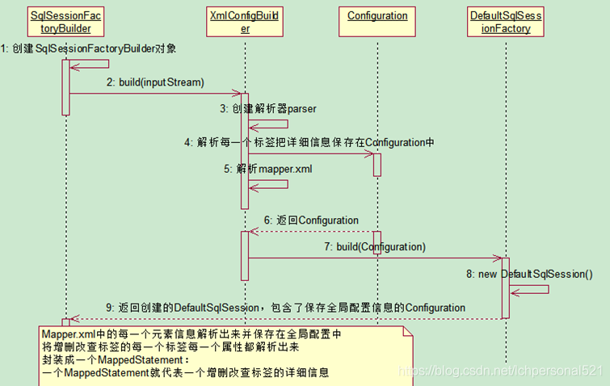
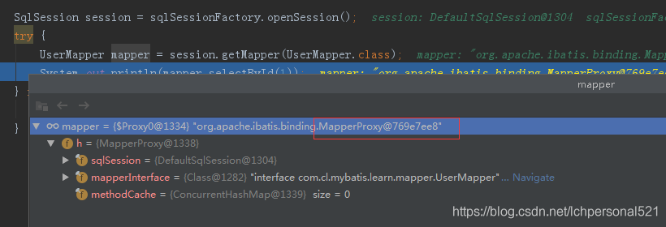
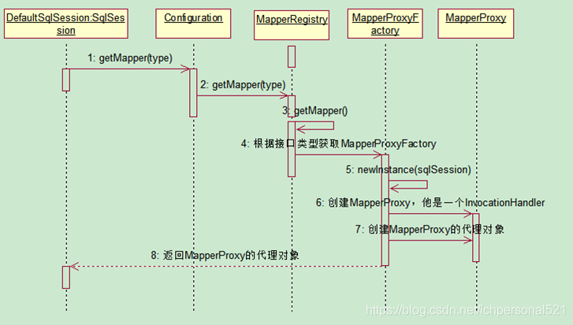
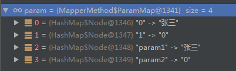
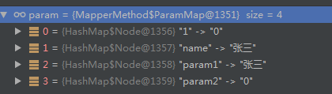
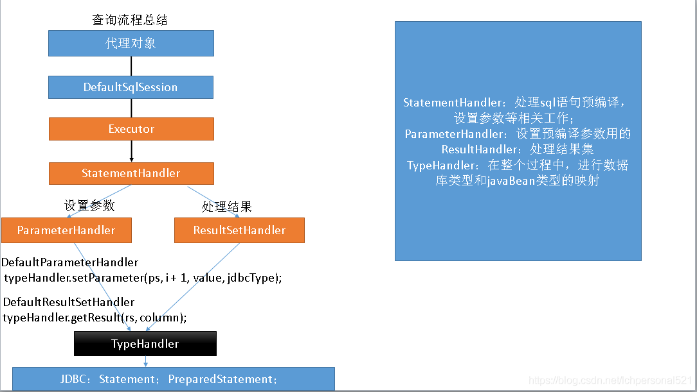

### mybatis原理

#### 前置示例

mybatis-config.xml

```xml

<?xml version="1.0" encoding="UTF-8" ?>
<!DOCTYPE configuration
        PUBLIC "-//mybatis.org//DTD Config 3.0//EN"
        "http://mybatis.org/dtd/mybatis-3-config.dtd">
<configuration>
    <properties resource="dbconfig.properties"></properties>

    <environments default="development">
        <environment id="development">
            <transactionManager type="JDBC"/>
            <dataSource type="POOLED">
                <property name="driver" value="${jdbc.driver}"/>
                <property name="url" value="${jdbc.url}"/>
                <property name="username" value="${jdbc.username}"/>
                <property name="password" value="${jdbc.password}"/>
            </dataSource>
        </environment>
    </environments>
    <mappers>
        <mapper resource="UserMapper.xml"/>
    </mappers>
</configuration>
```

定义一个UserMapper.xml

```xml
<?xml version="1.0" encoding="UTF-8" ?>
<!DOCTYPE mapper
        PUBLIC "-//mybatis.org//DTD Mapper 3.0//EN"
        "http://mybatis.org/dtd/mybatis-3-mapper.dtd">
<mapper namespace="com.cl.mybatis.learn.mapper.UserMapper">
    <select id="selectById" resultType="com.cl.mybatis.learn.user.User">
    select * from user where id = #{id}
  </select>
</mapper>
```

对应的UserMapper.java

```java
public interface UserMapper {
    User selectById(int id);
}
```

启动类：

```java
public class Mybatis001 {
    public static void main(String[] args) throws IOException {
        String resource = "mybatis-config.xml";
        InputStream inputStream = Resources.getResourceAsStream(resource);
        SqlSessionFactory sqlSessionFactory = new SqlSessionFactoryBuilder().build(inputStream);
        SqlSession session = sqlSessionFactory.openSession();
        try {
            UserMapper mapper = session.getMapper(UserMapper.class);
            System.out.println(mapper.selectById(1));
        } finally {
            session.close();
        }
    }
}
```

从main函数的运行步骤，本文将主要通过四个部分探讨mybatis的原理：

    SqlSessionFactory的创建
    SqlSession的创建
    UserMapper代理的生成
    数据库查询操作执行流程


### SqlSessionFactory的创建

#### 整体介绍

SqlSessionFactory的创建是SqlSessionFactoryBuilder通过mybatis主配置文件构建出的：

```
public SqlSessionFactory build(InputStream inputStream, String environment, Properties properties) {
    SqlSessionFactory var5;
    try {
        XMLConfigBuilder parser = new XMLConfigBuilder(inputStream, environment, properties);
        /**主要逻辑在下面这行代码*/
        var5 = this.build(parser.parse());
    } 
    ……
    ……  
    return var5;
}
```

parser.parse()到底做了什么呢？看如下代码：

```
private void parseConfiguration(XNode root) {
    try {
        /**解析配置文件中的各种属性*/
        this.propertiesElement(root.evalNode("properties"));
        /**解析别名配置*/
        this.typeAliasesElement(root.evalNode("typeAliases"));
        /**解析插件配置*/
        this.pluginElement(root.evalNode("plugins"));
        /**解析对象工厂元素*/
        this.objectFactoryElement(root.evalNode("objectFactory"));
        this.objectWrapperFactoryElement(root.evalNode("objectWrapperFactory"));
        /**解析mybatis的全局设置信息*/
        this.settingsElement(root.evalNode("settings"));
        /**解析mybatis的环境配置*/
        this.environmentsElement(root.evalNode("environments"));
        this.databaseIdProviderElement(root.evalNode("databaseIdProvider"));
        /**解析类型处理器配置信息*/
        this.typeHandlerElement(root.evalNode("typeHandlers"));
        /**解析mapper配置信息*/
        this.mapperElement(root.evalNode("mappers"));
    } catch (Exception var3) {
        throw new BuilderException("Error parsing SQL Mapper Configuration. Cause: " + var3, var3);
    }
}
```

实际上就是解析主配置文件中的各个节点，然后保存在Configuration当中，然后使用Configuration创建出一个DefaultSqlsessionFactory对象，至此过程结束：

```
public SqlSessionFactory build(Configuration config) {
    return new DefaultSqlSessionFactory(config);
}
```

此处，我们可以重点关注如下两个地方，看看具体在做了什么动作：

    this.pluginElement(root.evalNode("plugins")); this.mapperElement(root.evalNode("mappers"));
    
以上两个点分别是插件注册，和mapper的扫描注册。

#### 插件的注册

首先我们先看一下源代码：

```
private void pluginElement(XNode parent) throws Exception {
        if (parent != null) {
            Iterator i$ = parent.getChildren().iterator();
            while(i$.hasNext()) {
                XNode child = (XNode)i$.next();
                String interceptor = child.getStringAttribute("interceptor");
                Properties properties = child.getChildrenAsProperties();
                /**实例化拦截器类*/
                Interceptor interceptorInstance = (Interceptor)this.resolveClass(interceptor).newInstance();
                interceptorInstance.setProperties(properties);
                /**将实例化的拦截器类放到configuration中的interceptorChain中*/
                this.configuration.addInterceptor(interceptorInstance);
            }
        }
    }
```  

实际上就是通过interceptor标签，解析出拦截器类，然后将其实例化并保存到Configuration类中的InterceptorChain中，以备后用。

```
public void addInterceptor(Interceptor interceptor) {
    this.interceptorChain.addInterceptor(interceptor);
}
```  

#### mappers的扫描与解析

    this.mapperElement(root.evalNode("mappers"));

通过代码我们可以知道，这里主要是解析mappers标签的。我们先来看一下mappers标签里面是什么：

```xml
<mappers>
    <mapper resource="UserMapper.xml"/>
</mappers>
```    

所以他会去解析UserMapper.xml中的内容：

```xml
<mapper namespace="com.cl.mybatis.learn.mapper.UserMapper">
    <select id="selectById" resultType="com.cl.mybatis.learn.user.User">
    select * from user where id = #{id}
  </select>
</mapper>
```

我们看一下源代码：

```
private void mapperElement(XNode parent) throws Exception {
  if (parent != null) {
    for (XNode child : parent.getChildren()) {
      /**如果子节点是配置的package，那么进行包自动扫描处理*/  
      if ("package".equals(child.getName())) {
        String mapperPackage = child.getStringAttribute("name");
        configuration.addMappers(mapperPackage);
      } else {
        String resource = child.getStringAttribute("resource");
        String url = child.getStringAttribute("url");
        String mapperClass = child.getStringAttribute("class");
        /**如果子节点配置的是resource、url、mapperClass，本文我们使用的是resource*/
        if (resource != null && url == null && mapperClass == null) {
          ErrorContext.instance().resource(resource);
          InputStream inputStream = Resources.getResourceAsStream(resource);
          XMLMapperBuilder mapperParser = new XMLMapperBuilder(inputStream, configuration, resource, configuration.getSqlFragments());
          mapperParser.parse();
        } else if (resource == null && url != null && mapperClass == null) {
          ErrorContext.instance().resource(url);
          InputStream inputStream = Resources.getUrlAsStream(url);
          /**解析resource引入的另外一个xml文件*/
          XMLMapperBuilder mapperParser = new XMLMapperBuilder(inputStream, configuration, url, configuration.getSqlFragments());
          mapperParser.parse();
        } else if (resource == null && url == null && mapperClass != null) {
          Class<?> mapperInterface = Resources.classForName(mapperClass);
          configuration.addMapper(mapperInterface);
        } else {
          throw new BuilderException("A mapper element may only specify a url, resource or class, but not more than one.");
        }
      }
    }
  }
}
```

下面我们具体看一下他是如何解析另一个xml文件的：

```
public void parse() {
  if (!configuration.isResourceLoaded(resource)) {
    /**解析sql语句*/
    configurationElement(parser.evalNode("/mapper"));
    configuration.addLoadedResource(resource);
    /**解析名称空间，实际上就是对应绑定的接口类*/
    bindMapperForNamespace();
  }
  parsePendingResultMaps();
  parsePendingChacheRefs();
  parsePendingStatements();
}
``` 

下面我们来看一下 configurationElement(parser.evalNode("/mapper"))到底做了什么：

```
public void parseStatementNode() {
  String id = context.getStringAttribute("id");
  String databaseId = context.getStringAttribute("databaseId");
  if (!databaseIdMatchesCurrent(id, databaseId, this.requiredDatabaseId)) return;
  Integer fetchSize = context.getIntAttribute("fetchSize");
  Integer timeout = context.getIntAttribute("timeout");
  String parameterMap = context.getStringAttribute("parameterMap");
  String parameterType = context.getStringAttribute("parameterType");
  Class<?> parameterTypeClass = resolveClass(parameterType);
  String resultMap = context.getStringAttribute("resultMap");
  String resultType = context.getStringAttribute("resultType");
  String lang = context.getStringAttribute("lang");
  LanguageDriver langDriver = getLanguageDriver(lang);
  Class<?> resultTypeClass = resolveClass(resultType);
  String resultSetType = context.getStringAttribute("resultSetType");
  StatementType statementType = StatementType.valueOf(context.getStringAttribute("statementType", StatementType.PREPARED.toString()));
  ResultSetType resultSetTypeEnum = resolveResultSetType(resultSetType);

  String nodeName = context.getNode().getNodeName();
  SqlCommandType sqlCommandType = SqlCommandType.valueOf(nodeName.toUpperCase(Locale.ENGLISH));
  boolean isSelect = sqlCommandType == SqlCommandType.SELECT;
  boolean flushCache = context.getBooleanAttribute("flushCache", !isSelect);
  boolean useCache = context.getBooleanAttribute("useCache", isSelect);
  boolean resultOrdered = context.getBooleanAttribute("resultOrdered", false);

  // Include Fragments before parsing
  XMLIncludeTransformer includeParser = new XMLIncludeTransformer(configuration, builderAssistant);
  includeParser.applyIncludes(context.getNode());

  // Parse selectKey after includes and remove them.
  processSelectKeyNodes(id, parameterTypeClass, langDriver);
  
  // Parse the SQL (pre: <selectKey> and <include> were parsed and removed)
  SqlSource sqlSource = langDriver.createSqlSource(configuration, context, parameterTypeClass);
  String resultSets = context.getStringAttribute("resultSets");
  String keyProperty = context.getStringAttribute("keyProperty");
  String keyColumn = context.getStringAttribute("keyColumn");
  KeyGenerator keyGenerator;
  String keyStatementId = id + SelectKeyGenerator.SELECT_KEY_SUFFIX;
  keyStatementId = builderAssistant.applyCurrentNamespace(keyStatementId, true);
  if (configuration.hasKeyGenerator(keyStatementId)) {
    keyGenerator = configuration.getKeyGenerator(keyStatementId);
  } else {
    keyGenerator = context.getBooleanAttribute("useGeneratedKeys",
        configuration.isUseGeneratedKeys() && SqlCommandType.INSERT.equals(sqlCommandType))
        ? new Jdbc3KeyGenerator() : new NoKeyGenerator();
  }

  builderAssistant.addMappedStatement(id, sqlSource, statementType, sqlCommandType,
      fetchSize, timeout, parameterMap, parameterTypeClass, resultMap, resultTypeClass,
      resultSetTypeEnum, flushCache, useCache, resultOrdered, 
      keyGenerator, keyProperty, keyColumn, databaseId, langDriver, resultSets);
}
```

```
public MappedStatement addMappedStatement(
    String id,
    SqlSource sqlSource,
    StatementType statementType,
    SqlCommandType sqlCommandType,
    Integer fetchSize,
    Integer timeout,
    String parameterMap,
    Class<?> parameterType,
    String resultMap,
    Class<?> resultType,
    ResultSetType resultSetType,
    boolean flushCache,
    boolean useCache,
    boolean resultOrdered,
    KeyGenerator keyGenerator,
    String keyProperty,
    String keyColumn,
    String databaseId,
    LanguageDriver lang,
    String resultSets) {
  
  if (unresolvedCacheRef) throw new IncompleteElementException("Cache-ref not yet resolved");
  
  id = applyCurrentNamespace(id, false);
  boolean isSelect = sqlCommandType == SqlCommandType.SELECT;

  MappedStatement.Builder statementBuilder = new MappedStatement.Builder(configuration, id, sqlSource, sqlCommandType);
  statementBuilder.resource(resource);
  statementBuilder.fetchSize(fetchSize);
  statementBuilder.statementType(statementType);
  statementBuilder.keyGenerator(keyGenerator);
  statementBuilder.keyProperty(keyProperty);
  statementBuilder.keyColumn(keyColumn);
  statementBuilder.databaseId(databaseId);
  statementBuilder.lang(lang);
  statementBuilder.resultOrdered(resultOrdered);
  statementBuilder.resulSets(resultSets);
  setStatementTimeout(timeout, statementBuilder);

  setStatementParameterMap(parameterMap, parameterType, statementBuilder);
  setStatementResultMap(resultMap, resultType, resultSetType, statementBuilder);
  setStatementCache(isSelect, flushCache, useCache, currentCache, statementBuilder);

  MappedStatement statement = statementBuilder.build();
  configuration.addMappedStatement(statement);
  return statement;
}
```

通过解析一个个的标签，最终将sql语句的所有信息封装成MappedStatement对象，然后存储在configuration对象中。
那么bindMapperForNamespace();又做了什么呢？

```
private void bindMapperForNamespace() {
  String namespace = builderAssistant.getCurrentNamespace();
  if (namespace != null) {
    Class<?> boundType = null;
    try {
      boundType = Resources.classForName(namespace);
    } catch (ClassNotFoundException e) {
      //ignore, bound type is not required
    }
    if (boundType != null) {
      if (!configuration.hasMapper(boundType)) {
        // Spring may not know the real resource name so we set a flag
        // to prevent loading again this resource from the mapper interface
        // look at MapperAnnotationBuilder#loadXmlResource
        configuration.addLoadedResource("namespace:" + namespace);
        configuration.addMapper(boundType);
      }
    }
  }
}
```

实际上就是解析该sql对应的class，并把该class放到configuration中的mapperRegistry中。实际上mybatis的所有配置信息以及运行时的配置参数全部都保存在configuration对象中。
所以整个流程可以用如下的时序图表示：



### SqlSession的创建

我们知道，SqlSessionFactory创建的时候实际上返回的是一个DefaultSqlSessionFactory对象。
当执行openSession()操作的时候，实际上执行的代码如下：

```
private SqlSession openSessionFromDataSource(ExecutorType execType, TransactionIsolationLevel level, boolean autoCommit) {
  Transaction tx = null;
  try {
    final Environment environment = configuration.getEnvironment();
    final TransactionFactory transactionFactory = getTransactionFactoryFromEnvironment(environment);
    tx = transactionFactory.newTransaction(environment.getDataSource(), level, autoCommit);
    /**根据execType创建Executor对象*/
    final Executor executor = configuration.newExecutor(tx, execType);
    return new DefaultSqlSession(configuration, executor, autoCommit);
  } catch (Exception e) {
    closeTransaction(tx); // may have fetched a connection so lets call close()
    throw ExceptionFactory.wrapException("Error opening session.  Cause: " + e, e);
  } finally {
    ErrorContext.instance().reset();
  }
}
```
从代码可以知道，openSession操作会创建Mybatis四大对象之一的Executor对象，创建过程如下：

```
public Executor newExecutor(Transaction transaction, ExecutorType executorType) {
  executorType = executorType == null ? defaultExecutorType : executorType;
  executorType = executorType == null ? ExecutorType.SIMPLE : executorType;
  Executor executor;
  if (ExecutorType.BATCH == executorType) {
    executor = new BatchExecutor(this, transaction);
  } else if (ExecutorType.REUSE == executorType) {
    executor = new ReuseExecutor(this, transaction);
  } else {
    executor = new SimpleExecutor(this, transaction);
  }
  /**如果开启了二级缓存，executor会被CachingExecutor包装一次*/
  if (cacheEnabled) {
    executor = new CachingExecutor(executor);
  }
  /**尝试将executor使用interceptorChain中的每个interceptor包装一次(根据配置)，这里是对Mybatis强大的插件开发功能做支持*/
  executor = (Executor) interceptorChain.pluginAll(executor);
  return executor;
}
```

默认情况下会返回一个SimpleExecutor对象。然后SimpleExecutor被封装到DefaultSqlSession。这里我们需要注意一下，在Executor创建完毕之后，会根据配置是否开启了二级缓存，来决定是否使用CachingExecutor包装一次Executor。最后尝试将executor使用interceptorChain中的每个interceptor包装一次(根据配置)，这里是对Mybatis强大的插件开发功能做支持。


### Mapper代理的生成

当我们使用如下代码：

    UserMapper mapper = session.getMapper(UserMapper.class);

来获取UserMapper的时候，实际上是从configuration当中的MapperRegistry当中获取UserMapper的代理对象：

```
public <T> T getMapper(Class<T> type, SqlSession sqlSession) {
    final MapperProxyFactory<T> mapperProxyFactory = (MapperProxyFactory<T>) knownMappers.get(type);
    if (mapperProxyFactory == null)
      throw new BindingException("Type " + type + " is not known to the MapperRegistry.");
    try {
      return mapperProxyFactory.newInstance(sqlSession);
    } catch (Exception e) {
      throw new BindingException("Error getting mapper instance. Cause: " + e, e);
    }
  }
```

knownMappers属性里面的值，实际上就是我们在mappers扫描与解析的时候放进去的。

```
protected T newInstance(MapperProxy<T> mapperProxy) {
  return (T) Proxy.newProxyInstance(mapperInterface.getClassLoader(), new Class[] { mapperInterface }, mapperProxy);
}

public T newInstance(SqlSession sqlSession) {
  final MapperProxy<T> mapperProxy = new MapperProxy<T>(sqlSession, mapperInterface, methodCache);
  return newInstance(mapperProxy);
}
```

并且MapperProxy实现了InvocationHandler接口，从以上代码可以看出，实际上使用的就是jdk的动态代理，给UserMapper接口生成一个代理对象。实际上就是MapperProxy的一个对象，如下图调试信息所示：



所以整个代理对象生成过程可以用如下时序图表示：




### 执行查询语句

我们知道，我们获取到的UserMapper实际上是代理对象MapperProxy，所以我们执行查询语句的时候实际上执行的是MapperProxy的invoke方法：

```
public Object invoke(Object proxy, Method method, Object[] args) throws Throwable {
  /**如果调用的是Object原生的方法，则直接放行*/
  if (Object.class.equals(method.getDeclaringClass())) {
    try {
      return method.invoke(this, args);
    } catch (Throwable t) {
      throw ExceptionUtil.unwrapThrowable(t);
    }
  }
  final MapperMethod mapperMethod = cachedMapperMethod(method);
  return mapperMethod.execute(sqlSession, args);
}
```

我们再来看看cachedMapperMethod方法：

```
private MapperMethod cachedMapperMethod(Method method) {
  MapperMethod mapperMethod = methodCache.get(method);
  if (mapperMethod == null) {
    mapperMethod = new MapperMethod(mapperInterface, method, sqlSession.getConfiguration());
    methodCache.put(method, mapperMethod);
  }
  return mapperMethod;
}
```

可以看到，先根据方法签名，从方法缓存中获取方法，如果为空，则生成一个MapperMethod放入缓存并返回。

所以最终执行查询的是MapperMethod的execute方法：

```
public Object execute(SqlSession sqlSession, Object[] args) {
  Object result;
  if (SqlCommandType.INSERT == command.getType()) {
    Object param = method.convertArgsToSqlCommandParam(args);
    result = rowCountResult(sqlSession.insert(command.getName(), param));
  } else if (SqlCommandType.UPDATE == command.getType()) {
    Object param = method.convertArgsToSqlCommandParam(args);
    result = rowCountResult(sqlSession.update(command.getName(), param));
  } else if (SqlCommandType.DELETE == command.getType()) {
    Object param = method.convertArgsToSqlCommandParam(args);
    result = rowCountResult(sqlSession.delete(command.getName(), param));
      /**select查询语句*/
  } else if (SqlCommandType.SELECT == command.getType()) {
      /**档返回类型为空*/
    if (method.returnsVoid() && method.hasResultHandler()) {
      executeWithResultHandler(sqlSession, args);
      result = null;
      /**当返回many的时候*/
    } else if (method.returnsMany()) {
      result = executeForMany(sqlSession, args);
      /**当返回值类型为Map时*/
    } else if (method.returnsMap()) {
      result = executeForMap(sqlSession, args);
    } else {
      /**除去以上情况，执行这里的步骤*/
      Object param = method.convertArgsToSqlCommandParam(args);
      result = sqlSession.selectOne(command.getName(), param);
    }
  } else {
    throw new BindingException("Unknown execution method for: " + command.getName());
  }
  if (result == null && method.getReturnType().isPrimitive() && !method.returnsVoid()) {
    throw new BindingException("Mapper method '" + command.getName() 
        + " attempted to return null from a method with a primitive return type (" + method.getReturnType() + ").");
  }
  return result;
}
```

我们示例中执行的分支语句是：

```
Object param = method.convertArgsToSqlCommandParam(args);
 result = sqlSession.selectOne(command.getName(), param);
```

这里有一个查询参数的解析过程：

```
public Object convertArgsToSqlCommandParam(Object[] args) {
      final int paramCount = params.size();
      if (args == null || paramCount == 0) {
        return null;
        /**参数没有标注@Param注解，并且参数个数为一个*/
      } else if (!hasNamedParameters && paramCount == 1) {
        return args[params.keySet().iterator().next()];
        /**否则执行这个分支*/
      } else {
        final Map<String, Object> param = new ParamMap<Object>();
        int i = 0;
        for (Map.Entry<Integer, String> entry : params.entrySet()) {
          param.put(entry.getValue(), args[entry.getKey()]);
          // issue #71, add param names as param1, param2...but ensure backward compatibility
          final String genericParamName = "param" + String.valueOf(i + 1);
          if (!param.containsKey(genericParamName)) {
            param.put(genericParamName, args[entry.getKey()]);
          }
          i++;
        }
        return param;
      }
    }
```

这里的代码看起来可能逻辑不太好懂，我这里解释一下结论就好，这里参数解析如果判断参数一个只有一个（一个单一参数或者是一个集合参数），并且没有标注@Param注解，那么直接返回这个参数的值，否则会被封装为一个Map，然后再返回。

封装的样式如下用几个示例解释：

例1：

    /**接口为*/
    User selectByNameSex(String name, int sex);
    /**我们用如下格式调用*/
    userMapper.selectByNameSex("张三",0);
    /**参数会被封装为如下格式：*/
    0 ---> 张三
    1 ---> 0
    param1 ---> 张三
    param2 ---> 0

如下图所示：



例2：
    
    /**接口为*/
    User selectByNameSex(@Param("name") String name, int sex);
    /**我们用如下格式调用*/
    userMapper.selectByNameSex("张三",0);
    /**参数会被封装为如下格式：*/
    name ---> 张三
    1 ---> 0
    param1 ---> 张三
    param2 ---> 0

如下图所示：


参数处理完接下来就是调用执行过程，最终调用执行的是DefaultSqlSession中的selectList方法：

```
public <E> List<E> selectList(String statement, Object parameter, RowBounds rowBounds) {
  try {
    MappedStatement ms = configuration.getMappedStatement(statement);
    List<E> result = executor.query(ms, wrapCollection(parameter), rowBounds, Executor.NO_RESULT_HANDLER);
    return result;
  } catch (Exception e) {
    throw ExceptionFactory.wrapException("Error querying database.  Cause: " + e, e);
  } finally {
    ErrorContext.instance().reset();
  }
}
```

这里调用SimpleExecutor的query方法执行查询操作，接着调用doQuery方法：

```
public <E> List<E> doQuery(MappedStatement ms, Object parameter, RowBounds rowBounds, ResultHandler resultHandler, BoundSql boundSql) throws SQLException {
  Statement stmt = null;
  try {
    Configuration configuration = ms.getConfiguration();
      /**这里出现了Mybatis四大对象中的StatementHandler*/
    StatementHandler handler = configuration.newStatementHandler(wrapper, ms, parameter, rowBounds, resultHandler, boundSql);
    stmt = prepareStatement(handler, ms.getStatementLog());
    return handler.<E>query(stmt, resultHandler);
  } finally {
    closeStatement(stmt);
  }
}
```

```
public StatementHandler newStatementHandler(Executor executor, MappedStatement mappedStatement, Object parameterObject, RowBounds rowBounds, ResultHandler resultHandler, BoundSql boundSql) {
  StatementHandler statementHandler = new RoutingStatementHandler(executor, mappedStatement, parameterObject, rowBounds, resultHandler, boundSql);
  statementHandler = (StatementHandler) 
   /**创建StatementHandler并应用到插件支持*/   
      interceptorChain.pluginAll(statementHandler);
  return statementHandler;
}
```

在创建StatementHandler的同时，应用插件功能，同时创建了Mybatis四大对象中的另外两个对象：

```
protected BaseStatementHandler(Executor executor, MappedStatement mappedStatement, Object parameterObject, RowBounds rowBounds, ResultHandler resultHandler, BoundSql boundSql) {
   ……
   ……
   ……
 /**Mybatis四大对象中的ParameterHandler*/     
  this.parameterHandler = configuration.newParameterHandler(mappedStatement, parameterObject, boundSql);
  /**Mybatis四大对象中的ResultSetHandler*/ 
  this.resultSetHandler = configuration.newResultSetHandler(executor, mappedStatement, rowBounds, parameterHandler, resultHandler, boundSql);
}
```

同时在创建的时候，也运用到了插件增强功能：

```
public ParameterHandler newParameterHandler(MappedStatement mappedStatement, Object parameterObject, BoundSql boundSql) {
   ……
   ……
   ……
  interceptorChain.pluginAll(parameterHandler);
  return parameterHandler;
}

  public ResultSetHandler newResultSetHandler(Executor executor, MappedStatement mappedStatement, RowBounds rowBounds, ParameterHandler parameterHandler,
      ResultHandler resultHandler, BoundSql boundSql) {
   ……
   ……
   ……
    interceptorChain.pluginAll(resultSetHandler);
    return resultSetHandler;
  }
```


接下来就是执行正常的JDB C查询功能了，参数设置由ParameterHandler操作，结果集处理由ResultSetHandler处理。至此，整个查询流程结束。

整个查询阶段的时序图可以用如下图表示：


整个查询流程，可以总结如下图：




### Mybatis插件开发


#### 四大对象

Mybatis四大对象指的是：Executor、StatementHandler、ParamaterHandler、ResultSetHandler。Mybatis允许我们在四大对象执行的过程中对其指定方法进行拦截，这样就可以很方便了进行功能的增强，这个功能跟Spring的切面编程非常类似。上文我们都有提到过，在四大对象创建的时候，都进行了插件增强，下面我们就来讲解一下其实现原理。

例如我们希望在sql语句之前前后进行时间打印，计算出sql执行的时间。此功能我们就可以拦截StatementHandler。这里我们需要实现Mybatis提供的Intercaptor接口。

```java
package com.cl.mybatis.learn.intercaptor;

/**
 * @Author: chengli
 * @Date: 2018/11/24 17:37
 */

/**该注解签名告诉此拦截器拦截四大对象中的哪个对象的哪个方法，以及方法的签名信息*/
@Intercepts({
        @Signature(type = StatementHandler.class, method = "query", args = {Statement.class, ResultHandler.class})
})
public class SqlLogPlugin implements Interceptor {
    @Override
    public Object intercept(Invocation invocation) throws Throwable {
        long begin = System.currentTimeMillis();
        try {
            return invocation.proceed();
        } finally {
            long time = System.currentTimeMillis() - begin;
            System.out.println("sql 运行了 ：" + time + " ms");
        }
    }

    @Override
    public Object plugin(Object target) {
        return Plugin.wrap(target, this);
    }

    @Override
    public void setProperties(Properties properties) {

    }
}
```

接下来我们需要在mybatis-config.xml配置该拦截器：
```xml
<plugins>
    <plugin interceptor="com.cl.mybatis.learn.intercaptor.SqlLogPlugin">
        <property name="参数1" value="root"/>
        <property name="参数2" value="123456"/>
    </plugin>
</plugins>

```

此时，拦截器的配置就完成了，运行结果如下：

    DEBUG 11-24 17:51:34,877 ==>  Preparing: select * from user where id = ?   (BaseJdbcLogger.java:139) 
    DEBUG 11-24 17:51:34,940 ==> Parameters: 1(Integer)  (BaseJdbcLogger.java:139) 
    DEBUG 11-24 17:51:34,990 <==      Total: 1  (BaseJdbcLogger.java:139) 
    sql 运行了 ：51 ms
    User{id=1, name='张三', age=42, sex=0}

#### 插件原理探究

从代码我们可以看出:

```
public Object plugin(Object target) {
        return Plugin.wrap(target, this);
    }
```

该代码是对目标对象的包装，实际运行的时候，是使用的包装之后的类，运行的时候执行的是intercept方法。那么现在我们来看下它是怎么进行包装的：

```
public static Object wrap(Object target, Interceptor interceptor) {
  Map<Class<?>, Set<Method>> signatureMap = getSignatureMap(interceptor);
  Class<?> type = target.getClass();
  Class<?>[] interfaces = getAllInterfaces(type, signatureMap);
  if (interfaces.length > 0) {
    return Proxy.newProxyInstance(
        type.getClassLoader(),
        interfaces,
        new Plugin(target, interceptor, signatureMap));
  }
  return target;
}
```

而Plugin类实现了InvocationHanlder接口：

```
public class Plugin implements InvocationHandler {
    ……
}
```

显然这里使用的就是JDK的动态代理，对目标对象包装了一层。

假如一个对象被多个拦截器进行了多次包装，那么后包装的在最外层会先执行。


>PS: 参考：https://blog.csdn.net/lchpersonal521/article/details/84451357


