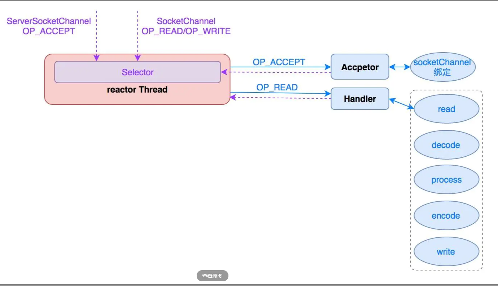
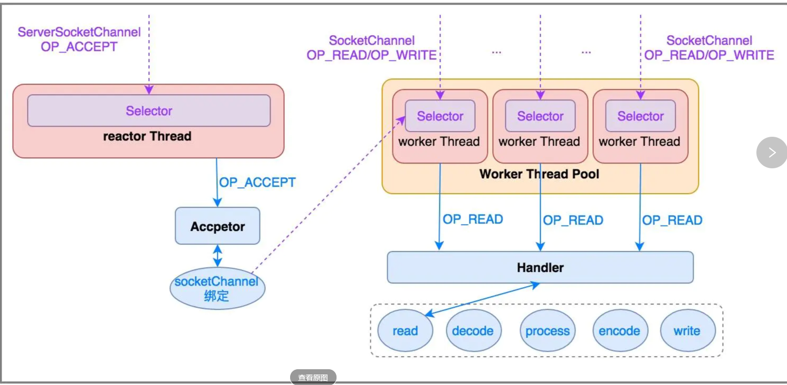
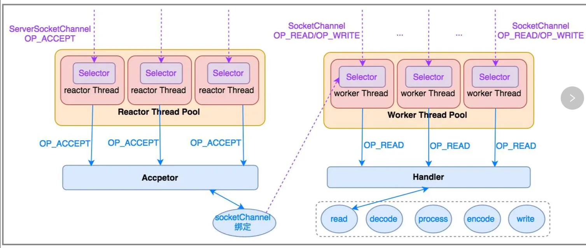
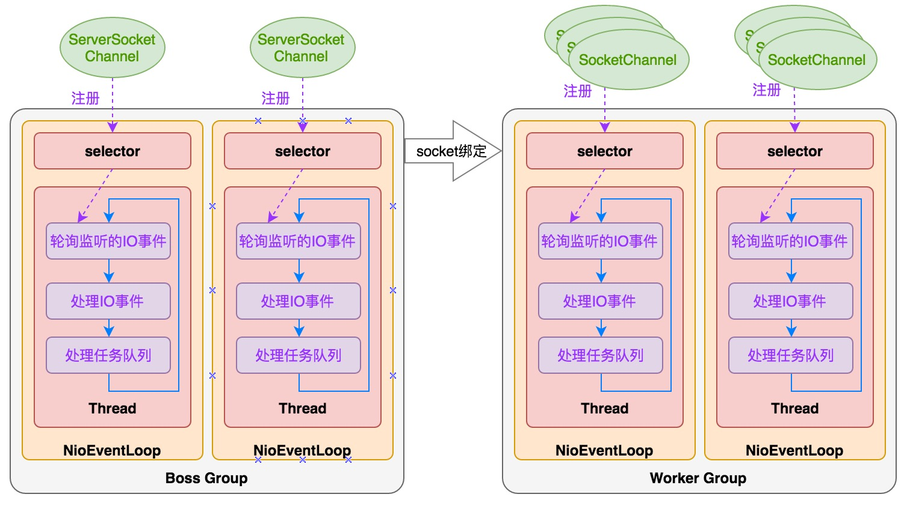
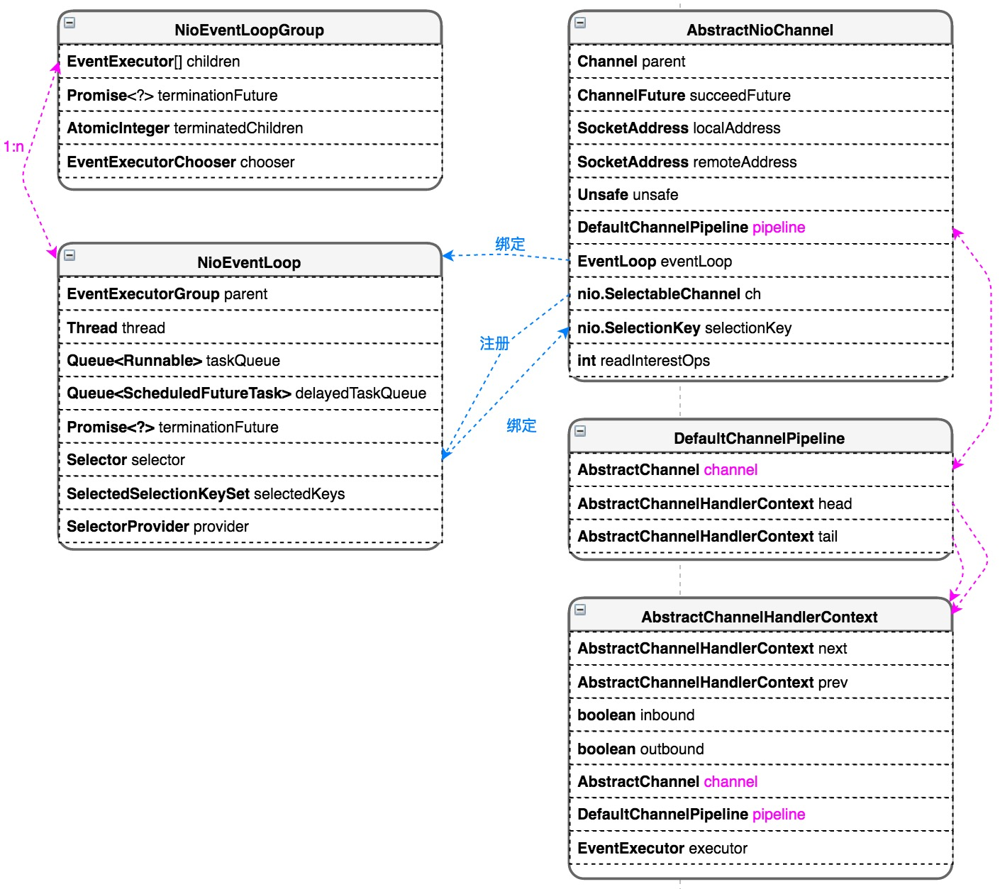

### NIO Reactor模型

#### Reactor模式思想：分而治之+事件驱动

1）分而治之

一个连接里完整的网络处理过程一般分为accept、read、decode、process、encode、send这几步。

Reactor模式将每个步骤映射为一个Task，服务端线程执行的最小逻辑单元不再是一次完整的网络请求，而是Task，且采用非阻塞方式执行。

2）事件驱动

每个Task对应特定网络事件。当Task准备就绪时，Reactor收到对应的网络事件通知，并将Task分发给绑定了对应网络事件的Handler执行。

3）几个角色

Reactor：负责响应事件，将事件分发给绑定了该事件的Handler处理；

Handler：事件处理器，绑定了某类事件，负责执行对应事件的Task对事件进行处理；

Acceptor：Handler的一种，绑定了connect事件。当客户端发起connect请求时，Reactor会将accept事件分发给Acceptor处理。

#### 单线程Reactor

1）优点：

不需要做并发控制，代码实现简单清晰。

2）缺点：

a)不能利用多核CPU；

b)一个线程需要执行处理所有的accept、read、decode、process、encode、send事件，处理成百上千的链路时性能上无法支撑；

c)一旦reactor线程意外跑飞或者进入死循环，会导致整个系统通信模块不可用。

#### 多线程Reactor

特点：

a)有专门一个reactor线程用于监听服务端ServerSocketChannel，接收客户端的TCP连接请求；

b)网络IO的读/写操作等由一个worker reactor线程池负责，由线程池中的NIO线程负责监听SocketChannel事件，进行消息的读取、解码、编码和发送。

c)一个NIO线程可以同时处理N条链路，但是一个链路只注册在一个NIO线程上处理，防止发生并发操作问题。

#### 主从多线程

在绝大多数场景下，Reactor多线程模型都可以满足性能需求；但是在极个别特殊场景中，一个NIO线程负责监听和处理所有的客户端连接可能会存在性能问题。

特点：

a)服务端用于接收客户端连接的不再是个1个单独的reactor线程，而是一个boss reactor线程池；

b)服务端启用多个ServerSocketChannel监听不同端口时，每个ServerSocketChannel的监听工作可以由线程池中的一个NIO线程完成。

### Netty线程模型

netty线程模型采用“服务端监听线程”和“IO线程”分离的方式，与多线程Reactor模型类似。

抽象出NioEventLoop来表示一个不断循环执行处理任务的线程，每个NioEventLoop有一个selector，用于监听绑定在其上的socket链路。

1、串行化设计避免线程竞争
netty采用串行化设计理念，从消息的读取->解码->处理->编码->发送，始终由IO线程NioEventLoop负责。整个流程不会进行线程上下文切换，数据无并发修改风险。

一个NioEventLoop聚合一个多路复用器selector，因此可以处理多个客户端连接。

netty只负责提供和管理“IO线程”，其他的业务线程模型由用户自己集成。

时间可控的简单业务建议直接在“IO线程”上处理，复杂和时间不可控的业务建议投递到后端业务线程池中处理。

2、定时任务与时间轮
NioEventLoop中的Thread线程按照时间轮中的步骤不断循环执行：

a)在时间片Tirck内执行selector.select()轮询监听IO事件；

b)处理监听到的就绪IO事件；

c)执行任务队列taskQueue/delayTaskQueue中的非IO任务。

### NioEventLoop与NioChannel类关系

>PS:参考： https://www.jianshu.com/p/38b56531565d