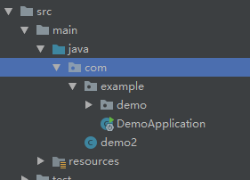
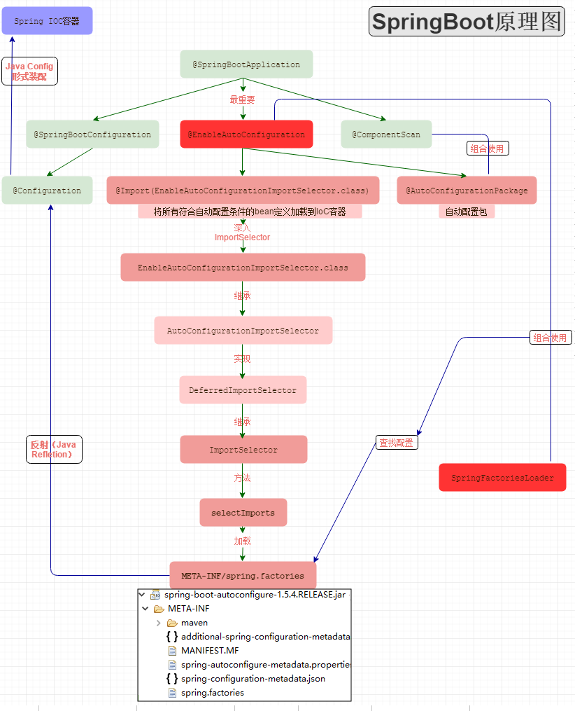

### spring boot 常用注解

#### @EnableConfigurationProperties

>注解表示对 @ConfigurationProperties的内嵌支持，默认会将对应Properties Class作为bean注入的IOC容器中，即在相应的Properties类上不用加 @Component注解。


### spring boot 启动原理

#### @SpringBootApplication

```
@Target(ElementType.TYPE)            // 注解的适用范围，其中TYPE用于描述类、接口（包括包注解类型）或enum声明
@Retention(RetentionPolicy.RUNTIME)  // 注解的生命周期，保留到class文件中（三个生命周期）
@Documented                          // 表明这个注解应该被javadoc记录
@Inherited                           // 子类可以继承该注解
@SpringBootConfiguration             // 继承了Configuration，表示当前是注解类
@EnableAutoConfiguration             // 开启springboot的注解功能，springboot的四大神器之一，其借助@import的帮助
@ComponentScan(excludeFilters = {    // 扫描路径设置（具体使用待确认）
        @Filter(type = FilterType.CUSTOM, classes = TypeExcludeFilter.class),
        @Filter(type = FilterType.CUSTOM, classes = AutoConfigurationExcludeFilter.class) })
public @interface SpringBootApplication {
...
}
```

虽然定义使用了多个Annotation进行了原信息标注，但实际上重要的只有三个Annotation：

@Configuration（@SpringBootConfiguration点开查看发现里面还是应用了@Configuration）
@EnableAutoConfiguration
@ComponentScan
所以，如果我们使用如下的SpringBoot启动类，整个SpringBoot应用依然可以与之前的启动类功能对等：
```
@Configuration
@EnableAutoConfiguration
@ComponentScan
public class Application {
    public static void main(String[] args) {
        SpringApplication.run(Application.class, args);
    }
}
```

#### @Configuration

>JavaConfig形式的Spring Ioc容器的配置类使用的那个@Configuration，SpringBoot社区推荐使用基于JavaConfig的配置形式，所以，这里的启动类标注了@Configuration之后，本身其实也是一个IoC容器的配置类。

`基于xml方式：`
 
 ```xml
<?xml version="1.0" encoding="UTF-8"?>
<beans xmlns="http://www.springframework.org/schema/beans"
       xmlns:xsi="http://www.w3.org/2001/XMLSchema-instance"
       xsi:schemaLocation="http://www.springframework.org/schema/beans http://www.springframework.org/schema/beans/spring-beans-3.0.xsd"
       default-lazy-init="true">
    <!--bean定义-->
</beans>
```

`基于JavaConfig的配置方式:`

```java
@Configuration
public class MockConfiguration{
    //bean定义
}   
```

`任何一个标注了@Bean的方法，其返回值将作为一个bean定义注册到Spring的IoC容器，方法名将默认成该bean定义的id。`

`如果一个bean的定义依赖其他bean,则直接调用对应的JavaConfig类中依赖bean的创建方法就可以了。`


#### @ComponentScan

>@ComponentScan这个注解在Spring中很重要，它对应XML配置中的元素，@ComponentScan的功能其实就是自动扫描并加载符合条件的组件（比如@Component和@Repository等）或者bean定义，最终将这些bean定义加载到IoC容器中。

我们可以通过basePackages等属性来细粒度的定制@ComponentScan自动扫描的范围，如果不指定，则默认Spring框架实现会从声明@ComponentScan所在类的package进行扫描。

>注：所以SpringBoot的启动类最好是放在root package下，因为默认不指定basePackages。


#### @EnableAutoConfiguration

@EnableScheduling是通过@Import将Spring调度框架相关的bean定义都加载到IoC容器。
@EnableMBeanExport是通过@Import将JMX相关的bean定义加载到IoC容器。
而@EnableAutoConfiguration也是借助@Import的帮助，将所有符合自动配置条件的bean定义加载到IoC容器，仅此而已！

@EnableAutoConfiguration作为一个复合Annotation,其自身定义关键信息如下：
```
@SuppressWarnings("deprecation")
@Target(ElementType.TYPE)
@Retention(RetentionPolicy.RUNTIME)
@Documented
@Inherited
@AutoConfigurationPackage
@Import(EnableAutoConfigurationImportSelector.class)
public @interface EnableAutoConfiguration {
    ...
}
```

`@AutoConfigurationPackage：自动配置包`

AutoConfigurationPackage注解：
```java
static class Registrar implements ImportBeanDefinitionRegistrar, DeterminableImports {

        @Override
        public void registerBeanDefinitions(AnnotationMetadata metadata,
                BeanDefinitionRegistry registry) {
            register(registry, new PackageImport(metadata).getPackageName());
        }
```
它其实是注册了一个Bean的定义。

new PackageImport(metadata).getPackageName()，它其实返回了当前主程序类的 同级以及子级 的包组件。



以上图为例，DemoApplication是和demo包同级，但是demo2这个类是DemoApplication的父级，和example包同级

也就是说，DemoApplication启动加载的Bean中，并不会加载demo2，这也就是为什么，我们要把DemoApplication放在项目的最高级中。

`@Import: 导入自动配置的组件`

Import(AutoConfigurationImportSelector.class)注解：


可以从图中看出 AutoConfigurationImportSelector 继承了 DeferredImportSelector 继承了 ImportSelector

ImportSelector有一个方法为：selectImports
```java
    @Override
    public String[] selectImports(AnnotationMetadata annotationMetadata) {
        if (!isEnabled(annotationMetadata)) {
            return NO_IMPORTS;
        }
        AutoConfigurationMetadata autoConfigurationMetadata = AutoConfigurationMetadataLoader
                .loadMetadata(this.beanClassLoader);
        AnnotationAttributes attributes = getAttributes(annotationMetadata);
        List<String> configurations = getCandidateConfigurations(annotationMetadata,
                attributes);
        configurations = removeDuplicates(configurations);
        Set<String> exclusions = getExclusions(annotationMetadata, attributes);
        checkExcludedClasses(configurations, exclusions);
        configurations.removeAll(exclusions);
        configurations = filter(configurations, autoConfigurationMetadata);
        fireAutoConfigurationImportEvents(configurations, exclusions);
        return StringUtils.toStringArray(configurations);
    }
```

其中，最关键的要属@Import(EnableAutoConfigurationImportSelector.class)，借助EnableAutoConfigurationImportSelector，@EnableAutoConfiguration可以帮助SpringBoot应用将所有符合条件的@Configuration配置都加载到当前SpringBoot创建并使用的IoC容器。就像一只“八爪鱼”一样


#### SpringFactoriesLoader详解

>借助于Spring框架原有的一个工具类：SpringFactoriesLoader的支持，@EnableAutoConfiguration可以智能的自动配置功效才得以大功告成！

SpringFactoriesLoader属于Spring框架私有的一种扩展方案，其主要功能就是从指定的配置文件META-INF/spring.factories加载配置。

```java
public abstract class SpringFactoriesLoader {
    //...
    public static <T> List<T> loadFactories(Class<T> factoryClass, ClassLoader classLoader) {
    }


    public static List<String> loadFactoryNames(Class<?> factoryClass, ClassLoader classLoader) {
    }
}

```

配合@EnableAutoConfiguration使用的话，它更多是提供一种配置查找的功能支持，即根据@EnableAutoConfiguration的完整类名org.springframework.boot.autoconfigure.EnableAutoConfiguration作为查找的Key,获取对应的一组@Configuration类

上图就是从SpringBoot的autoconfigure依赖包中的META-INF/spring.factories配置文件中摘录的一段内容，可以很好地说明问题。

所以，@EnableAutoConfiguration自动配置的魔法骑士就变成了：从classpath中搜寻所有的META-INF/spring.factories配置文件，并将其中org.springframework.boot.autoconfigure.EnableutoConfiguration对应的配置项通过反射（Java Refletion）实例化为对应的标注了@Configuration的JavaConfig形式的IoC容器配置类，然后汇总为一个并加载到IoC容器。




#### 启动流程

```
public ConfigurableApplicationContext run(String... args) {
		//构造一个任务执行观察器
		StopWatch stopWatch = new StopWatch();
		stopWatch.start();// 开始执行，记录开始时间
		ConfigurableApplicationContext context = null;
		Collection<SpringBootExceptionReporter> exceptionReporters = new ArrayList<>();
		configureHeadlessProperty();
		//获取SpringApplicationRunListeners，内部只有一个EventPublishingRunListener  1
		SpringApplicationRunListeners listeners = getRunListeners(args);
		listeners.starting();
		try {
			//创建一个 DefaultApplicationArguments 对象，它持有 args 参数，就是 main 函数传进来的参数调用 prepareEnvironment 方法。  2
			ApplicationArguments applicationArguments = new DefaultApplicationArguments(args);
			ConfigurableEnvironment environment = prepareEnvironment(listeners,	applicationArguments);
			configureIgnoreBeanInfo(environment);
			//3
			Banner printedBanner = printBanner(environment);
			//创建文ApplicationContext 4
			context = createApplicationContext();
			exceptionReporters = getSpringFactoriesInstances(SpringBootExceptionReporter.class,
					new Class[] { ConfigurableApplicationContext.class }, context);
			//5
			prepareContext(context, environment, listeners, applicationArguments,printedBanner);
			//6
			refreshContext(context);
			afterRefresh(context, applicationArguments);
			stopWatch.stop();
			if (this.logStartupInfo) {
				new StartupInfoLogger(this.mainApplicationClass)
						.logStarted(getApplicationLog(), stopWatch);
			}
			listeners.started(context);
			callRunners(context, applicationArguments);
		}
		catch (Throwable ex) {
			handleRunFailure(context, ex, exceptionReporters, listeners);
			throw new IllegalStateException(ex);
		}

		try {
			listeners.running(context);
		}
		catch (Throwable ex) {
			handleRunFailure(context, ex, exceptionReporters, null);
			throw new IllegalStateException(ex);
		}
		return context;
	}
```

**1** 通过SpringFactoriesLoader查找并加载所有的 SpringApplicationRunListeners，通过调用starting()方法通知所有的SpringApplicationRunListener：应用开始启动了。SpringApplicationRunListener其本质上就是一个事件发布者，它在SpringBoot应用启动的不同时间点发布不同应用事件类型(ApplicationEvent)，如果有哪些事件监听者(ApplicationListener)对这些事件感兴趣，则可以接收并且处理。前面的初始化流程中，SpringApplication加载了一系列ApplicationListener。发布事件的代码已经在SpringApplicationRunListeners中实现了。

看下SpringApplicationRunListener的源码：

```java
public interface SpringApplicationRunListener {

	//首次启动run方法时立即调用。 可用于早期的初始化。
	void starting();
	//一旦准备好环境就调用，但是在创建ApplicationContext之前调用
	void environmentPrepared(ConfigurableEnvironment environment);
	//一旦创建并准备了ApplicationContext，但在加载源之前调用
	void contextPrepared(ConfigurableApplicationContext context);
	//在应用程序上下文加载之后但在刷新之前调用
	void contextLoaded(ConfigurableApplicationContext context);
	//上下文已刷新且应用程序已启动但尚未调用CommandLineRunner CommandLineRunners和ApplicationRunner ApplicationRunners。
	//2.0之后添加的
	void started(ConfigurableApplicationContext context);
	//在run方法完成之前立即调用，即刷新应用程序上下文并调用所有CommandLineRunners和ApplicationRunner后调用。
	void running(ConfigurableApplicationContext context);
	//在运行应用程序时发生故障时调用。
	void failed(ConfigurableApplicationContext context, Throwable exception);
}

```

SpringApplicationRunListener只有一个实现类： EventPublishingRunListener。1处的代码只会返回一个SpringApplicationRunListeners ，注意后面多了一个s字母，看下源码就会发现该类就是包含了一个SpringApplicationRunListener的List。操作SpringApplicationRunListeners ，在内部会遍历每一个SpringApplicationRunListener。

1处的代码其实是遍历每个SpringApplicationRunListener，调用每一个SpringApplicationRunListener的实现类的starting方法，如下：

```
@Override
	public void starting() {
		//发布一个ApplicationStartedEvent
		this.initialMulticaster.multicastEvent(
				new ApplicationStartingEvent(this.application, this.args));
	}
```

**2** 创建并配置当前应用将要使用的 Environment，Environment用于描述应用程序当前的运行环境，其抽象了两个方面的内容：配置文件(profile)和属性(properties)，开发经验丰富的同学对这两个东西一定不会陌生：不同的环境(eg：生产环境、预发布环境)可以使用不同的配置文件，而属性则可以从配置文件、环境变量、命令行参数等来源获取。因此，当Environment准备好后，在整个应用的任何时候，都可以从Environment中获取资源。
 
总结起来，②处的两句代码，主要完成以下几件事：
- 判断Environment是否存在，不存在就创建（如果是web项目就创建 StandardServletEnvironment，否则创建 StandardEnvironment）
- 配置Environment：配置profile以及properties
- 调用SpringApplicationRunListener的 environmentPrepared()方法，通知事件监听者：应用的Environment已经准备好

**3 打印Banner图案**

**4** 根据不同的ApplicationType创建不同的Context，具体的类型回顾初始化中App类型的介绍

**5** 初始化ApplicationContext，主要完成以下工作：

- 将准备好的Environment设置给ApplicationContext

- 遍历调用所有的ApplicationContextInitializer的 initialize()方法来对已经创建好的ApplicationContext进行进一步的处理

- 调用SpringApplicationRunListener的 contextPrepared()方法，通知所有的监听者：ApplicationContext已经准备完毕

- 将所有的bean加载到容器中

- 调用SpringApplicationRunListener的 contextLoaded()方法，通知所有的监听者：ApplicationContext已经装载完毕

**6** refresh完成配置类的解析、各种BeanFactoryPostProcessor和BeanPostProcessor的注册、国际化配置的初始化、web内置容器的构造等等


### spring boot与spring、springMVC区别


https://juejin.im/post/5aa22d1f51882555677e2492

### 面试篇

#### 什么是springboot

    用来简化spring应用的初始搭建以及开发过程 使用特定的方式来进行配置（properties或yml文件） 

    创建独立的spring引用程序 main方法运行

    嵌入的Tomcat 无需部署war文件

    简化maven配置

    自动配置spring添加对应功能starter自动化配置 

#### springboot自动配置的原理

    在spring程序main方法中 添加@SpringBootApplication或者@EnableAutoConfiguration

    会自动去maven中读取每个starter中的spring.factories文件  该文件里配置了所有需要被创建spring容器中的bean
    

#### 