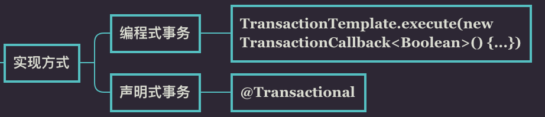
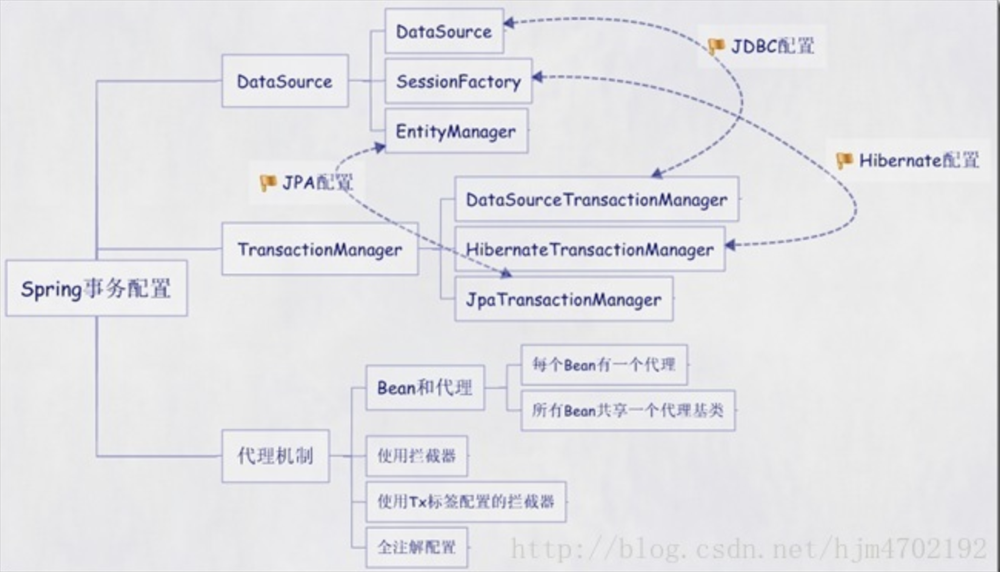
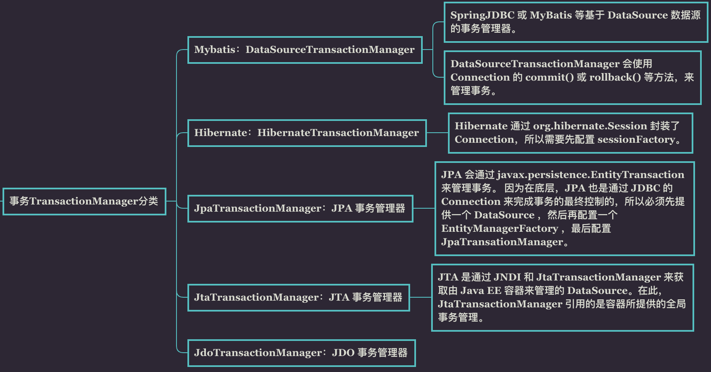
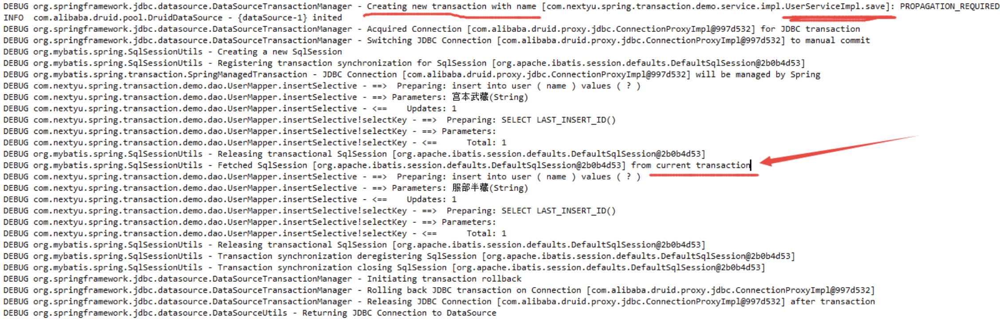
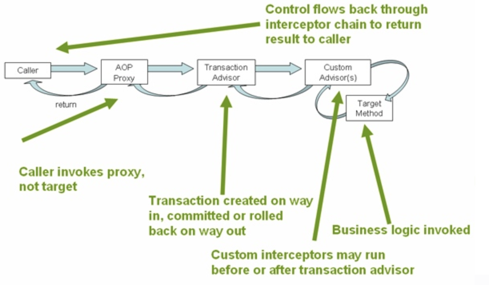
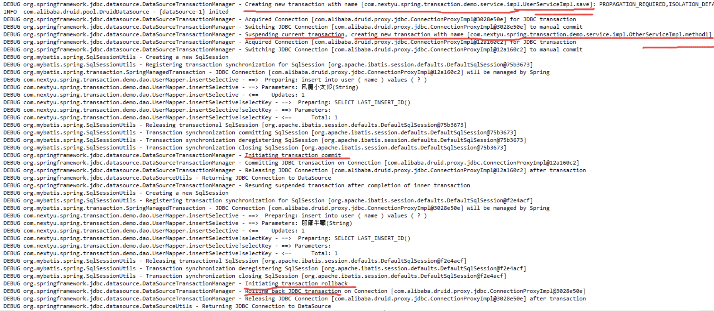
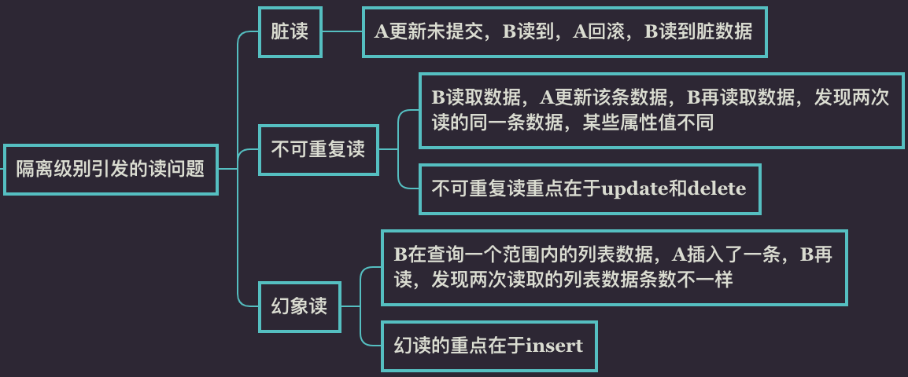
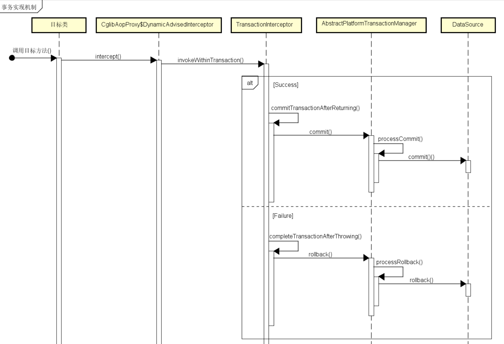

### spring 事务管理

Spring 事务管理分为编程式和声明式的两种方式。编程式事务指的是通过编码方式实现事务；声明式事务基于 AOP,将具体业务逻辑与事务处理解耦。声明式事务管理使业务代码逻辑不受污染, 因此在实际使用中声明式事务用的比较多。



声明式事务有两种方式，一种是在配置文件（xml）中做相关的事务规则声明，另一种是基于 @Transactional 注解的方式。

需要明确几点：

　　1、默认配置下 Spring 只会回滚运行时、未检查异常（继承自 RuntimeException 的异常）或者 Error。
　　2、@Transactional 注解只能应用到 public 方法才有效。

　　3、@Transactional 注解可以被应用于接口定义和接口方法、类定义和类的 public 方法上。然而仅仅 @Transactional 注解的出现不足以开启事务行为，它仅仅是一种元数据，能够被可以识别 @Transactional 注解和上述的配置适当的具有事务行为的beans所使用。其实是 <tx:annotation-driven/>元素的出现开启了事务行为。

　　4、注解不可以继承，建议在具体的类（或类的方法）上使用 @Transactional 注解，而不要使用在类所要实现的任何接口上。当然可以在接口上使用 @Transactional 注解，但是这将只有当你设置了基于接口的代理时它才生效。

Spring配置文件中关于事务配置总是由三个组成部分，分别是DataSource、TransactionManager和代理机制这三部分，无论哪种配置方式，一般变化的只是代理机制这部分。

DataSource、TransactionManager这两部分只是会根据数据访问方式有所变化，比如使用Hibernate进行数据访问时，DataSource实际为SessionFactory，TransactionManager的实现为HibernateTransactionManager。

具体如下图：


事务的TransactionManager事务管理器总共有5种，与DataSource关联关系如图所示：


### Spring事务配置方式

#### 1、XML配置每个Bean都有一个代理

```xml
<?xml version="1.0" encoding="UTF-8"?>
<beans xmlns="http://www.springframework.org/schema/beans"
    xmlns:xsi="http://www.w3.org/2001/XMLSchema-instance"
    xmlns:context="http://www.springframework.org/schema/context"
    xmlns:aop="http://www.springframework.org/schema/aop"
    xsi:schemaLocation="http://www.springframework.org/schema/beans 
           http://www.springframework.org/schema/beans/spring-beans-2.5.xsd
           http://www.springframework.org/schema/context
           http://www.springframework.org/schema/context/spring-context-2.5.xsd
           http://www.springframework.org/schema/aop http://www.springframework.org/schema/aop/spring-aop-2.5.xsd">
 
    <bean id="sessionFactory"  
            class="org.springframework.orm.hibernate3.LocalSessionFactoryBean">  
        <property name="configLocation" value="classpath:hibernate.cfg.xml" />  
        <property name="configurationClass" value="org.hibernate.cfg.AnnotationConfiguration" />
    </bean>  
 
    <!-- 定义事务管理器（声明式的事务） -->  
    <bean id="transactionManager"
        class="org.springframework.orm.hibernate3.HibernateTransactionManager">
        <property name="sessionFactory" ref="sessionFactory" />
    </bean>
    
    <!-- 配置DAO -->
    <bean id="userDaoTarget" class="com.bluesky.spring.dao.UserDaoImpl">
        <property name="sessionFactory" ref="sessionFactory" />
    </bean>
    
    <bean id="userDao"  
        class="org.springframework.transaction.interceptor.TransactionProxyFactoryBean">  
           <!-- 配置事务管理器 -->  
        <property name="transactionManager" ref="transactionManager" />     
        <property name="target" ref="userDaoTarget" />  
        <property name="proxyInterfaces" value="com.bluesky.spring.dao.GeneratorDao" />
        <!-- 配置事务属性 -->  
        <property name="transactionAttributes">  
            <props>  
                <prop key="*">PROPAGATION_REQUIRED</prop>
            </props>  
        </property>  
    </bean>  
</beans>
```

#### 2、XML所有Bean共享一个代理基类：

```xml
<?xml version="1.0" encoding="UTF-8"?>
<beans xmlns="http://www.springframework.org/schema/beans"
    xmlns:xsi="http://www.w3.org/2001/XMLSchema-instance"
    xmlns:context="http://www.springframework.org/schema/context"
    xmlns:aop="http://www.springframework.org/schema/aop"
    xsi:schemaLocation="http://www.springframework.org/schema/beans 
           http://www.springframework.org/schema/beans/spring-beans-2.5.xsd
           http://www.springframework.org/schema/context
           http://www.springframework.org/schema/context/spring-context-2.5.xsd
           http://www.springframework.org/schema/aop http://www.springframework.org/schema/aop/spring-aop-2.5.xsd">
 
    <bean id="sessionFactory"  
            class="org.springframework.orm.hibernate3.LocalSessionFactoryBean">  
        <property name="configLocation" value="classpath:hibernate.cfg.xml" />  
        <property name="configurationClass" value="org.hibernate.cfg.AnnotationConfiguration" />
    </bean>  
 
    <!-- 定义事务管理器（声明式的事务） -->  
    <bean id="transactionManager"
        class="org.springframework.orm.hibernate3.HibernateTransactionManager">
        <property name="sessionFactory" ref="sessionFactory" />
    </bean>
    
　　 <!-- 此处所有transactionBase所有Bean共用 --> 
    <bean id="transactionBase"  
            class="org.springframework.transaction.interceptor.TransactionProxyFactoryBean"  
            lazy-init="true" abstract="true">  
        <!-- 配置事务管理器 -->  
        <property name="transactionManager" ref="transactionManager" />  
        <!-- 配置事务属性 -->  
        <property name="transactionAttributes">  
            <props>  
                <prop key="*">PROPAGATION_REQUIRED</prop>  
            </props>  
        </property>  
    </bean>    
   
    <!-- 配置DAO -->
    <bean id="userDaoTarget" class="com.bluesky.spring.dao.UserDaoImpl">
        <property name="sessionFactory" ref="sessionFactory" />
    </bean>
    
    <bean id="userDao" parent="transactionBase" >  
        <property name="target" ref="userDaoTarget" />   
    </bean>
</beans>
```

#### XML配置拦截器：

```xml
<?xml version="1.0" encoding="UTF-8"?>
<beans xmlns="http://www.springframework.org/schema/beans"
    xmlns:xsi="http://www.w3.org/2001/XMLSchema-instance"
    xmlns:context="http://www.springframework.org/schema/context"
    xmlns:aop="http://www.springframework.org/schema/aop"
    xsi:schemaLocation="http://www.springframework.org/schema/beans 
           http://www.springframework.org/schema/beans/spring-beans-2.5.xsd
           http://www.springframework.org/schema/context
           http://www.springframework.org/schema/context/spring-context-2.5.xsd
           http://www.springframework.org/schema/aop http://www.springframework.org/schema/aop/spring-aop-2.5.xsd">
 
    <bean id="sessionFactory"  
            class="org.springframework.orm.hibernate3.LocalSessionFactoryBean">  
        <property name="configLocation" value="classpath:hibernate.cfg.xml" />  
        <property name="configurationClass" value="org.hibernate.cfg.AnnotationConfiguration" />
    </bean>  
 
    <!-- 定义事务管理器（声明式的事务） -->  
    <bean id="transactionManager"
        class="org.springframework.orm.hibernate3.HibernateTransactionManager">
        <property name="sessionFactory" ref="sessionFactory" />
    </bean> 
   
    <bean id="transactionInterceptor"  
        class="org.springframework.transaction.interceptor.TransactionInterceptor">  
        <property name="transactionManager" ref="transactionManager" />  
        <!-- 配置事务属性 -->  
        <property name="transactionAttributes">  
            <props>  
                <prop key="*">PROPAGATION_REQUIRED</prop>  
            </props>  
        </property>  
    </bean>
      
    <bean class="org.springframework.aop.framework.autoproxy.BeanNameAutoProxyCreator">  
        <property name="beanNames">  
            <list>  
                <value>*Dao</value>
            </list>  
        </property>  
        <property name="interceptorNames">  
            <list>  
                <value>transactionInterceptor</value>  
            </list>  
        </property>  
    </bean>  
  
    <!-- 配置DAO -->
    <bean id="userDao" class="com.bluesky.spring.dao.UserDaoImpl">
        <property name="sessionFactory" ref="sessionFactory" />
    </bean>
</beans>
```

#### XML使用tx标签配置AOP切面：

```xml
<?xml version="1.0" encoding="UTF-8"?>
<beans xmlns="http://www.springframework.org/schema/beans"
    xmlns:xsi="http://www.w3.org/2001/XMLSchema-instance"
    xmlns:context="http://www.springframework.org/schema/context"
    xmlns:aop="http://www.springframework.org/schema/aop"
    xmlns:tx="http://www.springframework.org/schema/tx"
    xsi:schemaLocation="http://www.springframework.org/schema/beans 
           http://www.springframework.org/schema/beans/spring-beans-2.5.xsd
           http://www.springframework.org/schema/context
           http://www.springframework.org/schema/context/spring-context-2.5.xsd
           http://www.springframework.org/schema/aop http://www.springframework.org/schema/aop/spring-aop-2.5.xsd
           http://www.springframework.org/schema/tx http://www.springframework.org/schema/tx/spring-tx-2.5.xsd">
 
    <context:annotation-config />
    <context:component-scan base-package="com.bluesky" />
 
    <bean id="sessionFactory"  
            class="org.springframework.orm.hibernate3.LocalSessionFactoryBean">  
        <property name="configLocation" value="classpath:hibernate.cfg.xml" />  
        <property name="configurationClass" value="org.hibernate.cfg.AnnotationConfiguration" />
    </bean>  
 
    <!-- 定义事务管理器（声明式的事务） -->  
    <bean id="transactionManager"
        class="org.springframework.orm.hibernate3.HibernateTransactionManager">
        <property name="sessionFactory" ref="sessionFactory" />
    </bean>
 
    <tx:advice id="txAdvice" transaction-manager="transactionManager">
        <tx:attributes>
            <tx:method name="*" propagation="REQUIRED" />
        </tx:attributes>
    </tx:advice>
    
    <aop:config>
        <aop:pointcut id="interceptorPointCuts"
            expression="execution(* com.bluesky.spring.dao.*.*(..))" />
        <aop:advisor advice-ref="txAdvice"
            pointcut-ref="interceptorPointCuts" />        
    </aop:config>      
</beans>
```

#### 五、全注解方式

```xml
<?xml version="1.0" encoding="UTF-8"?>
<beans xmlns="http://www.springframework.org/schema/beans"
    xmlns:xsi="http://www.w3.org/2001/XMLSchema-instance"
    xmlns:context="http://www.springframework.org/schema/context"
    xmlns:aop="http://www.springframework.org/schema/aop"
    xmlns:tx="http://www.springframework.org/schema/tx"
    xsi:schemaLocation="http://www.springframework.org/schema/beans 
           http://www.springframework.org/schema/beans/spring-beans-2.5.xsd
           http://www.springframework.org/schema/context
           http://www.springframework.org/schema/context/spring-context-2.5.xsd
           http://www.springframework.org/schema/aop http://www.springframework.org/schema/aop/spring-aop-2.5.xsd
           http://www.springframework.org/schema/tx http://www.springframework.org/schema/tx/spring-tx-2.5.xsd">
 
    <context:annotation-config />
    <context:component-scan base-package="com.bluesky" />
 
    <tx:annotation-driven transaction-manager="transactionManager"/>
 
    <bean id="sessionFactory"  
            class="org.springframework.orm.hibernate3.LocalSessionFactoryBean">  
        <property name="configLocation" value="classpath:hibernate.cfg.xml" />  
        <property name="configurationClass" value="org.hibernate.cfg.AnnotationConfiguration" />
    </bean>  
 
    <!-- 定义事务管理器（声明式的事务） -->  
    <bean id="transactionManager"
        class="org.springframework.orm.hibernate3.HibernateTransactionManager">
        <property name="sessionFactory" ref="sessionFactory" />
    </bean>
    
</beans>
```

或者SpringBoot在Application启动类通过注解开启事务管理：

```
@EnableTransactionManagement // 启注解事务管理，等同于xml配置方式的 <tx:annotation-driven />
```

然后在具体的DAO类中添加注解@Transaction

```java
@Transactional
@Component("userDao")
public class UserDaoImpl extends HibernateDaoSupport implements UserDao {
 
    public List<User> listUsers() {
        return this.getSession().createQuery("from User").list();
    }
}

```

### Spring事务属性配置(注解示例)

>- 我们在使用Spring声明式事务时，有一个非常重要的概念就是事务属性。事务属性通常由事务的传播行为，事务的隔离级别，事务的超时值和事务只读标志组成。我们在进行事务划分时，需要进行事务定义，也就是配置事务的属性。 
>- Spring在TransactionDefinition接口中定义这些属性,以供PlatfromTransactionManager使用, PlatfromTransactionManager是spring事务管理的核心接口。

    TransactionDefinition  
    public interface TransactionDefinition {  
        int getPropagationBehavior();   //事务的传播性
        int getIsolationLevel();   //事务的隔离性 
        int getTimeout();   //超时
        boolean isReadOnly();    //只读
    } 

#### 1、事务的传播性

getPropagationBehavior()返回事务的传播行为，由是否有一个活动的事务来决定一个事务调用。 在TransactionDefinition接口中定义了七个事务传播行为。

配置方式：

    @Transactional(propagation=Propagation.REQUIRED)    //默认方式，跟@Transactional同效果


propagation取值：

    PROPAGATION_REQUIRED 表示业务方法需要在一个事务中处理，如果业务方法执行时已经在一个事务中，则加入该事务，否则重新开启一个事务。这也是默认的事务传播行为；
    
    PROPAGATION_SUPPORTS 该属性指定，如果业务方法在一个既有的事务中进行，则加入该事务；否则，业务方法将在一个没有事务的环境下进行；但是对于事务同步的事务管理器，PROPAGATION_SUPPORTS与不使用事务有少许不同。 
    
    PROPAGATION_MANDATORY 该属性指定业务方法只能在一个已经存在的事务中进行，业务方法不能发起自己的事务；如果业务方法没有在一个既有的事务中进行，容器将抛出异常； 
    
    PROPAGATION_REQUIRES_NEW 表明业务方法需要在一个单独的事务中进行，如果业务方法进行时已经在一个事务中，则这个事务被挂起，并重新开启一个事务来执行这个业务方法，业务方法执行完毕后，原来的事务恢复进行；
    
    PROPAGATION_NOT_SUPPORTED  总是非事务地执行，并挂起任何存在的事务。 
    
    PROPAGATION_NEVER 总是非事务地执行，如果存在一个活动事务，则抛出异常。
    
    PROPAGATION_NESTED 该属性指定，如果业务方法在一个既有的事务中执行，则该业务方法将在一个嵌套的事务中进行；否则，按照TransactionDefinition.PROPAGATION_REQUIRED来对待。它使用一个单独的事务，这个事务可以有多个rollback点，内部事务的rollback对外部事务没有影响，但外部事务的rollback会导致内部事务的rollback。这个行为只对DataSourceTransactionManager有效。


##### PROPAGATION_REQUIRED　

    //事务属性 PROPAGATION_REQUIRED
    @Transactional(propagation=Propagation.REQUIRED)
    methodA{ 
        ……
        methodB();
        …… 
    } 
    //事务属性 PROPAGATION_REQUIRED
    @Transactional(propagation=Propagation.REQUIRED)
    methodB{
        …… 
    }

单独调用MethodB时，Spring保证在methodB方法中所有的调用都获得到一个相同的连接。在调用methodB时，没有一个存在的事务，所以获得一个新的连接，开启了一个新的事务。 

调用MethodA时，环境中没有事务，所以开启一个新的事务. 当在MethodA中调用MethodB时，环境中已经有了一个事务，所以methodB就加入当前事务。 相当于把B方法直接移到A方法中，同时回滚或者同时提交。

##### PROPAGATION_SUPPORTS

    //事务属性 PROPAGATION_REQUIRED
    @Transactional(propagation=Propagation.REQUIRED)
    methodA{ 
        ……
        methodB();
        …… 
    } 
    //事务属性 PROPAGATION_SUPPORTS
    @Transactional(propagation=Propagation.SUPPORTS)
    methodB{
        …… 
    }

单独调用MethodB时，methodB方法是非事务的执行的。  

调用MethodA时，methodB则加入到了methodA的事务中,事务地执行。

#####  PROPAGATION_MANDATORY

    //事务属性 PROPAGATION_REQUIRED
    @Transactional(propagation=Propagation.REQUIRED)
    methodA{ 
        ……
        methodB();
        …… 
    } 
    //事务属性 PROPAGATION_MANDATORY
    @Transactional(propagation=Propagation.MANDATORY)
    methodB{
        …… 
    }

当单独调用methodB时，因为当前没有一个活动的事务，则会抛出异常 throw new IllegalTransactionStateException("Transactionpropagation 'mandatory' but no existing transaction found"); 

当调用methodA时，methodB则加入到methodA的事务中，事务地执行。

##### PROPAGATION_REQUIRES_NEW

    //事务属性 PROPAGATION_REQUIRED
    @Transactional(propagation=Propagation.REQUIRED)
    methodA{ 
        doSomeThingA(); 
        methodB();
        doSomeThingB(); 
    } 
    //事务属性 PROPAGATION_REQUIRES_NEW
    @Transactional(propagation=Propagation.REQUIRES_NEW)
    methodB{
        …… 
    }

当单独调用methodB时，相当于把methodb声明为REQUIRED。开启一个新的事务，事务地执行。 

当调用methodA时，类似如下效果：

    main(){
        TransactionManager tm = null; 
        try{
            //获得一个JTA事务管理器
            tm = getTransactionManager(); 
            tm.begin();//开启一个新的事务
            Transaction ts1 = tm.getTransaction();
            doSomeThing();
            tm.suspend();//挂起当前事务
            try{
                tm.begin();//重新开启第二个事务
                Transaction ts2 = tm.getTransaction();
                methodB();
                ts2.commit();//提交第二个事务
            }Catch(RunTimeException ex){
                ts2.rollback();//回滚第二个事务
            }finally{  
                //释放资源
            }
    
            //methodB执行完后，复恢第一个事务
            tm.resume(ts1);
            doSomeThingB();
            ts1.commit();//提交第一个事务
        }catch(RunTimeException ex){
            ts1.rollback();//回滚第一个事务
        }finally{
            //释放资源 
        }
    }

在这里，我把ts1称为外层事务，ts2称为内层事务。从上面的代码可以看出，ts2与ts1是两个独立的事务，互不相干。Ts2是否成功并不依赖于ts1。如果methodA方法在调用methodB方法后的doSomeThingB方法失败了,而methodB方法所做的结果依然被提交。而除了methodB之外的其它代码导致的结果却被回滚了。 

使用PROPAGATION_REQUIRES_NEW,需要使用JtaTransactionManager作为事务管理器。 

注意：

    @Transactional(propagation = Propagation.REQUIRED)
    @Override
    public void save() {
    
        method1();
    
        User user = new User("A");
        userMapper.insertSelective(user);
    
        if (true) {
            throw new RuntimeException("save 抛异常了");
        }
    }
    
    @Transactional(propagation = Propagation.REQUIRES_NEW)
    public void method1() {
        User user = new User("B");
        userMapper.insertSelective(user);
    }

运行之后，发现数据并没有插入数据库。查看日志内容。



从日志内容可以看出，其实两个方法都是处于同一个事务中，method1 方法并没有创建一个新的事务。根据 Spring 官方文档：



>- In proxy mode (which is the default), only external method calls coming in through the proxy are intercepted. This means that self-invocation, in effect, a method within the target object calling another method of the target object, will not lead to an actual transaction at runtime even if the invoked method is marked with @Transactional.
>- 大概意思：在默认的代理模式下，只有目标方法由外部调用，才能被 Spring 的事务拦截器拦截。在同一个类中的两个方法直接调用，是不会被 Spring 的事务拦截器拦截，就像上面的 save 方法直接调用了同一个类中的 method1方法，method1 方法不会被 Spring 的事务拦截器拦截。可以使用 AspectJ 取代 Spring AOP 代理来解决这个问题，但是这里暂不讨论。


为了解决这个问题，我们可以新建一个类。

```java
@Service
public class OtherServiceImpl implements OtherService {

    @Autowired
    private UserMapper userMapper;

    @Transactional(propagation = Propagation.REQUIRES_NEW)
    @Override
    public void method1() {
        User user = new User("XXXXX");
        userMapper.insertSelective(user);
    }
}
```

然后在 save 方法中调用 otherService.method1 方法。

    @Autowired
    private OtherService otherService;
    
    @Transactional(propagation = Propagation.REQUIRED)
    @Override
    public void save() {
    
        otherService.method1();
        User user = new User("YYYYY");
        userMapper.insertSelective(user);
    
        if (true) {
            throw new RuntimeException("save 抛异常了");
        }
    }


这下，otherService.method1 方法的数据插入成功，save 方法的数据未插入，事务回滚。

继续看一下日志内容：



从日志可以看出，首先创建了 save 方法的事务，由于 otherService.method1 方法的 @Transactional 的 propagation 属性为 Propagation.REQUIRES_NEW ，所以接着暂停了 save 方法的事务，重新创建了 otherService.method1 方法的事务，接着 otherService.method1 方法的事务提交，接着 save 方法的事务回滚。这就印证了只有目标方法由外部调用，才能被 Spring 的事务拦截器拦截。

##### PROPAGATION_NOT_SUPPORTED

    //事务属性 PROPAGATION_REQUIRED
    @Transactional(propagation=Propagation.REQUIRED)
    methodA{ 
        doSomeThingA(); 
        methodB();
        doSomeThingB(); 
    } 
    //事务属性 PROPAGATION_NOT_SUPPORTED
    Transactional(propagation=Propagation.NOT_SUPPORTED)
    methodB{
        …… 
    }

当单独调用methodB时，不启用任何事务机制，非事务地执行。 

当调用methodA时，相当于下面的效果:

    main(){
        TransactionManager tm = null;
        try{
            //获得一个JTA事务管理器
            tm = getTransactionManager();
            tm.begin();//开启一个新的事务
            Transaction ts1 = tm.getTransaction();
            doSomeThingA();
            tm.suspend();//挂起当前事务
            methodB();
            //methodB执行完后，复恢第一个事务
            tm.resume(ts1);
            doSomeThingB();
            ts1.commit();//提交第一个事务
        }catch(RunTimeException ex){
            ts1.rollback();//回滚第一个事务
        }finally{
            //释放资源
        }
    }

使用PROPAGATION_NOT_SUPPORTED,也需要使用JtaTransactionManager作为事务管理器。


##### PROPAGATION_NEVER

    //事务属性 PROPAGATION_REQUIRED
    @Transactional(propagation=Propagation.REQUIRED)
    methodA{ 
        doSomeThingA(); 
        methodB();
        doSomeThingB(); 
    } 
    //事务属性 PROPAGATION_NEVER
    Transactional(propagation=Propagation.NEVER)
    methodB{
        …… 
    }    

单独调用methodB，则非事务的执行。 

调用methodA则会抛出异常throw new IllegalTransactionStateException("Transaction propagation 'never' butexisting transaction found"); 

##### PROPAGATION_NESTED

这是一个嵌套事务,使用JDBC 3.0驱动时,仅仅支持DataSourceTransactionManager作为事务管理器。需要JDBC 驱动的java.sql.Savepoint类。有一些JTA的事务管理器实现可能也提供了同样的功能。 

使用PROPAGATION_NESTED，还需要把PlatformTransactionManager的nestedTransactionAllowed属性设为true; 而nestedTransactionAllowed属性值默认为false; 

    //事务属性 PROPAGATION_REQUIRED
    @Transactional(propagation=Propagation.REQUIRED)
    methodA{ 
        doSomeThingA(); 
        methodB();
        doSomeThingB(); 
    } 
    //事务属性 PROPAGATION_NESTED
    Transactional(propagation=Propagation.NESTED)
    methodB{
        …… 
    }

如果单独调用methodB方法，则按REQUIRED属性执行。 
如果调用methodA方法，相当于下面的效果：

    main(){
        Connection con = null;
        Savepoint savepoint = null;
        try{
            con = getConnection();
            con.setAutoCommit(false);
            doSomeThingA();
            savepoint = con2.setSavepoint();
            try{
                methodB();
            }catch(RuntimeException ex){
                con.rollback(savepoint);
            }finally{
                //释放资源
            }
            doSomeThingB();
            con.commit();
        }catch(RuntimeException ex){
            con.rollback();
        }finally{
            //释放资源
        }
    } 

当methodB方法调用之前，调用setSavepoint方法，保存当前的状态到savepoint。如果methodB方法调用失败，则恢复到之前保存的状态。但是需要注意的是，这时的事务并没有进行提交，如果后续的代码(doSomeThingB()方法)调用失败，则回滚包括methodB方法的所有操作。 

嵌套事务一个非常重要的概念就是内层事务依赖于外层事务。外层事务失败时，会回滚内层事务所做的动作。而内层事务操作失败并不会引起外层事务的回滚。

PROPAGATION_NESTED与PROPAGATION_REQUIRES_NEW的区别:

　　相同点：都是一个嵌套事务，如果不存在一个活动的事务，都会开启一个新的事务。使用PROPAGATION_REQUIRES_NEW时，内层事务与外层事务就像两个独立的事务一样，一旦内层事务进行了提交后，外层事务不能对其进行回滚。两个事务互不影响。两个事务不是一个真正的嵌套事务。同时它需要JTA事务管理器的支持。 

　　不同点：使用PROPAGATION_NESTED时，外层事务的回滚可以引起内层事务的回滚。而内层事务的异常并不会导致外层事务的回滚，它是一个真正的嵌套事务。DataSourceTransactionManager使用savepoint支持PROPAGATION_NESTED时，需要JDBC 3.0以上驱动及1.4以上的JDK版本支持。其它的JTA TrasactionManager实现可能有不同的支持方式。 

注意事项：

　　1、Transactional的异常控制，默认是Check Exception 不回滚，unCheck Exception回滚；

　　2、如果配置了rollbackFor 和 noRollbackFor 且两个都是用同样的异常，那么遇到该异常，还是回滚；

　　3、rollbackFor 和noRollbackFor 配置也许不会含盖所有异常，对于遗漏的按照Check Exception 不回滚，unCheck Exception回滚；

　　4、@Transactional只能被应用到public方法上, 对于其它非public的方法,如果标记了@Transactional也不会报错,但方法没有事务功能.

　　5、Spring使用声明式事务处理，默认情况下，如果被注解的数据库操作方法中发生了unchecked异常，所有的数据库操作将rollback；如果发生的异常是checked异常，默认情况下数据库操作还是会提交的。这种默认的行为是可以改变的。使用@Transactional注解的noRollbackFor和rollbackFor属性：

如：@Transactional(rollbackFor=Exception.class)可以使checked异常发生时，数据库操作也rollback、@Transactional(noRollbackFor=RuntimeException.class)可以使unchecked异常发生时也提交数据库操作。

　　6、可以使用noRollbackForClassName、rollbackForClassName属性来指定一个异常类名的String数组来改变默认的行为。

　　7、读取数据库中的数据时是不需要事务管理的，这种情况下可以使用事务的传播行为来告诉Spring不需要开启事务，如：@Transactional(propagation =Propagation.NOT_SUPPORTED)。

#### 事物的隔离级别

使用@Transactional的Isolation属性可以指定事务的隔离级别。但事务的隔离级别是由底层的数据库实现的，并不是由Spring来实现。

    READ_UNCOMMITTED：会出现脏读、不可重复读和幻读问题；
    
    READ_COMMITTED：会出现不可重复读和幻读问题；
    
    REPEATABLE_READ：会出现幻读问题；
    
    SERIALIZABLE：串行化，不会出现上面的问题。    

一般的数据库默认提供的是READ_COMMITTED隔离级别，如sqlserver2000；Mysql默认提供的是REPEATABLE_READ。

注意：在MySQL的众多存储引擎中，只有InnoDB支持事务，所以说的事务隔离级别指的是InnoDB下的事务隔离级别。隔离级别引发的读问题如下：



#### 事务超时

设置事务超时时间

```
@Transactional (propagation = Propagation.REQUIRED,timeout=30)
```

Spring事务超时 = 事务开始时到最后一个Statement创建时时间 + 最后一个Statement的执行时超时时间（即其queryTimeout）。

设置了超时时间，如DataSourceTransactionManager首先开启事物会调用其doBegin方法：

    int timeout = determineTimeout(definition);  
    if (timeout != TransactionDefinition.TIMEOUT_DEFAULT) {  
        txObject.getConnectionHolder().setTimeoutInSeconds(timeout);  
    }  

其中determineTimeout用来获取我们设置的事务超时时间；然后设置到ConnectionHolder对象上（其是ResourceHolder子类），接着看ResourceHolderSupport的setTimeoutInSeconds实现：

    public void setTimeoutInSeconds(int seconds) {  
        setTimeoutInMillis(seconds * 1000);  
    }  
      
    public void setTimeoutInMillis(long millis) {  
        this.deadline = new Date(System.currentTimeMillis() + millis);  
    }  

可以看到，其会设置一个deadline时间，用来判断事务超时时间的；在JdbcTemplate中，执行sql之前，会调用其applyStatementSettings：其会调用DataSourceUtils.applyTimeout(stmt, getDataSource(), getQueryTimeout());设置超时时间；

    public static void applyTimeout(Statement stmt, DataSource dataSource, int timeout) throws SQLException {  
        Assert.notNull(stmt, "No Statement specified");  
        Assert.notNull(dataSource, "No DataSource specified");  
        ConnectionHolder holder = (ConnectionHolder) TransactionSynchronizationManager.getResource(dataSource);  
        if (holder != null && holder.hasTimeout()) {  
            // Remaining transaction timeout overrides specified value.  
            stmt.setQueryTimeout(holder.getTimeToLiveInSeconds());  
        }  
        else if (timeout > 0) {  
            // No current transaction timeout -> apply specified value.  
            stmt.setQueryTimeout(timeout);  
        }  
    }  

在调用getTimeToLiveInSeconds和getTimeToLiveInMillis，会检查是否超时，如果超时设置事务回滚，并抛出TransactionTimedOutException异常。

    public int getTimeToLiveInSeconds() {  
        double diff = ((double) getTimeToLiveInMillis()) / 1000;  
        int secs = (int) Math.ceil(diff);  
        checkTransactionTimeout(secs <= 0);  
        return secs;  
    }  
      
    public long getTimeToLiveInMillis() throws TransactionTimedOutException{  
        if (this.deadline == null) {  
            throw new IllegalStateException("No timeout specified for this resource holder");  
        }  
        long timeToLive = this.deadline.getTime() - System.currentTimeMillis();  
        checkTransactionTimeout(timeToLive <= 0);  
        return timeToLive;  
    }  
    private void checkTransactionTimeout(boolean deadlineReached) throws TransactionTimedOutException {  
        if (deadlineReached) {  
            setRollbackOnly();  
            throw new TransactionTimedOutException("Transaction timed out: deadline was " + this.deadline);  
        }  
    }  
    
因此，在请求之后sleep并不会超时。如代码

    public void testTimeout() throws InterruptedException {
        //放在此处会发生timeout
        Thread.sleep(3000L); 
        System.out.println(System.currentTimeMillis());  
        JdbcTemplate jdbcTemplate = new JdbcTemplate(ds);  
        jdbcTemplate.execute(" update test set hobby = hobby || '1'");  
        System.out.println(System.currentTimeMillis());  
        //放在此处并不会发生timeout
        Thread.sleep(3000L);  
    }      

#### 事务的只读readonly

>readOnly=true只读,不能更新,删除

    @Transactional (propagation = Propagation.REQUIRED,readOnly=true) 

注意：一次执行多次查询来统计某些信息，这时为了保证数据整体的一致性，要用只读事务。

　　由于只读事务不存在数据的修改，因此数据库将会为只读事务提供一些优化手段，例如Oracle对于只读事务，不启动回滚段，不记录回滚log。

　　1、在JDBC中，指定只读事务的办法为： connection.setReadOnly(true);

　　2、在Hibernate中，指定只读事务的办法为： session.setFlushMode(FlushMode.NEVER); 

　　此时，Hibernate也会为只读事务提供Session方面的一些优化手段

　　3、在Spring的Hibernate封装中，指定只读事务的办法为： bean配置文件中，prop属性增加“readOnly”，或者用注解方式@Transactional(readOnly=true)

　　【 if the transaction is marked as read-only, Spring will set the Hibernate Session’s flush mode to FLUSH_NEVER, and will set the JDBC transaction to read-only】也就是说在Spring中设置只读事务是利用上面两种方式。


#### @Transactional 事务实现机制

在应用系统调用声明了 @Transactional 的目标方法时，Spring Framework 默认使用 AOP 代理，在代码运行时生成一个代理对象，根据 @Transactional 的属性配置信息，这个代理对象决定该声明 @Transactional 的目标方法是否由拦截器 TransactionInterceptor 来使用拦截，在 TransactionInterceptor 拦截时，会在目标方法开始执行之前创建并加入事务，并执行目标方法的逻辑, 最后根据执行情况是否出现异常，利用抽象事务管理器 AbstractPlatformTransactionManager 操作数据源 DataSource 提交或回滚事务。

Spring AOP 代理有 CglibAopProxy 和 JdkDynamicAopProxy 两种，以 CglibAopProxy 为例，对于 CglibAopProxy，需要调用其内部类的 DynamicAdvisedInterceptor 的 intercept 方法。对于 JdkDynamicAopProxy，需要调用其 invoke 方法。



正如上文提到的，事务管理的框架是由抽象事务管理器 AbstractPlatformTransactionManager 来提供的，而具体的底层事务处理实现，由 PlatformTransactionManager 的具体实现类来实现，如事务管理器 DataSourceTransactionManager。不同的事务管理器管理不同的数据资源 DataSource，比如 DataSourceTransactionManager 管理 JDBC 的 Connection。

#### 指定事务管理器

关于事务管理器，不管是JPA还是JDBC等都实现自接口 PlatformTransactionManager 如果你添加的是 spring-boot-starter-jdbc 依赖，框架会默认注入 DataSourceTransactionManager 实例。如果你添加的是 spring-boot-starter-data-jpa 依赖，框架会默认注入 JpaTransactionManager 实例。

可以在启动类中添加如下方法，Debug测试，就能知道自动注入的是 PlatformTransactionManager 接口的哪个实现类。


```java

@EnableTransactionManagement // 启注解事务管理，等同于xml配置方式的 <tx:annotation-driven />
@SpringBootApplication
public class ProfiledemoApplication {

    @Bean
    public Object testBean(PlatformTransactionManager platformTransactionManager){
        System.out.println(">>>>>>>>>>" + platformTransactionManager.getClass().getName());
        return new Object();
    }

    public static void main(String[] args) {
        SpringApplication.run(ProfiledemoApplication.class, args);
    }
}
```

可以在启动项目时，指定事务管理器，代码如下：

```java
@EnableTransactionManagement
@SpringBootApplication
public class ProfiledemoApplication {

    // 其中 dataSource 框架会自动为我们注入
    @Bean
    public PlatformTransactionManager txManager(DataSource dataSource) {
        return new DataSourceTransactionManager(dataSource);
    }

    @Bean
    public Object testBean(PlatformTransactionManager platformTransactionManager) {
        System.out.println(">>>>>>>>>>" + platformTransactionManager.getClass().getName());
        return new Object();
    }

    public static void main(String[] args) {
        SpringApplication.run(ProfiledemoApplication.class, args);
    }
}

```

在Spring容器中，我们手工注解@Bean 将被优先加载，框架不会重新实例化其他的 PlatformTransactionManager 实现类。然后在Service中，被 @Transactional 注解的方法，将支持事务。如果注解在类上，则整个类的所有方法都默认支持事务。对于同一个工程中存在多个事务管理器要怎么处理，请看下面的实例，具体说明请看代码中的注释。

```java
@EnableTransactionManagement // 开启注解事务管理，等同于xml配置文件中的 <tx:annotation-driven />
@SpringBootApplication
public class ProfiledemoApplication implements TransactionManagementConfigurer {

    @Resource(name="txManager2")
    private PlatformTransactionManager txManager2;

    // 创建事务管理器1
    @Bean(name = "txManager1")
    public PlatformTransactionManager txManager(DataSource dataSource) {
        return new DataSourceTransactionManager(dataSource);
    }

    // 创建事务管理器2
    @Bean(name = "txManager2")
    public PlatformTransactionManager txManager2(EntityManagerFactory factory) {
        return new JpaTransactionManager(factory);
    }

    // 实现接口 TransactionManagementConfigurer 方法，其返回值代表在拥有多个事务管理器的情况下默认使用的事务管理器
    @Override
    public PlatformTransactionManager annotationDrivenTransactionManager() {
        return txManager2;
    }

    public static void main(String[] args) {
        SpringApplication.run(ProfiledemoApplication.class, args);
    }

}

@Component
public class DevSendMessage implements SendMessage {

    // 使用value具体指定使用哪个事务管理器
    @Transactional(value="txManager1")
    @Override
    public void send() {
        System.out.println(">>>>>>>>Dev Send()<<<<<<<<");
        send2();
    }

    // 在存在多个事务管理器的情况下，如果使用value具体指定
    // 则默认使用方法 annotationDrivenTransactionManager() 返回的事务管理器
    @Transactional
    public void send2() {
        System.out.println(">>>>>>>>Dev Send2()<<<<<<<<");
    }

}

```

>PS:参考：https://www.cnblogs.com/jing99/p/11495252.html


### spring-boot 配置aop拦截全局事务管理器

```java
import org.aspectj.lang.annotation.Aspect;
import org.springframework.aop.Advisor;
import org.springframework.aop.aspectj.AspectJExpressionPointcut;
import org.springframework.aop.support.DefaultPointcutAdvisor;
import org.springframework.beans.factory.annotation.Autowired;
import org.springframework.context.annotation.Bean;
import org.springframework.context.annotation.Configuration;
import org.springframework.transaction.PlatformTransactionManager;
import org.springframework.transaction.TransactionDefinition;
import org.springframework.transaction.interceptor.*;

import java.util.Collections;
/**
 * 通过AOP切面设置全局事务，拦截service包下面所有方法
 * AOP术语：通知（Advice）、连接点（Joinpoint）、切入点（Pointcut)、切面（Aspect）、目标(Target)、代理(Proxy)、织入（Weaving）
 */
@Aspect
@Configuration
public class TransactionAdviceConfig {

/*定义切点变量：拦截xx.xxx.xxxxx.****.***.service包下所有类的所有方法,返回值类型任意的方法*/
     private static final String AOP_POINTCUT_EXPRESSION = "execution (* xx.xxx.xxxxx.****.***.service.*.*(..))";


    @Autowired
    private PlatformTransactionManager transactionManager;

    @Bean
    public TransactionInterceptor txAdvice() {

        /*事务管理规则，声明具备事务管理的方法名*/
        NameMatchTransactionAttributeSource source = new NameMatchTransactionAttributeSource();
        source.addTransactionalMethod("add*", requiredTransactionRule());
        source.addTransactionalMethod("save*", requiredTransactionRule());
        source.addTransactionalMethod("insert*", requiredTransactionRule());
        source.addTransactionalMethod("delete*", requiredTransactionRule());
        source.addTransactionalMethod("update*", requiredTransactionRule());
        source.addTransactionalMethod("exec*", requiredTransactionRule());
        source.addTransactionalMethod("set*", requiredTransactionRule());
        source.addTransactionalMethod("get*", readOnlyTransactionRule());
        source.addTransactionalMethod("query*", readOnlyTransactionRule());
        source.addTransactionalMethod("find*", readOnlyTransactionRule());
        source.addTransactionalMethod("list*", readOnlyTransactionRule());
        source.addTransactionalMethod("count*", readOnlyTransactionRule());
        source.addTransactionalMethod("is*", readOnlyTransactionRule());
        return new TransactionInterceptor(transactionManager, source);
    }
    /**
     * 利用AspectJExpressionPointcut设置切面=切点+通知（写成内部bean的方式）
     * 
     */
    @Bean
    public Advisor txAdviceAdvisor() {
         /* 声明切点的面
         * 切面（Aspect）：切面就是通知和切入点的结合。通知和切入点共同定义了关于切面的全部内容——它的功能、在何时和何地完成其功能。
         * */
        AspectJExpressionPointcut pointcut = new AspectJExpressionPointcut();
        /*声明和设置需要拦截的方法,用切点语言描写*/
        pointcut.setExpression(AOP_POINTCUT_EXPRESSION);
        /*设置切面=切点pointcut+通知TxAdvice*/
        return new DefaultPointcutAdvisor(pointcut, txAdvice());
    }


    /**
     * 当前存在事务就使用当前事务，当前不存在事务就创建一个新的事务 {@link org.springframework.transaction.annotation.Propagation#REQUIRED}
     */
    private RuleBasedTransactionAttribute requiredTransactionRule() {
        RuleBasedTransactionAttribute required = new RuleBasedTransactionAttribute();

        /**添加对所有EXCEPTON异常进行事务回滚*/
        required.setRollbackRules( Collections.singletonList(new RollbackRuleAttribute(Exception.class)));
         /*PROPAGATION_REQUIRED:事务隔离性为1，若当前存在事务，则加入该事务；如果当前没有事务，则创建一个新的事务。这是                        默认值。 */
        required.setPropagationBehavior(TransactionDefinition.PROPAGATION_REQUIRED);
        /*设置事务失效时间，如果超过5秒，则回滚事务*/
        required.setTimeout(TransactionDefinition.TIMEOUT_DEFAULT);

        return required;
    }

    /**
     * 只读事务 {@link org.springframework.transaction.annotation.Propagation#NOT_SUPPORTED}
     */
    private RuleBasedTransactionAttribute readOnlyTransactionRule() {
        RuleBasedTransactionAttribute readOnly = new RuleBasedTransactionAttribute();
        /*设置当前事务是否为只读事务，true为只读*/
        readOnly.setReadOnly(true);
        /* transactiondefinition 定义事务的隔离级别；
         * PROPAGATION_NOT_SUPPORTED事务传播级别5，以非事务运行，如果当前存在事务，则把当前事务挂起*/
        readOnly.setPropagationBehavior(TransactionDefinition.PROPAGATION_NOT_SUPPORTED);

        return readOnly;
    }

}


```


>PS:参考：https://blog.csdn.net/qq_27173485/article/details/88821585