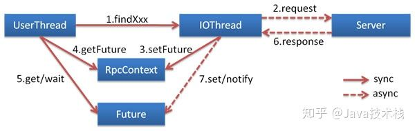

###dubbo简介
>dubbo是一款高性能、轻量级的开源Java RPC框架，它提供了三大核心能力：面向接口的远程方法调用，智能容错和负载均衡，以及服务自动注册和发现。

**特性：**

>- 面向接口代理的高性能RPC调用
>   - 提供高性能的基于代理的远程调用能力，服务以接口为粒度，为开发者屏蔽远程调用底层细节。
>- 智能负载均衡
>   - 内置多种负载均衡策略，智能感知下游节点健康状况，显著减少调用延迟，提高系统吞吐量。
>- 服务自动注册与发现
>   - 支持多种注册中心服务，服务实例上下线实时感知。
>- 高度可扩展能力
>   - 遵循微内核+插件的设计原则，所有核心能力如Protocol、Transport、Serialization被设计为扩展点，平等对待内置实现和第三方实现。
>- 运行期流量调度
>   - 内置条件、脚本等路由策略，通过配置不同的路由规则，轻松实现灰度发布，同机房优先等功能。
>- 可视化的服务治理与运维
>   - 提供丰富服务治理、运维工具：随时查询服务元数据、服务健康状态及调用统计，实时下发路由策略、调整配置参数。

### dubbo都支持什么协议，推荐用哪种？

- dubbo://（推荐）
- rmi://
- hessian://
- http://
- webservice://
- thrift://
- memcached://
- redis://
- rest://

###Dubbo需要 Web 容器吗？
>不需要，如果硬要用 Web 容器，只会增加复杂性，也浪费资源。

###Dubbo内置了哪几种服务容器？

- Spring Container
- Jetty Container
- Log4j Container

        Dubbo 的服务容器只是一个简单的 Main 方法，并加载一个简单的 Spring 容器，用于暴露服务。
        
###Dubbo里面有哪几种节点角色？

节点 | 角色说明 |
|:---:|:---:|
 Provider | 暴露服务的服务提供方 
 Consumer | 调用远程服务的服务消费方 
 Registry | 服务注册与发现的注册中心 
 Monitor | 统计服务的调用次数和调用时间的监控中心 
 Container | 服务运行容器
 
 ###服务注册与发现的流程图
 
 
 
 ###Dubbo默认使用什么注册中心，还有别的选择吗？
 >推荐使用 Zookeeper 作为注册中心，还有 Redis、Multicast、Simple 注册中心，但不推荐。
 
 ###Dubbo有哪几种配置方式？
 >- Spring 配置方式 
 >- Java API 配置方式
 
 ###Dubbo 核心的配置有哪些？
 
 配置 | 配置说明 
 ---|--- 
 dubbo:service | 服务配置 
 dubbo:reference | 引用配置 
 dubbo:protocol | 协议配置 
 dubbo:application | 应用配置 
 dubbo:module | 模块配置 
 dubbo:registry | 注册中心配置 
 dubbo:monitor | 监控中心配置 
 dubbo:provider | 提供方配置 
 dubbo:consumer | 消费方配置 
 dubbo:method | 方法配置 
 dubbo:argument | 参数配置
 
 ###在 Provider 上可以配置的 Consumer 端的属性有哪些？
 
 - timeout：方法调用超时 
 - retries：失败重试次数，默认重试 2 次 
 - loadbalance：负载均衡算法，默认随机 
 - actives 消费者端，最大并发调用限制
 
 ###Dubbo启动时如果依赖的服务不可用会怎样？
 
 >Dubbo 缺省会在启动时检查依赖的服务是否可用，不可用时会抛出异常，阻止 Spring 初始化完成，默认 check="true"，可以通过 check="false" 关闭检查。
 
 ###Dubbo推荐使用什么序列化框架，你知道的还有哪些？
 >推荐使用Hessian序列化，还有Duddo、FastJson、Java自带序列化。
 
 ###Dubbo默认使用的是什么通信框架，还有别的选择吗？
 
 >Dubbo 默认使用 Netty 框架，也是推荐的选择，另外内容还集成有Mina、Grizzly。
 
 ###Dubbo有哪几种集群容错方案，默认是哪种？
 
 集群容错方案 | 说明 
 ---|--- 
 Failover Cluster | 失败自动切换，自动重试其它服务器（默认） 
 Failfast Cluster | 快速失败，立即报错，只发起一次调用 
 Failsafe Cluster | 失败安全，出现异常时，直接忽略 
 Failback Cluster | 失败自动恢复，记录失败请求，定时重发 
 Forking Cluster | 并行调用多个服务器，只要一个成功即返回 
 Broadcast Cluster | 广播逐个调用所有提供者，任意一个报错则报错
 
 ###Dubbo有哪几种负载均衡策略，默认是哪种？
 
 负载均衡策略 | 说明 
 ---|--- 
 Random LoadBalance | 随机，按权重设置随机概率（默认） 
 RoundRobin LoadBalance | 轮询，按公约后的权重设置轮询比率 
 LeastActive LoadBalance | 最少活跃调用数，相同活跃数的随机 
 ConsistentHash LoadBalance | 一致性 Hash，相同参数的请求总是发到同一提供者
 
 ###注册了多个同一样的服务，如果测试指定的某一个服务呢？
 
 >可以配置环境点对点直连，绕过注册中心，将以服务接口为单位，忽略注册中心的提供者列表。
 
 ###Dubbo支持服务多协议吗？
 
 >Dubbo 允许配置多协议，在不同服务上支持不同协议或者同一服务上同时支持多种协议。
 
 ###当一个服务接口有多种实现时怎么做？
 
 >当一个接口有多种实现时，可以用 group 属性来分组，服务提供方和消费方都指定同一个 group 即可。
  
###服务上线怎么兼容旧版本？
>可以用版本号（version）过渡，多个不同版本的服务注册到注册中心，版本号不同的服务相互间不引用。这个和服务分组的概念有一点类似。

###Dubbo可以对结果进行缓存吗？

>可以，Dubbo 提供了声明式缓存，用于加速热门数据的访问速度，以减少用户加缓存的工作量。

###Dubbo服务之间的调用是阻塞的吗？

>默认是同步等待结果阻塞的，支持异步调用。

>Dubbo 是基于 NIO 的非阻塞实现并行调用，客户端不需要启动多线程即可完成并行调用多个远程服务，相对多线程开销较小，异步调用会返回一个 Future 对象。

**异步调用流程图如下:**

###Dubbo telnet 命令能做什么？

>dubbo 通过 telnet 命令来进行服务治理

###Dubbo支持服务降级吗？

>Dubbo 2.2.0 以上版本支持。

###Dubbo如何优雅停机？
>Dubbo 是通过 JDK 的 ShutdownHook 来完成优雅停机的，所以如果使用 kill -9 PID 等强制关闭指令，是不会执行优雅停机的，只有通过 kill PID 时，才会执行。

###服务提供者能实现失效踢出是什么原理？
>服务失效踢出基于 Zookeeper 的临时节点原理。

###服务读写推荐的容错策略是怎样的？

>- 读操作建议使用 Failover 失败自动切换，默认重试两次其他服务器。
>- 写操作建议使用 Failfast 快速失败，发一次调用失败就立即报错。

###Dubbo的管理控制台能做什么？

>管理控制台主要包含：路由规则，动态配置，服务降级，访问控制，权重调整，负载均衡，等管理功能。

###Dubbo 服务暴露的过程。

>Dubbo 会在 Spring 实例化完 bean 之后，在刷新容器最后一步发布 ContextRefreshEvent 事件的时候，通知实现了 ApplicationListener 的 ServiceBean 类进行回调 onApplicationEvent 事件方法，Dubbo 会在这个方法中调用 ServiceBean 父类 ServiceConfig 的 export 方法，而该方法真正实现了服务的（异步或者非异步）发布

