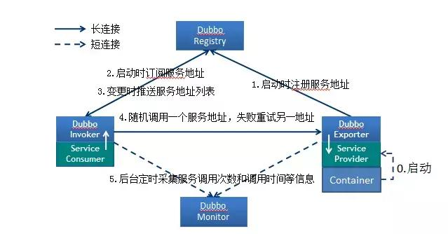
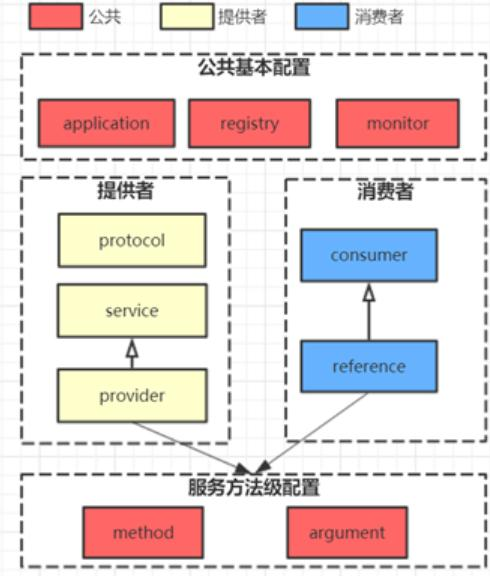
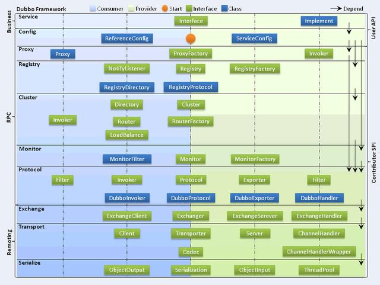
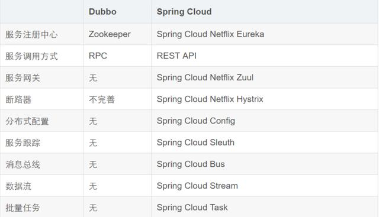

###Dubbo的核心功能？

- Remoting：网络通信框架，提供对多种NIO框架抽象封装，包括“同步转异步”和“请求-响应”模式的信息交换方式。
- Cluster：服务框架，提供基于接口方法的透明远程过程调用，包括多协议支持，以及软负载均衡，失败容错，地址路由，动态配置等集群支持。
- Registry：服务注册，基于注册中心目录服务，使服务消费方能动态的查找服务提供方，使地址透明，使服务提供方可以平滑增加或减少机器。

###Dubbo服务注册与发现的流程？

**流程说明：**

- Provider(提供者)绑定指定端口并启动服务
- 指供者连接注册中心，并发本机IP、端口、应用信息和提供服务信息发送至注册中心存储
- Consumer(消费者），连接注册中心 ，并发送应用信息、所求服务信息至注册中心
- 注册中心根据 消费 者所求服务信息匹配对应的提供者列表发送至Consumer 应用缓存。
- Consumer 在发起远程调用时基于缓存的消费者列表择其一发起调用。
- Provider 状态变更会实时通知注册中心、在由注册中心实时推送至Consumer

**设计的原因：**

- Consumer 与Provider 解偶，双方都可以横向增减节点数。
- 注册中心对本身可做对等集群，可动态增减节点，并且任意一台宕掉后，将自动切换到另一台
- 去中心化，双方不直接依懒注册中心，即使注册中心全部宕机短时间内也不会影响服务的调用
- 服务提供者无状态，任意一台宕掉后，不影响使用

###dubbo架构设计

**Dubbo框架设计一共划分了10个层：**

>- 服务接口层（Service）：该层是与实际业务逻辑相关的，根据服务提供方和服务消费方的业务设计对应的接口和实现。
>- 配置层（Config）：对外配置接口，以ServiceConfig和ReferenceConfig为中心。
>- 服务代理层（Proxy）：服务接口透明代理，生成服务的客户端Stub和服务器端Skeleton。
>- 服务注册层（Registry）：封装服务地址的注册与发现，以服务URL为中心。
>- 集群层（Cluster）：封装多个提供者的路由及负载均衡，并桥接注册中心，以Invoker为中心。
>- 监控层（Monitor）：RPC调用次数和调用时间监控。
>- 远程调用层（Protocol）：封将RPC调用，以Invocation和Result为中心，扩展接口为Protocol、Invoker和Exporter。
>- 信息交换层（Exchange）：封装请求响应模式，同步转异步，以Request和Response为中心。
>- 网络传输层（Transport）：抽象mina和netty为统一接口，以Message为中心。

###Dubbo超时时间怎样设置？

**Dubbo超时时间设置有两种方式：**

>- 服务提供者端设置超时时间，在Dubbo的用户文档中，推荐如果能在服务端多配置就尽量多配置，因为服务提供者比消费者更清楚自己提供的服务特性。
>-  服务消费者端设置超时时间，如果在消费者端设置了超时时间，以消费者端为主，即优先级更高。因为服务调用方设置超时时间控制性更灵活。如果消费方超时，服务端线程不会定制，会产生警告。

###dubbo和spring cloud的区别？

>- Dubbo底层是使用Netty这样的NIO框架，是基于TCP协议传输的，配合以Hession序列化完成RPC通信。
>- SpringCloud是基于Http协议+Rest接口调用远程过程的通信，相对来说，Http请求会有更大的报文，占的带宽也会更多。但是REST相比RPC更为灵活，服务提供方和调用方的依赖只依靠一纸契约，不存在代码级别的强依赖，这在强调快速演化的微服务环境下，显得更为合适，至于注重通信速度还是方便灵活性，具体情况具体考虑。

